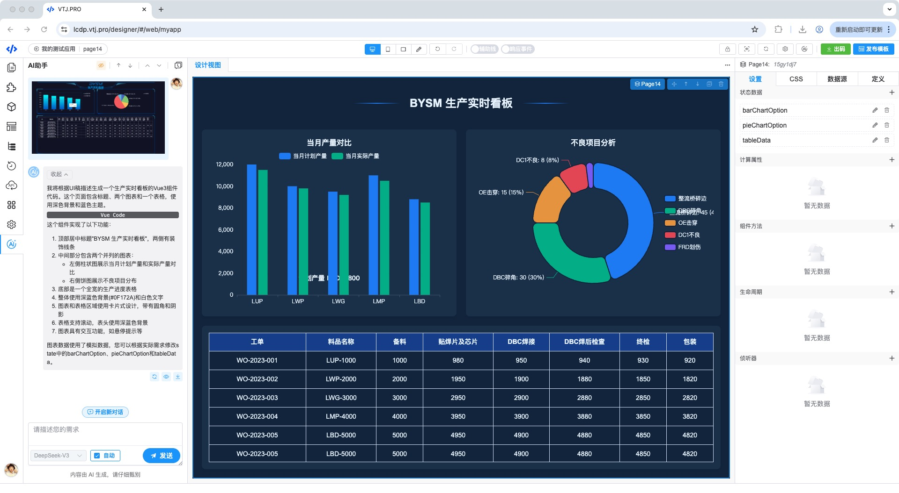
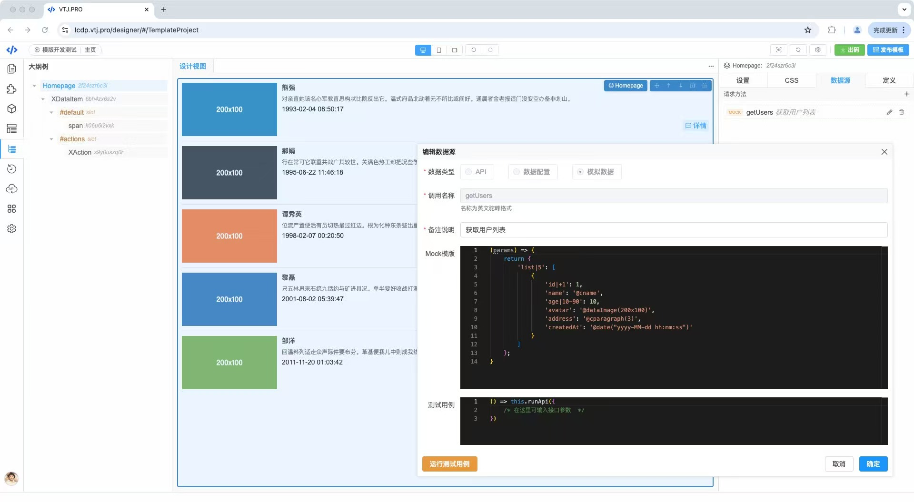

<div align="center"> <a href="https://gitee.com/newgateway/vtj">  </a> <br>
<h1>VTJ.PRO</h1>
<h3>AI 驱动的 Vue3 低代码开发平台</h3>
<br>

[](https://gitee.com/newgateway/vtj)
[](https://www.npmjs.com/package/@vtj/pro)
[](https://npm-stat.com/charts.html?package=@vtj/core)
[](LICENSE)

</div>

内置低代码引擎、渲染器与代码生成器，**实现 Vue 源码与低代码 DSL 的双向智能转换。专为前端开发者打造，开箱即用**。

**无缝融入现有工程**，**零侵入**开发流程与编码习惯。

- **官方文档**：[https://vtj.pro](https://vtj.pro)
- **在线应用开发平台**：[https://lcdp.vtj.pro](https://lcdp.vtj.pro)

## 核心特性

- ⚙️ **主流技术栈**: 基于 Vue3 + TypeScript + Vite 构建，深度整合 ElementPlus、Axios、ECharts 等主流工具链，开箱即用。

- 🧩 **源码级自定义**: 低代码设计器支持**源码级自由定制**，无缝实现传统编码开发的所有功能，满足深度个性化需求。

- 🚀 **零适应成本**: 完全遵循前端开发习惯，**Vue开发者无需额外学习**，设计器与本地项目环境天然融合。

- 🔌 **引擎化扩展**: 内置可拆解的**低代码引擎**，支持独立调用，快速构建自有低代码平台，扩展能力无上限。

- 💻 **源码零污染**: 采用**设计器-渲染器分离架构**，产物为纯净Vue代码，支持直接二次开发，杜绝环境侵入。

- 📦 **高复用物料库**: 内置多套企业级组件库+页面模板，提供**可定制区块组件**，大幅提升标准化开发效率。

- 🤖 **AI智能提效**: 支持通过自然语言/设计稿/网页截图**智能生成Vue组件**，快速实现需求可视化。

- 🔄 **双向代码转换**: 独创 **DSL与Vue源码双向编译**能力，保障低代码与手写代码的自由切换。

## 设计器预览

### 双向代码转换

通过双向代码转换技术，开发者可以将可视化设计的界面一键导出为标准Vue组件代码，也能将手写代码导入设计器进行可视化调整。

<table border="0" style="display: table">
  <tr>
    <td>
      
    </td>
  </tr>
</table>

### 深度AI赋能

VTJ.PRO的AI不是噱头，而是实打实的生产力加速器.

<table border="0" style="display: table">
  <tr>
    <td>
      
    </td>
  </tr>
</table>

<table border="0">
  <tr>
    <td></td>
    <td></td>
  </tr>
  <tr>
    <td></td>
    <td></td>
  </tr>
  <tr>
    <td></td>
    <td></td>
  </tr>
</table>

## 试用体验

### 一、在线体验

- [https://lcdp.vtj.pro](https://lcdp.vtj.pro)

访问VTJ专属低代码开发平台，创建应用可以体验设计器和出码功能。

### 二、本地体验 <span style="color:red">（强烈推荐：功能全， 性能最佳）</span>

VTJ支持多种平台应用开发，可以使用脚手架搭建相应平台的项目工程。命令：

1. Web应用(PC端)

   ```sh
   npm create vtj@latest --registry=https://registry.npmmirror.com -- -t app
   ```

1. H5应用(移动端)

   ```sh
   npm create vtj@latest --registry=https://registry.npmmirror.com -- -t h5
   ```

1. uni-app(跨端应用)

   ```sh
   npm create vtj@latest --registry=https://registry.npmmirror.com -- -t uniapp
   ```

1. 物料开发项目

   ```sh
   npm create vtj@latest --registry=https://registry.npmmirror.com -- -t material
   ```

## 贡献指南

VTJ支持多种方式对设计器进行扩展，通常情况下你不需要用到源码，如果需要深度定制或与业务捆绑时才有可能需要用源码进行二开，欢迎各位喜欢VTJ的开发者贡献代码。

### 开发环境要求

VTJ 使用了最新的 Vue3 生态技术栈，要求 Node 版本必须是 v20+， 建议使用 nvm 切换 Node 版本。
开发项目工程采用`lerna` 和 `pnpm` 包管理工具，需要全局安装。

```sh
npm install -g lerna@latest pnpm@latest --registry=https://registry.npmmirror.com
```

如果需要二开或贡献代码，可以拉取仓库master分支。

### 快速开始

```sh
git clone https://gitee.com/newgateway/vtj.git
cd vtj
npm run setup && npm run build && npm run app:dev
```

- 首次启动需要执行初始化：`npm run setup && npm run build`
- 重启开发环境：`npm run app:dev`
- 清理项目：`npm run clean` 清理后需要重新执行初始化

## 技术交流

钉钉群、 微信群(加好友，拉进群，备注：vtj)

<table border="0">
  <tr>
    <td></td>
    <td></td>
  </tr>
</table>

## 媒体报道

- [这个开源的「AI + 低代码」开发平台绝了，Gitee上斩获 9.2K Star!](https://mp.weixin.qq.com/s/DBoMp7ymX5XS9zWz9LzCMw)
- [【开源】告别重复代码！AI驱动的Vue3低代码平台，让开发快人一步](https://mp.weixin.qq.com/s/8zJyrGpL4yHxUCgmGg4qYQ)
- [解锁低码高效新篇章：VTJ，让开发“飞”起来！](https://mp.weixin.qq.com/s/2bOX6p3mBG1ys_HivCMHhA)
- [开箱即用，一款基于Vue3 + TypeScript的低代码开发神器！](https://mp.weixin.qq.com/s/mwD0dgeCl_GX_yDBwBsNtA)
- [一款以AI驱动的Vue3前端低代码开发工具](https://mp.weixin.qq.com/s/RDzHUZENIOpDuY9G98M2uw)
- [Vue3+TS 低代码神器 VTJ.PRO，0 学习成本玩转页面可视化设计](https://mp.weixin.qq.com/s/3QxgCenYT4KKdg1idhd06A)
- [[开源]一款低代码开发工具，内置设计器引擎、渲染器和代码生成器](https://mp.weixin.qq.com/s/I3KSeeKadoirY4Xo42sdlA)
- [基于 Vue3 + TypeScript 的低代码页面可视化设计器，开箱即用](https://mp.weixin.qq.com/s/Te84P6J-JXaU7mRLXVJ_-g)
- [5.4K Star 【VTJ.PRO】：重新定义前端开发的低代码神器](https://mp.weixin.qq.com/s/ySWojJ1DKMSYes_CeYk9qw)
- [低代码开发工具推荐，VTJ.PRO，一款基于Vue3和TypeScript打造的低代码开发工具，值得一试！](https://mp.weixin.qq.com/s/wIw7XWOJ4xQ8f7OOhqAyzQ)
- [开源|一个基于Vue3 + TypeScript的低代码开发工具平台，内置了设计器引擎、渲染器和代码生成器](https://mp.weixin.qq.com/s/JTfqmIfmbBcBUbCORCUHkA)

## 他们也在用 VTJ.PRO

众多企业和组织正在使用 **VTJ.PRO** 加速数字化转型和升级。

<table border="0" class="sponsors" style="display: table">
  <tbody>
    <tr>
      <td align="center">浪潮集团有限公司</td>
      <td align="center">北京百度网讯科技有限公司</td>
      <td align="center">上药控股有限公司</td>
      <td align="center">中国***有限公司</td>
    </tr>
    <tr>
      <td align="center">
        
      </td>
      <td align="center">
        
      </td>
      <td align="center">
        
      </td>
      <td align="center">
      </td>
    </tr>
  </tbody>
</table>

<table border="0" class="sponsors" style="display: table">
  <tbody>
    <tr>
      <td align="center">中国铁塔股份有限公司</td>
      <td align="center">海尔消费金融有限公司</td>
      <td align="center">苹果电子产品商贸（北京）有限公司</td>
      <td align="center">广州诗悦网络科技有限公司</td>
    </tr>
    <tr>
      <td align="center">
        
      </td>
      <td align="center">
        
      </td>
      <td align="center">
        
      </td>
      <td align="center">
        
      </td>
    </tr>
  </tbody>
</table>

<table border="0" class="sponsors" style="display: table">
  <tbody>
    <tr>
      <td align="center">山东国子软件股份有限公司</td>
      <td align="center">乐至县清源水务有限公司</td>
      <td align="center">河南贤迈网络科技服务有限公司</td>
      <td align="center">中电福富信息科技有限公司</td>
    </tr>
    <tr>
      <td align="center">
        
      </td>
      <td align="center">
        
      </td>
      <td align="center">
        
      </td>
      <td align="center">
        
      </td>
    </tr>
  </tbody>
</table>

<table border="0" class="sponsors" style="display: table">
  <tbody>
    <tr>
      <td align="center">上海森克电子科技有限公司</td>
      <td align="center">南京韬盛信息科技有限公司</td>
      <td align="center">南京派光智慧感知信息技术有限公司</td>
      <td align="center">上海同筑信息科技有限公司</td>
    </tr>
    <tr>
      <td align="center">
        
      </td>
      <td align="center">
        
      </td>
      <td align="center">
        
      </td>
      <td align="center">
        
      </td>
    </tr>
  </tbody>
</table>

<table border="0" class="sponsors" style="display: table">
  <tbody>
    <tr>
      <td align="center">合肥晨飞网络科技有限公司</td>
      <td align="center">成都淞幸科技有限责任公司</td>
      <td align="center">北京万古科技股份有限公司</td>
      <td align="center">杭州江南布衣服饰有限公司</td>
    </tr>
    <tr>
      <td align="center">
        
      </td>
      <td align="center">
        
      </td>
      <td align="center">
        
      </td>
      <td align="center">
        
      </td>
    </tr>
  </tbody>
</table>

<table border="0" class="sponsors" style="display: table">
  <tbody>
    <tr>
      <td align="center">合肥市星之源信息技术有限公司</td>
      <td align="center">泉州海丝泓盛供应链有限公司</td>
      <td align="center">浪潮云洲工业互联网有限公司</td>
      <td align="center">武汉仓鼠科技有限公司</td>
    </tr>
    <tr>
      <td align="center">义乌市云度企业管理咨询有限公司</td>
      <td align="center">深圳海用智能科技有限公司</td>
      <td align="center">天津易讯文传科技有限公司</td>
      <td align="center">深圳市翱阳鸿宇科技有限公司</td>
    </tr>
    <tr>
      <td align="center">武汉兄弟桥科技发展有限公司</td>
      <td align="center">江西牛虎科技有限公司</td>
      <td align="center">青岛艾玛信息技术有限公司</td>
      <td align="center">贵阳市第四人民医院</td>
    </tr>
    <tr>
      <td align="center">常熟市融媒体中心</td>
      <td align="center">年华数据科技有限公司</td>
      <td align="center">Employers’ Advocate, Inc.</td>
      <td align="center">江西七叶莲科技</td>
    </tr>
    <tr>
      <td align="center">北京寄云鼎城科技有限公司</td>
      <td align="center">福建国通星驿网络科技有限公司</td>
      <td align="center"></td>
      <td align="center"></td>
    </tr>
  </tbody>
</table>
