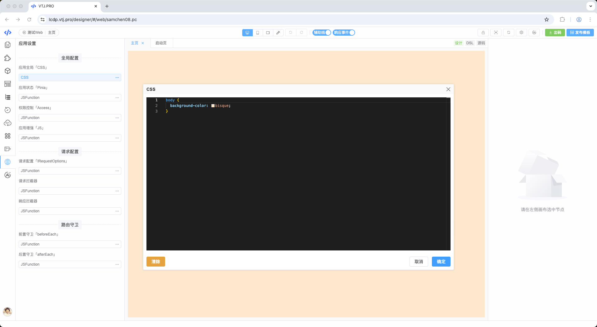
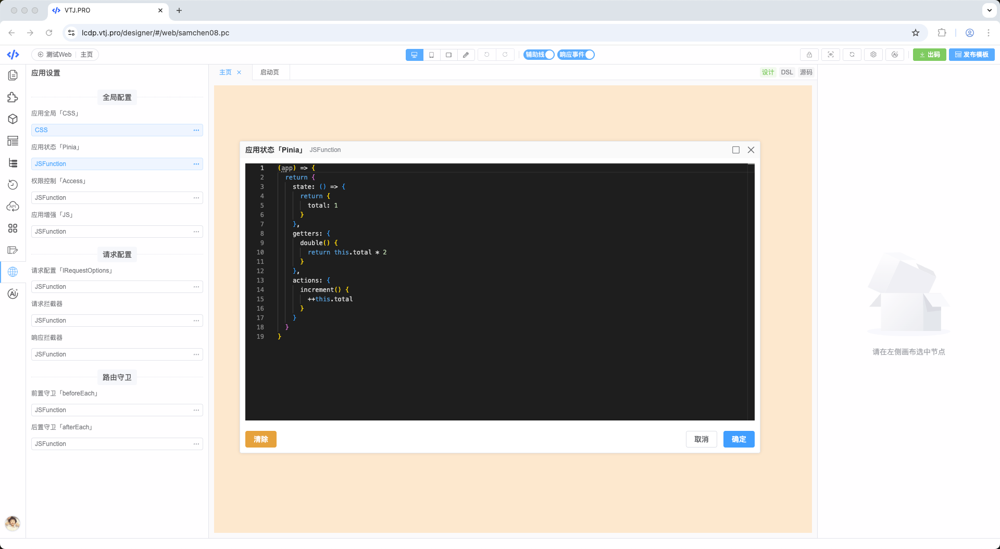
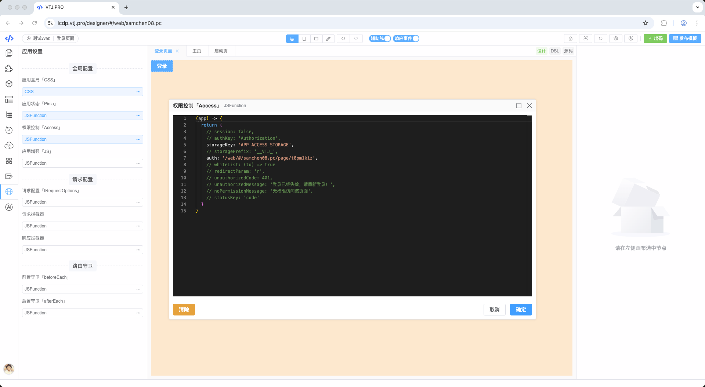
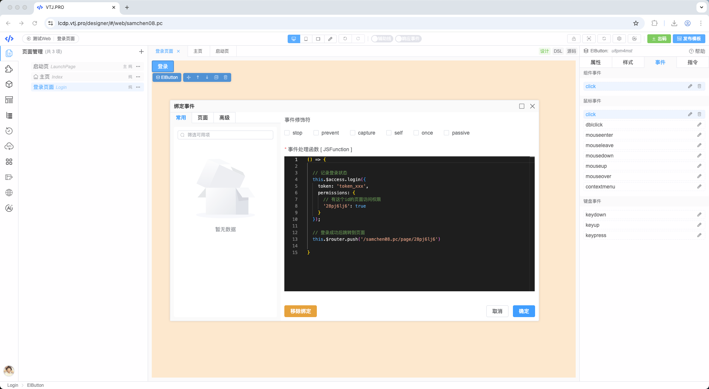
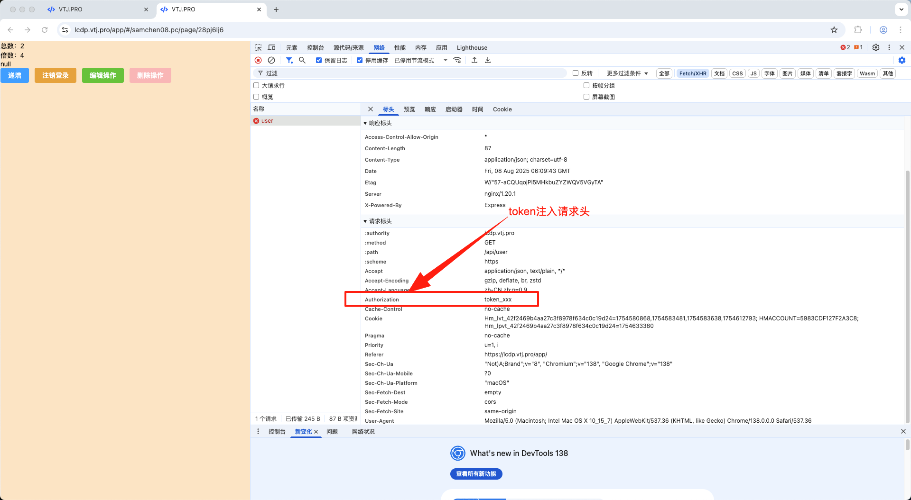
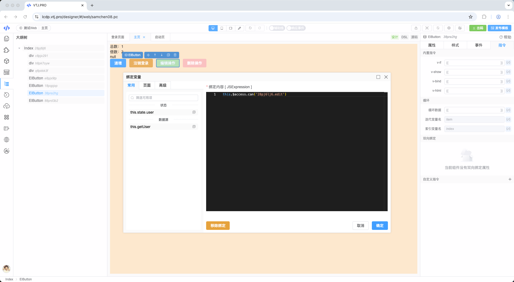
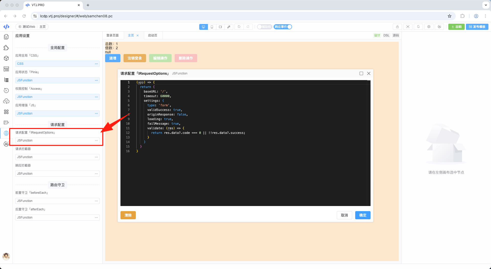
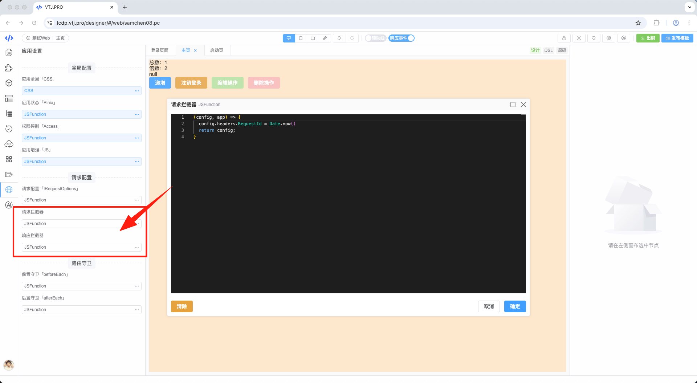
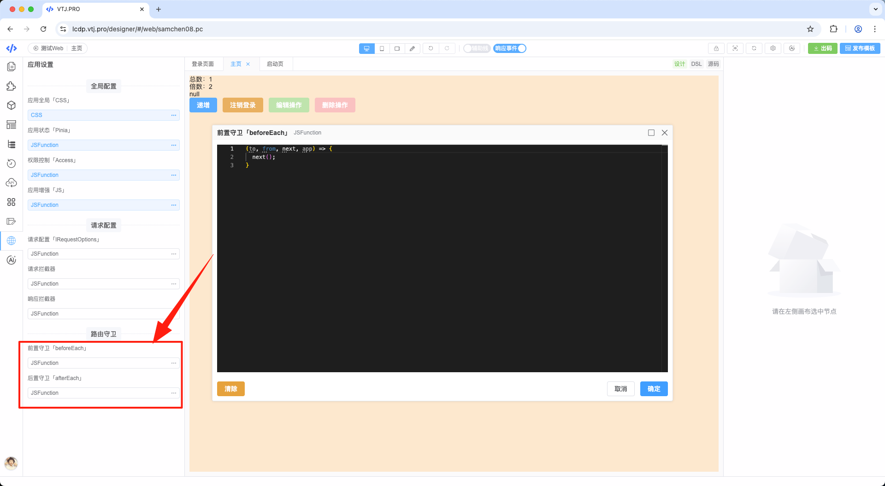

# 应用全局设置

设计器从 `v0.13.0` 版本开始，为 **Web** 和 **H5** 平台提供了应用全局设置功能，支持配置全局 CSS、应用状态、权限控制、请求设置、路由守卫等核心功能。


## 一、应用全局 CSS



全局 CSS 仅支持标准 CSS 语法，不支持 SCSS/LESS 等预处理器。配置的 CSS 会注入到所有页面。

**使用示例**：

```css
/* 全局字体设置 */
body {
  font-family:
    -apple-system, BlinkMacSystemFont, 'Segoe UI', Roboto, sans-serif;
}

/* 主题色变量 */
:root {
  --primary-color: #1890ff;
}
```

## 二、应用状态管理

全局应用状态采用 [Pinia](https://pinia.vuejs.org/) 实现。应用启动后会注入名为 `$store` 的全局状态模块，在页面组件中可通过 `this.$store` 访问。



**特性说明**：

- 支持 Vue 响应式机制
- 内置状态持久化能力
- 提供模块化状态管理

## 三、权限控制

基于 [Access 插件](./access.md) 实现全方位的权限控制，包括：

- 接口请求自动注入 token
- 路由访问限制
- 页面元素权限控制

### 核心配置项

| 参数名              | 类型              | 默认值         | 说明                                                        |
| ------------------- | ----------------- | -------------- | ----------------------------------------------------------- |
| session             | boolean           | false          | 开启 session 模式，token 存储在 cookie 中，关闭浏览器后失效 |
| authKey             | string            | Authorization  | 请求头和 cookie 中使用的 token 字段名                       |
| storagePrefix       | string            | \_\_VTJ\_      | 本地存储 key 前缀                                           |
| storageKey          | string            | ACCESS_STORAGE | 本地存储用户信息的 key                                      |
| auth                | string            | /#/login       | 登录页面路径 (URL path，非路由名称)                         |
| redirectParam       | string            | r              | 重定向到登录页时携带当前页面 URL 的参数名                   |
| whiteList           | string[]/Function | []             | 路由白名单，匹配的路由跳过权限校验                          |
| unauthorized        | string[]/Function | -              | 无权限访问时跳转的路由路径                                  |
| unauthorizedMessage | string            | 登录已失效     | 未登录时的提示信息                                          |
| noPermissionMessage | string            | 无权限访问     | 无权限操作时的提示信息                                      |
| statusKey           | string            | code           | API 响应状态码字段名                                        |
| unauthorizedCode    | number            | 401            | 未登录状态码                                                |

### 启用权限控制

启用权限控制需至少配置：

- **storageKey**：浏览器存储 key
- **auth**：登录页面路径



### 登录认证

启用 Access 后，可通过 `this.$access` 访问权限实例：

```ts
// 登录方法
this.$access.login({
  token: 'YOUR_JWT_TOKEN',
  permissions: {
    'page.edit': true,
    'user.manage': false
  },
  userInfo: {
    name: 'Admin'
  }
});
```



**登录成功后请求头自动注入 token**：


:::tip 注销登录
调用 `this.$access.logout()` 会清除用户信息并跳转到登录页
:::

### 操作权限控制

通过 `this.$access.can(permissionCode)` 控制元素权限：

```vue
<template>
  <button v-if="$access.can('user.delete')">删除用户</button>
</template>
```



**返回值说明**：

- `true`：有权限
- `false`：无权限
- `null`：权限未定义

## 四、应用增强

用于注入全局插件和公共逻辑：

```ts
// 全局工具方法示例
export default {
  install(app) {
    app.config.globalProperties.$utils = {
      formatDate: (date) => new Date(date).toLocaleString()
    };
  }
};
```


## 五、请求配置

### 基础配置项



**完整配置接口**：

```ts
export interface IRequestSettings {
  /**
   * 请求数据类型
   * - form: application/x-www-form-urlencoded
   * - json: application/json
   * - data: multipart/form-data
   */
  type?: 'form' | 'json' | 'data';

  /** 是否注入自定义请求头 */
  injectHeaders?: boolean;

  /** 自定义请求头 */
  headers?:
    | RawAxiosRequestHeaders
    | ((id: string, config: AxiosRequestConfig) => RawAxiosRequestHeaders);

  /** 是否显示加载状态 */
  loading?: boolean;

  /** 自定义加载状态显示 */
  showLoading?: () => void;

  /** 自定义加载状态隐藏 */
  hideLoading?: () => void;

  /** 是否显示错误提示 */
  failMessage?: boolean;

  /** 自定义错误处理 */
  showError?: (msg: string, error: any) => void;

  /** 是否返回原始响应对象 */
  originResponse?: boolean;

  /** 是否启用成功状态校验 */
  validSuccess?: boolean;

  /** 自定义响应校验逻辑 */
  validate?: (response: AxiosResponse) => boolean;

  /** 跳过警告的请求模式 */
  skipWarn?: IRequestSkipWarn;
}
```

### 请求拦截器配置



## 六、路由守卫

路由守卫用于在路由切换前后执行逻辑，典型场景包括：

- 页面访问权限校验
- 路由切换动画控制
- 页面数据预加载


