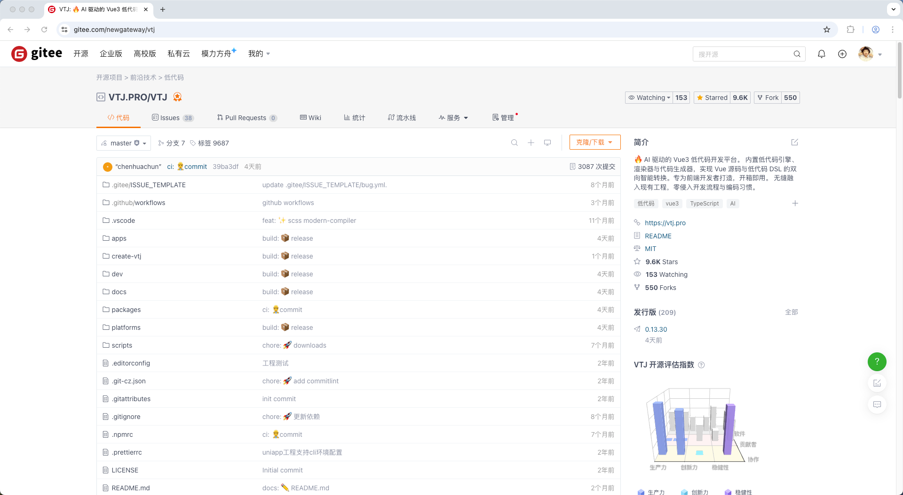

# 这个开源的「AI + 低代码」开发平台绝了，Gitee上斩获 9.2K Star!

VTJ.PRO 是一款 **AI驱动的革命性低代码开发平台**，专注于提升前端开发效率，尤其深度适配 Vue3 技术栈。它通过融合可视化设计、AI智能引擎与源码级自由编辑能力，重新定义了高效开发的工作流。

## 🚀 一、核心定位与技术突破

### 1. 双向代码自由穿梭

VTJ.PRO 的核心创新在于 “设计即代码，代码即设计” 的闭环工作流：

- **可视化设计 → 纯净源码**：拖拽生成的界面可一键转换为高质量、无冗余的 Vue3 组件代码（标准 .vue 文件），无缝嵌入现有工程，源码100%自主可控。
- **手写代码 → 可视化编辑**：已有 Vue 组件可反向解析为低代码 DSL，在设计器中实时调整样式或事件绑定，修改后仍可切回源码模式，保留注释与编码习惯，彻底避免平台锁定。

### 2. AI深度赋能

- **设计稿智能转代码**：首创支持解析 Sketch / Figma / MasterGo 设计稿 JSON 文件，通过 双引擎AI架构（CV视觉理解 + 语义化代码生成）自动生成生产级 Vue 组件，将传统 2-3 天的 UI 开发压缩至分钟级
- **AI代码修复引擎（AI-CodeFix）**：动态检测数据流冲突、响应式漏洞等47类风险，自动重构冗余逻辑，修复成功率85%，使调试时间从 2.1 小时降至 12 分钟。

### 3. 企业级工程化能力

- **多模态渲染**：支持设计模式（动态调试）、运行模式（JSON渲染）、源码模式（Vue源码编译渲染）
- **污染架构**：生成代码无运行时依赖，性能等同手写代码，内存泄漏率低于 0.1%

## ⚙️ 二、核心功能与技术架构

### 1. 多平台支持

- 通过统一引擎输出 **Web（PC端）**、**H5（移动端）**、**UniApp（跨端）** 三端代码，一次设计适配17种设备模板。

### 2. 开放性与定制化

- 支持企业定制代码转换策略，适配内部开发规范；提供本地离线部署、物料市场与区块复用功能

### 3. 技术栈与生态

- 基于 **Vue3 + TypeScript + Vite** 构建，集成 ElementPlus、ECharts 等主流库；
- 设计器（`@vtj/designer`）与渲染器（`@vtj/renderer`）分离，确保项目代码纯净。

## 💼 三、应用场景与用户价值

- **快速原型验证**：拖拽搭建界面 → 生成代码 → 扩展逻辑 → 微调，迭代速度提升300%。
- **遗留项目改造**：老旧 Vue 组件逆向解析为可视化模块，改造效率提升80%，避免重写成本。
- **团队协作升级**：产品经理用 AI 生成原型 → 开发者补充源码逻辑 → 测试实时调校 UI，全链路无缝衔接。
- **业级案例**：
  - 金融系统开发周期从 6周压缩至9天（提速150%）；
  - 电商中台页面迭代效率 提升300%，维护成本降低75%。

### AI作品展示

## 📦 四、完全开源

项目已在 Gitee 完全开源，无商业版/社区版之分，社区版即包含全部功能，绝无套路。

- **源码仓库：**[https://gitee.com/newgateway/vtj](https://gitee.com/newgateway/vtj)

## 🛠️ 五、开发者体验与获取方式

- **零学习成本**：Vue 开发者无缝上手，5分钟快速启动（`npm create vtj@latest -- -t app`）。
- **免费体验**：
  - 在线沙盒：[https://lcdp.vtj.pro](https://lcdp.vtj.pro)（秒级代码转换体验）；
  - 本地部署支持 Web/H5/UniApp 全平台模板。

## 💎 总结

VTJ.PRO 重新定义了低代码的边界：它既提供可视化开发的效率，又保障了手写代码的灵活性与可控性，通过AI智能引擎与企业级工程能力，成为开发者兼顾“速度与自由”的终极工具。其核心价值在于 “让每一行代码自由呼吸，让每一个创意极速落地” 🌈。

