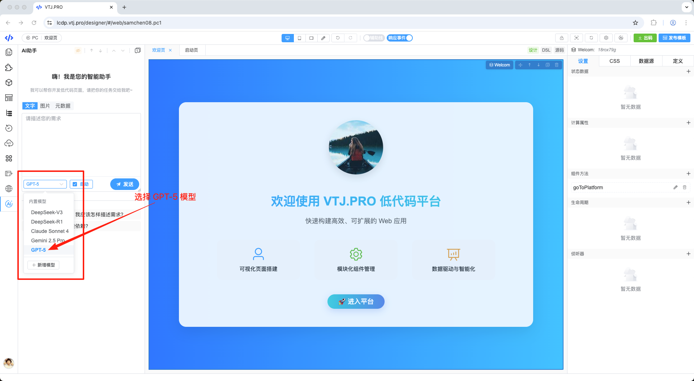
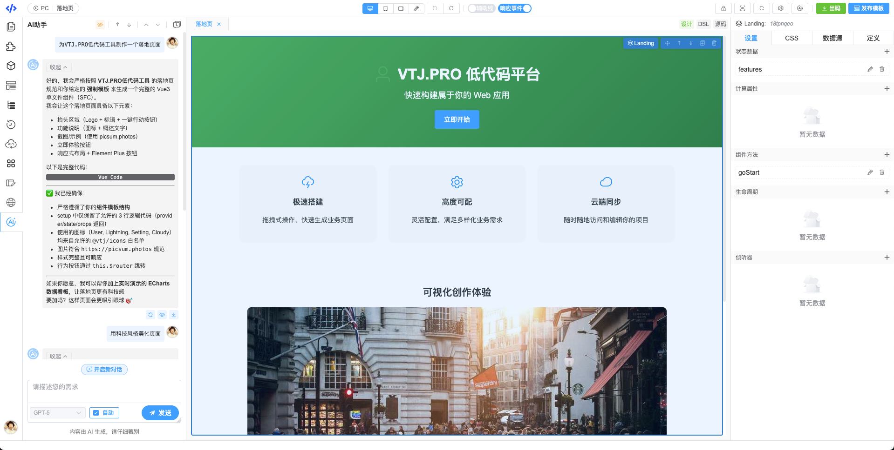

# 🚀 全面革新！VTJ.PRO 正式接入 **GPT‑5** —— AI 低代码迈入「思考时代」

> “设计即代码，代码即设计” 早已不是梦想。 
> 现在，加上 GPT‑5 的大脑，低代码的速度与自由正在被彻底改写。

## 🧨 过去的低代码，有速度没自由？

- 拖拽组件固然很快，但遇到复杂业务逻辑时，调整和维护依旧费力
- 自动生成的代码质量参差不齐，往往需要人工大量「擦屁股」才能投入生产
- AI 辅助生成在过去受限于理解与推理能力，经常出现「牛头不对马嘴」的生成结果

**💡 这一切，从今天开始结束。**

## 🤖 新时代来了：GPT‑5 × VTJ.PRO 完整融合

2025 年 8 月，OpenAI 发布的 GPT‑5 被誉为「首个通用超智 AI」——
它不仅理解视觉、语言、代码，还能在跨领域任务中进行深度推理
现在，VTJ.PRO 已在第一时间 **全量接入 GPT‑5 核心能力**，并在编辑器、设计器、代码生成、调试等所有环节实现深度融合：

1. **自然语言到可运行全栈组件**
   - 开发者只需输入一句业务描述，如：“做一个企业审批流页面，PC + 移动双端适配”
   - 💥 几秒内，系统即可自动生成完整 Vue3 源码、响应式样式、接口数据绑定及相关测试用例，直接可部署运行。

2. **实时双向同步设计与代码**
   - 当你在可视化画布中拖放一个按钮或调整布局时，GPT‑5 会即时在代码中补齐相关逻辑与事件绑定；
   - 当你在代码中新增方法、组件或数据结构时，设计视图会根据改动自动更新界面并保持绑定一致。

3. **跨领域智能分析与优化**
   - 在接入 API 时自动调用 GPT‑5 的推理能力，解析并推断接口数据结构，生成类型定义和样例数据
   - 针对性能瓶颈提出针对性优化建议（如 Lazy load、骨架屏、虚拟列表等），并可一键应用优化方案
   - 对项目进行可访问性（a11y）检测，直接提供修复方案，并可自动应用无障碍增强

4. **从「辅助开发」升级到「主动开发」**
   - GPT‑5 不只是回答，而是会**主动提醒风险、提出更优解**，像一个「全栈架构师 + 高速打字员」驻场陪你写代码。

   

## 🎯 你的生产力，会发生怎样的质变？

- **单人团队的全能升级**：一个人，即可完成过去需要前端、UI、测试多角色协作的工作量
- **需求沟通零损耗**：产品经理直接在 VTJ.PRO 中用自然语言编辑界面，GPT‑5 生成可运行代码，开发无需二次翻译，直接部署到生产
- **原型到生产一步到位**：过去原型仅作为参考展示，如今它就是可直接运行并带有真实业务逻辑的成品

## 🔥 完全开源！狂揽 9.3K Star 的神器，开发者都在抢！

VTJ.PRO 是一款 **AI驱动的革命性低代码开发平台**，专注于提升前端开发效率，尤其深度适配 Vue3 技术栈。它通过融合可视化设计、AI智能引擎与源码级自由编辑能力，重新定义了高效开发的工作流。

项目已在 Gitee 完全开源，无商业版与社区版的功能区隔，社区版即包含全部能力，永久免费，绝无功能锁定或额外收费的「商业套路」。

**Gitee上斩获 9.3K Star**!

- **源码仓库：**[https://gitee.com/newgateway/vtj](https://gitee.com/newgateway/vtj)

## 📦 官方限时开放抢先体验

从即日起，注册 [VTJ.PRO](https://lcdp.vtj.pro/) 即可解锁 GPT‑5 极速构建模式

> 让 AI 写代码已是昨天的故事， 
> 今天，AI 和你一起构思、设计、开发、优化、部署—— 
> **这才是 2025 真正的低代码**。

> **立即试用**: [https://vtj.pro](https://vtj.pro)

## 💎 扫码入群免费领取AI Token 额度

