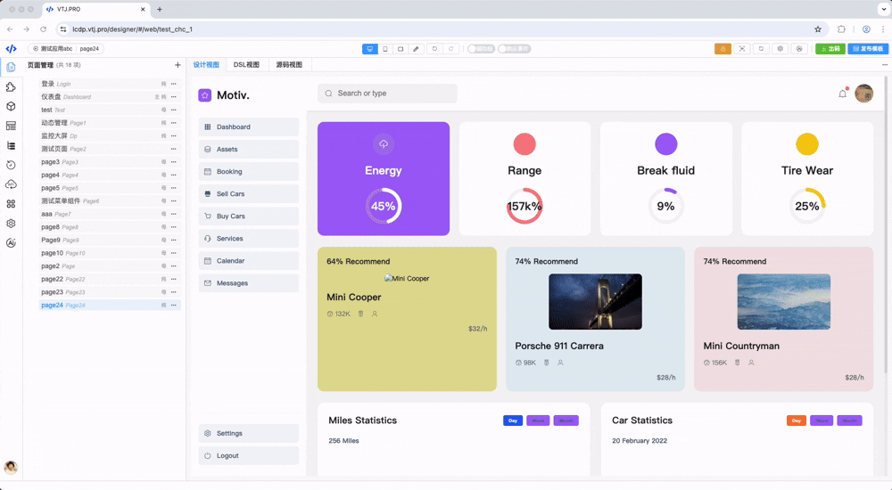
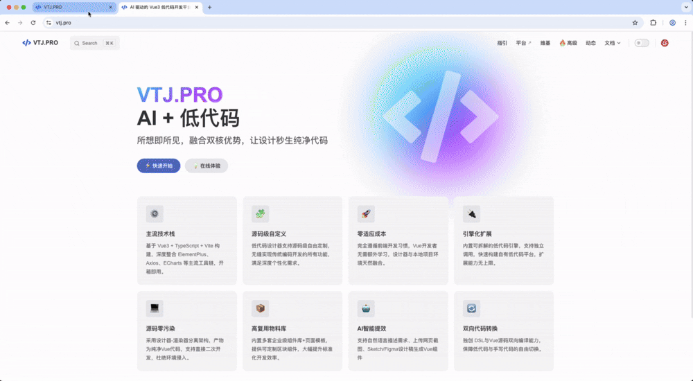
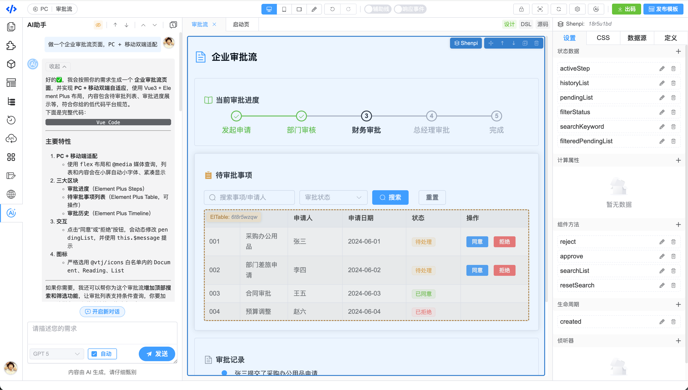
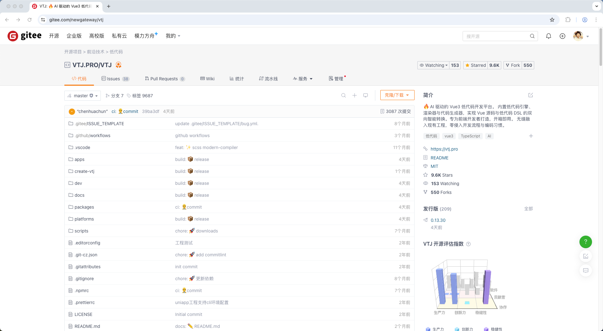
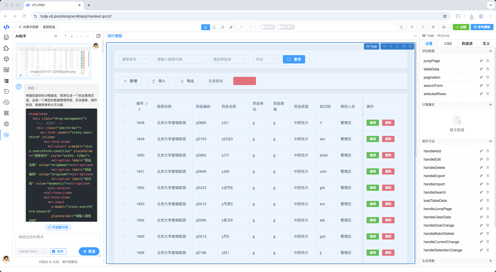
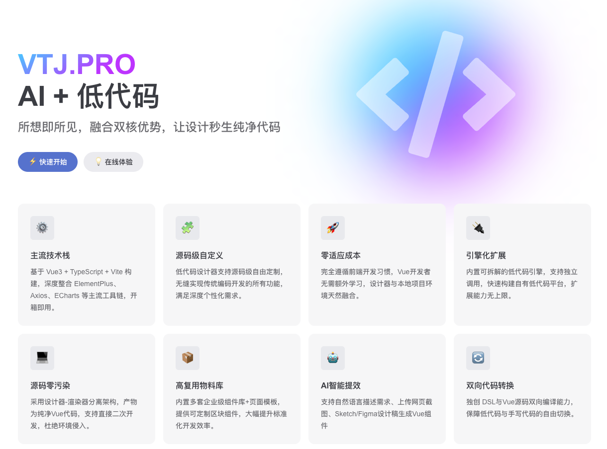

# 🚀 AI 驱动的 Vue3 低代码革命，下一代前端开发方式来了！

在数字化大潮下，前端开发的门槛越来越高：

- Vue3、TypeScript、Vite、组件工程化……技术更新飞快；
- 企业应用动辄几十个模块、上百张表格，开发周期拉得漫长；
- “改需求如改命”，重复劳动消耗了大量开发者的激情。

过去，我们在 **“手写代码”和“拖拽式低代码”** 之间摇摆，却始终没能找到最优解。

今天，这个答案终于出现了——
它就是 **VTJ.PRO** —— 一个 **AI 驱动的 Vue3 双向低代码平台**。

## 🔑 为什么是 VTJ.PRO？

### 1. 双向代码流：自由切换，绝不锁死

在 VTJ.PRO 中，所有页面都可以：

- 通过拖拽快速搭建 (低代码灵活度高)
- 一键切换到 Vue3 源码编辑 (工程化自由度高)

它不是那些“黑箱式平台”，**源码永远属于你自己**，开发体验丝滑无负担。

### 2. AI 赋能：代码从此自动生长

- 上传设计稿 → AI 自动生成 Vue 页面组件；
- 输入需求描述 → AI 给你产出完整表单/报表；
- 老项目迁移 → AI 一键重构更优雅的 Vue3/TS 写法。

  从 CRUD 到复杂逻辑，**AI 是你 24h 不下班的资深前端搭子**。

  

### 3. 生态级兼容：Vue3 全家桶的最好拍档

- 基于 Vue3 + TypeScript + Vite 原生开发；
- 与现有前端项目零缝隙衔接；
- 不搞封闭架构，不绑架开发者。

对开发者来说，VTJ.PRO 不只是工具，**而是团队生产力的放大器**。

## 完全开源！狂揽9.3K Star!，开发者都在抢

在开源社区，Star数是衡量工具受欢迎程度的硬指标。而VTJ.PRO仅用一年时间，就在**Gitee（国内最大开源平台）狂揽9.3K Star**（截至2025年8月），成为前端开发领域的“现象级工具”。更难得的是——**它完全免费！无商业版/社区版套路，所有功能全部开源开放**！

开发者们用脚投票的背后，是实打实的“真香体验”。

源码仓库：[https://gitee.com/newgateway/vtj](https://gitee.com/newgateway/vtj)

## 🎯 VTJ.PRO 适合谁？

- **前端开发者**：想快速交付业务，但依旧掌控源码自由。
- **企业技术团队**：需要降本增效，加快数字化应用交付速度。
- **创业团队 / 中小企业**：需要高质量 Demo 或 MVP，但人手有限。

## 用户声音

> "过去做一个 IoT 可视化大屏，要 2-3 周；现在用 VTJ.PRO，2-3 天就能交付，客户说我们像换了一支全新外包团队。" 
> — 某智慧城市解决方案架构师

## 🚀 总结

**VTJ.PRO = Vue3 + 低代码 + AI 赋能**

它不是“另起炉灶”的孤岛产品，而是贴近开发者的 **生产力引擎**。

未来的前端开发者，不再是“码农”，而是 **指挥代码洪流的架构师**。
而 VTJ.PRO，就是那双让你更快实现想法的翅膀。

👉 立即体验：[VTJ.PRO](https://vtj.pro) 官网 [https://vtj.pro](https://vtj.pro)

**用 AI，赋能下一代前端 —— 从今天开始**。

