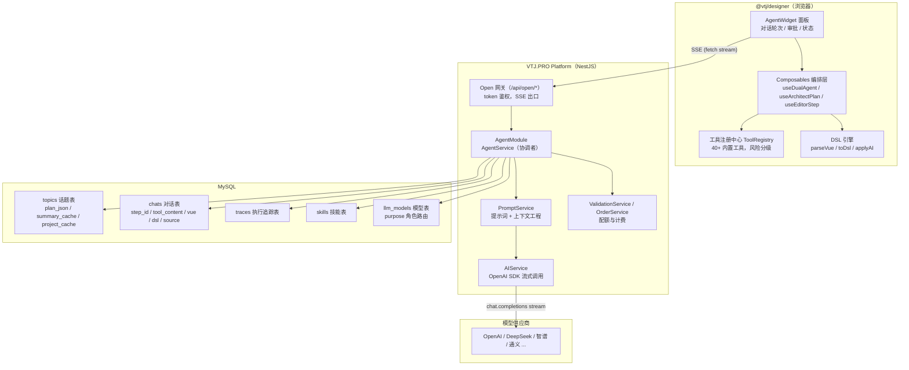
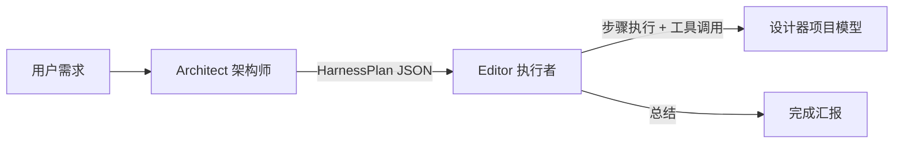
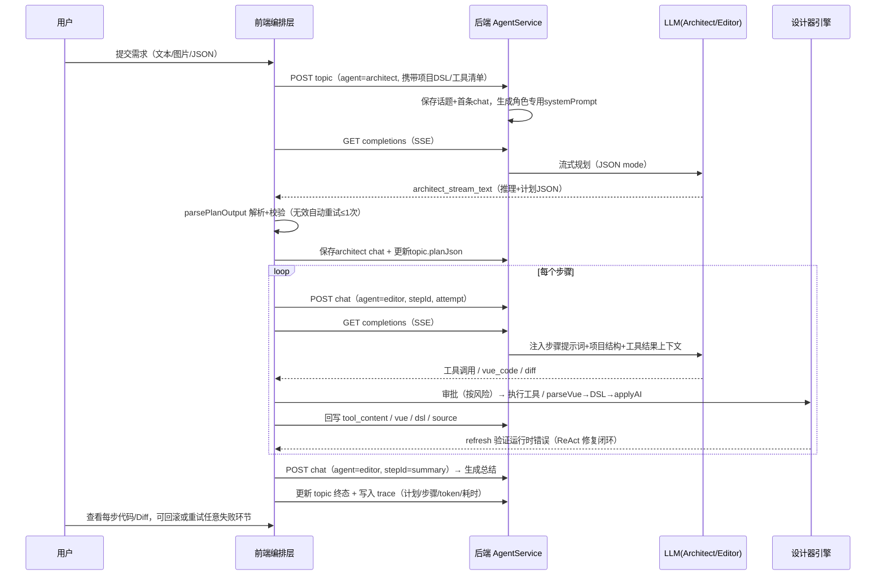
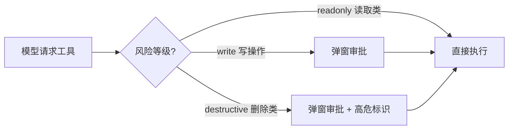

# VTJ.PRO AI Agent 技术白皮书

> 面向开源社区的技术评审文档
>
> 版本：v1.0 ｜ 引擎：@vtj/designer + VTJ.PRO Platform ｜ 关键词：双代理、DSL、ReAct、SSE、上下文工程

---

## 目录

1. [摘要](#1-摘要)
2. [背景与定位](#2-背景与定位)
3. [总体架构](#3-总体架构)
4. [双代理架构设计](#4-双代理架构设计)
5. [Agent 工作流拆解](#5-agent-工作流拆解)
6. [上下文工程：裁剪、摘要与缓存](#6-上下文工程裁剪摘要与缓存)
7. [工具系统与安全审批](#7-工具系统与安全审批)
8. [可靠性设计](#8-可靠性设计)
9. [多模态输入与技能系统](#9-多模态输入与技能系统)
10. [计费、配额与可观测性](#10-计费配额与可观测性)
11. [技术特点与创新点](#11-技术特点与创新点)
12. [局限性与演进方向](#12-局限性与演进方向)
13. [附录：关键实现位置](#13-附录关键实现位置)

---

## 1. 摘要

VTJ.PRO 是一个开源的 AI 低代码引擎，核心哲学是「**生成代码即源码**」：通过 **DSL 与 Vue 3 源码的双向转换**，让可视化设计与工程化开发无缝融合。本文评审的 **AI Agent 系统**是该引擎的智能中枢——它内嵌于可视化设计器，将用户的自然语言需求转化为**可执行的、可追溯的、可恢复的**工程化修改。

Agent 系统的核心是一套 **双代理（Dual-Agent）架构**：

- **Architect（架构师）**：面向需求做全局规划，输出结构化执行计划（HarnessPlan）；
- **Editor（执行者）**：按计划逐步执行，通过 ReAct 循环调用设计器工具、生成/修复代码，并以 `refresh` 工具做运行时验证闭环；
- **single（单代理）**：兼容传统的一问一答式代码生成。

系统在 **上下文工程**（预算裁剪、增量摘要、多级缓存）、**可靠性**（断点恢复、最小粒度重试、中断兜底）、**安全性**（工具风险分级与人工审批）三个维度上做了大量工程化设计，是少见的「低代码 + Agent」深度融合实践，值得开源社区借鉴。

---

## 2. 背景与定位

### 2.1 要解决的问题

低代码平台长期面临两大质疑：

1. **生成代码不可控**：拖拽产物是黑盒，无法二次开发、无法维护；
2. **AI 生成不可落地**：大模型输出的是「代码片段」，与工程结构（页面、路由、API、依赖、全局配置）脱节，用户需要手工搬运。

VTJ.PRO 的回答是：**以 DSL 为中间表示，让 AI 直接操作工程模型**。Agent 生成的 Vue 源码经过 `parseVue` 编译为 DSL 后，通过 `engine.applyAI` 原子地落入项目模型，设计器画布、代码编辑器、项目文件三者实时同步——AI 的产出不是一段孤立的文本，而是**结构化的、可继续可视化编辑的工程资产**。

### 2.2 定位与适用场景

| 维度     | 说明                                                                 |
| -------- | -------------------------------------------------------------------- |
| 载体     | 内嵌于可视化设计器的「智能体」面板（AgentWidget）                    |
| 输入     | 自然语言、设计稿图片、Sketch/Figma/MasterGo JSON、项目上下文         |
| 输出     | 对当前工程的增量修改：建页面、改区块、配 API、设全局样式/状态/权限等 |
| 交付形态 | 标准 Vue3 工程（Web / H5 / UniApp），零锁定                          |

---

## 3. 总体架构

### 3.1 架构总览



### 3.2 前端分层

前端代码集中在 `@vtj/designer` 的 `components/widgets/agent/` 目录，采用 **Composable 分层 + 依赖注入（DI）** 的组织方式，职责边界清晰：

| 层       | 模块                                                                                                        | 职责                                               |
| -------- | ----------------------------------------------------------------------------------------------------------- | -------------------------------------------------- |
| 视图层   | `index.vue`、`conversation-round.vue`、`editor-step.vue`、`architect-plan.vue`、`summary.vue`、`detail.vue` | 对话轮次渲染、流式文本、代码/Diff 查看、审批 UI    |
| 编排层   | `useDualAgent`                                                                                              | 顶层流程控制：启动/续聊/取消/恢复/重试的统一入口   |
| 执行层   | `useArchitectPlan`                                                                                          | Architect 规划、Editor 步骤链、总结与 trace 收尾   |
| 执行层   | `useEditorStep`                                                                                             | 单步骤内的 ReAct 多轮循环（工具/代码/Diff）        |
| 基础设施 | `useSSEStream`、`useAgentApi`、`useAuth`、`useFileRecognition`、`useReplayChat`                             | SSE 封装、API 容错包装、登录态、文件识别、历史回放 |
| 工具层   | `managers/built-in/tools.ts`（`TOOL_CONFIGS`）                                                              | 40+ 声明式工具定义与风险声明                       |

> 设计亮点：所有 composable 通过**参数对象注入**（`DualAgentInfrastructure` / `DualAgentApi` / `DualAgentState`）组合，不依赖全局单例，便于单测与替换；状态写入统一收敛到 `setStatus` 闭包，避免双 ref 漂移。

### 3.3 后端分层

后端为 NestJS 模块化单体，Agent 相关能力分布在两个业务模块：

- **`AgentModule`**（`business/agent/`）：领域核心，`AgentService` 作为**服务协调者**（Facade），组合 6 个子服务：
  - `TopicService` / `ChatService`：话题与对话的持久化；
  - `PromptService`：提示词模板渲染、消息构建、上下文工程（裁剪/摘要/缓存）；
  - `AIService`：OpenAI 兼容 SDK 的流式调用、中断控制、错误标准化；
  - `ValidationService`：配额/订阅校验；
  - `ConfigService`：LLM 配置解析与角色路由。
- **`OpenModule`**（`business/open/`）：面向设计器的**开放网关**，`@Public()` + token 鉴权，提供 SSE 端点 `/api/open/completions/:token` 及话题/对话/订单等 REST 接口，将平台内部实现与前端解耦。

### 3.4 数据模型

核心是 `topics`（话题，一次任务的根实体）与 `chats`（对话，任务内每一步的流水账）双表设计，二者 1:N 关联：

```
topics  ──1:N──  chats
```

`topics` 关键字段：`plan_json`（执行计划）、`summary_cache`（增量摘要缓存）、`project_cache`（项目快照）、`agent_role`、`status`（draft/planning/executing/completed/failed/cancelled）、`current_step_id`。

`chats` 是 Agent 的「操作日志」，除消息内容外还记录工程语义字段：

- `agent_role` + `step_id` + `attempt`：定位到「哪个角色的第几步的第几次尝试」；
- `tool_content`：工具调用的结构化结果（`{action, parameters, result, approval}`），供后续步骤注入上下文；
- `vue` / `dsl` / `source`：**代码产物审计三元组**（生成代码、DSL、修改前源码），实现「每个改动都可回放、可追溯」。

---

## 4. 双代理架构设计

### 4.1 角色定义



| 角色      | 职责                                                | 输出协议                                                                      | 关键约束                                                       |
| --------- | --------------------------------------------------- | ----------------------------------------------------------------------------- | -------------------------------------------------------------- |
| Architect | 理解需求、拆解步骤、判断安全等级                    | `HarnessPlan`：`{intent, contextKeys, steps[], safety}` 或纯文本答复 `answer` | 强制 JSON mode（`response_format=json_object`），temperature=0 |
| Editor    | 逐步骤执行：工具调用、代码生成、Diff 应用、错误修复 | 工具调用 `{action, parameters}` / `vue_code` / `diff` / 文本                  | 单步骤内最多 `MAX_TURNS` 轮 ReAct 循环                         |
| single    | 传统单代理问答式生成                                | 自由格式                                                                      | 兼容旧流程，使用 coder 提示词                                  |

**分工的价值**：规划与执行分离避免了「边想边做」导致的上下文污染——Architect 的上下文只包含「需求 + 项目结构 + 执行进度」，不含 Editor 的步骤级代码文本；Editor 的上下文只包含「计划 + 本步骤 + 工具结果」，不含 Architect 的规划文本。

### 4.2 角色专用提示词与模型路由

- **提示词**：后端 `PromptService.createSystemPromptByRole` 按角色渲染模板（`ai_prompts_config_architect` / `ai_prompts_config_editor`），未配置时回退 coder 模板；
- **模型路由**：`llm_models` 表为模型标注 `purpose`（coder / architect / editor / multimodal）。`ConfigService.getLLMConfigByRole` 的解析优先级为：

```
自定义模型（用户自带 key） > 用户显式指定模型 > auto 按角色选专用模型 > 回退 coder 模型
```

- **多供应商**：基于 OpenAI 兼容协议，`createOpenAIClient` 统一封装 baseURL + apiKey，支持 OpenAI、Azure、Anthropic、Google、DeepSeek、智谱、百度、阿里、腾讯及任意自定义端点；多 key 以 `;` 分隔存储，请求时随机轮询实现负载均衡与容灾。

### 4.3 角色上下文隔离（关键细节）

后端的 `createCompletionParams` 对两条消息流做了**按角色的上下文隔离**，这是双代理能长期稳定工作的关键：

- **Editor 视角**：剥离所有 Architect chat 的 `assistantContent`（防止模型误认为自己是规划者而抢跑执行）；
- **Architect 视角**：剥离 Editor 步骤级 chat 的 user/assistant 文本，**仅保留 `toolContent` 中的工具结果**——因为 `getPages`/`getBlocks` 返回的实体 ID 是后续规划引用真实 ID 的依据（否则模型只能编造占位符 ID，导致删除/更新类任务失效）。

### 4.4 双代理状态机

话题级状态机由前后端协同驱动：

- 后端负责 `executing / cancelled / completed / failed` 的兜底同步（`syncTopicStatusExecuting`、取消补录）；
- 前端显式驱动 `planning → executing`（依赖 planning 判定标题更新），避免后端覆盖前端刚写入的规划状态——**前后端各管一段，通过注释与代码双重约定边界**，是协作设计上值得借鉴的细节。

---

## 5. Agent 工作流拆解

### 5.1 完整流程（单轮）



### 5.2 单步骤内 ReAct 多轮循环（Editor）

`useEditorStep.executeEditorStep` 实现了类 ReAct 的循环：每个步骤内，模型可多次「思考 → 行动」，直至步骤完成或达到 `MAX_TURNS`：

1. **输出解析分发**：`parseOutput` 将模型输出归类为 `tool_call` / `vue_code` / `diff` / `text` 四种类型，各自走专属处理管线；
2. **工具调用**：解析 `{action, parameters}` → 风险审批（见第 7 章）→ `toolRegistry.execute` 执行 → 结果回写 `tool_content` → 反馈给模型继续；
3. **vue_code**：源码 → `parseVue` 编译为 DSL（失败时把解析错误列表反馈给模型重试）→ 审批 → `applyAI` 落库；
4. **diff**：对当前文件源码执行 SEARCH/REPLACE 补丁，内置**精确匹配校验**（0 处匹配 / 多处匹配均反馈错误让模型重写 SEARCH 块），CRLF 归一化处理；
5. **验证闭环**：`refresh` 工具触发设计器模拟器刷新并捕获运行时错误——若有错，自动拉取源码与错误信息回灌给模型继续修复，直到验证通过。**这是「AI 生成代码可运行」的关键保障**。

### 5.3 总结与收尾

全部步骤成功后，Editor 以 `stepId=summary` 的专用 chat 生成任务总结；前端随后 `updateTopic` 写入终态并 `saveTrace` 落库执行追踪（计划、步骤记录、总 token、总耗时），完成可观测闭环。

---

## 6. 上下文工程：裁剪、摘要与缓存

多步骤 Agent 最大的技术挑战是 **上下文长度随步骤数线性增长**（步骤越靠后，单次调用 token 越大，呈 O(n²) 累积）。系统用三级策略（代码中标记为 P0/P1/P2）解决：

### 6.1 P0：预算裁剪（分级丢数据）

```
CONTEXT_BUDGET = 20K tokens（仅约束 chats 部分，systemPrompt 固定成本不参与）
```

- 最近 `FULL_KEEP_COUNT=6` 条 chat **全量保留**（保证重试/修复上下文完整）；
- 窗口外历史按价值从低到高裁剪：`toolContent → assistantContent → userContent`；
- 首条用户需求永不裁剪，预算超限时从最老开始兜底裁 user 消息；
- 附带两个文本级优化：`stripPrevStepContext` 剔除 userContent 中冗余的「前序步骤结果」前缀；工具结果统一由 `toolContent` 字段承载为独立消息，杜绝重复累加。

### 6.2 P1：增量摘要（用语义换长度）

- 触发：Editor 步骤成功完成且自上次摘要以来新增步骤数 ≥ `SUMMARY_TRIGGER_STEPS=5`；
- 执行：`saveChat` 后**异步**调用 LLM 将窗口外历史压缩为进度摘要，缓存到 `topic.summaryCache`；
- 注入：后续 completion 中，`lastChatId` 之前的历史由摘要替代，且**摘要与原始消息严格不重叠**；
- 并发安全：生成期间若摘要已被其他请求更新（`lastChatId` 变化），放弃本次覆盖（乐观并发控制）；
- 降级：摘要失败时静默退化为纯裁剪，不阻塞主流程。

### 6.3 P2：多级内存缓存（省数据库与重复展开）

- **chats 查询缓存**：completion 每步先核对 `lastChatId/updatedAt` 一致性元数据，未变化则复用全量查询结果；`saveChat` 写成功后主动失效；跨实例由元数据不一致自动触发重建（LRU 上限 100 话题）；
- **chat 展开缓存**：每条 chat 展开为 user/assistant/tool 三段消息后按 `chatId + 内容指纹`（轻量 djb2）缓存，字段变化指纹失效自动重建，无需手动失效（LRU 上限 3000 条）；
- **token 估算免依赖**：内置 CJK 按 1 字/token、其他按 4 字符/token 的估算器，不引入分词库。

> 这三级的组合拳（丢细节 / 换语义 / 省开销）是一个完整的上下文治理闭环，对任何多轮 Agent 系统都有直接借鉴意义。

---

## 7. 工具系统与安全审批

### 7.1 声明式工具定义

工具以 `ToolConfig` 声明（名称、自然语言描述、JSON Schema 参数、handler 工厂、风险等级），运行时通过 `toolRegistry.register` 注册，并在建话题时随请求提交给后端注入提示词（`generateToolDescriptions`）。40+ 内置工具覆盖：

- **页面**：`getPages` / `createPage` / `updatePage` / `movePage` / `removePage` / `setHomepage`；
- **区块**：`getBlocks` / `createBlock` / `updateBlock` / `removeBlock` / `active` / `getCurrentFile(Content)`；
- **API**：`getApis` / `setApi(s)` / `removeApi(s)`；
- **依赖**：`getDeps` / `setDeps` / `removeDeps`（`official` 依赖不可改，防破坏）；
- **全局能力**：CSS / Pinia Store / 权限插件 / Axios 与拦截器 / 路由守卫 / i18n / 环境变量 / UniApp 配置；
- **验证**：`refresh`（运行时错误检测，ReAct 闭环的基石）；
- **技能**：`getSkills`（按需拉取技能文档）。

### 7.2 风险分级与人工审批



- 显式声明：`TOOL_RISKS` 表为每个写工具标注 `write` / `destructive`（`removePage`、`removeApi`、`removeDeps` 等删除类均为 destructive）；
- 隐式推断：未声明的 `get*` / `refresh` 视为只读免审批，其余写操作按 `write` 兜底；
- **审批体验**：审批请求以 Promise 挂在 `approvalResolvers` Map 上，支持「全部批准」（autoApprove）一键切换；运行中关闭 autoApprove 会立即挂起后续审批；取消任务时统一 reject 所有挂起审批。
- 审批结果随 `tool_content` 落库，形成**审计证据**。

### 7.3 防御性工具设计

工具 handler 内置大量防「假成功」校验：删除不存在的页面/区块/API/i18n 词条时返回明确错误并引导模型先调用查询工具获取真实 ID；批量删除前全量校验、任一不存在则整体失败；`official` 依赖跳过保护。这些细节显著提升了模型在真实工程中的工具使用成功率。

---

## 8. 可靠性设计

### 8.1 SSE 流与中断兜底

- 前端 `useSSEStream` 用原生 `fetch` + `ReadableStream` 逐行解析 SSE，支持推理内容（`reasoning_content`）与 usage 统计的分离收集；abort 控制器贯穿「编排层 → SSE 层」；
- 后端 `AIService.createCompletion` 以 RxJS Observable 承载流，`AbortController` 按 chatId 注册管理；**关键兜底**：若客户端在未正常结算时退订（刷新/断网/关页），`markInterrupted` 自动将 chat 与 topic 标记为 cancelled 并补录 trace——中断状态永不丢失。

### 8.2 断点恢复（三级粒度）

取消/中断后，`resumeLastRound` 根据断点位置自动选择最小恢复范围：

| 断点位置                | 恢复策略                                              |
| ----------------------- | ----------------------------------------------------- |
| 规划阶段取消（无 plan） | 复用 architectChatId 重跑规划                         |
| 步骤执行中取消          | 标记 `aborted` 槽位，从断点步骤续跑（跳过已完成步骤） |
| 总结阶段取消            | 仅重新生成总结                                        |

配合后端 `buildEditorProgressSummary`：Architect 续跑时被注入「上一轮执行进度」（步骤级 ✅/⏸/❌ 状态 + 查询类工具结果），**避免模型因看不到执行历史而从头重复执行**——这是「继续执行上一轮计划」类需求能正确工作的核心机制。

### 8.3 最小粒度重试

- 用户可重试**任意轮次的任意失败步骤**（不再局限于最后一轮），`retryLastRound` 自动定位失败位置选择最小重试范围（步骤 > 总结 > 规划）；
- 提交阶段失败（建话题/建 chat 失败，轮次未创建）时记录 `lastFailedSubmission`，重试直接重放原请求，避免新建重复话题；
- Architect 输出无效（空/缺字段/错误占位）时自动重试 ≤1 次，且重试前将无效输出标记 Failed 落库，后端据此注入 `RETRY_CORRECTION_PROMPT` 纠错提示（指明角色与输出协议）；
- 服务端 `saveChat` 按 id 合并更新（`mergeKeys` 白名单），前端 `saveWithRetry` 幂等重试，网络抖动不产生脏数据。

### 8.4 响应容错

前端 `pickTopic` / `pickChat` 统一解包响应（兼容裸对象 / 包裹对象 / id 双命名）；服务端错误经 `normalizeCompletionError` 标准化（OpenAI APIError / AbortError→499 / 未知→500）；额度用尽类文案（`isPayLimitError`）前端即时弹出付费引导，不依赖轮询。

---

## 9. 多模态输入与技能系统

### 9.1 多模态输入

- **图片**：`recognitionImage` 调用多模态模型（`purpose=multimodal`）产出 `<summary_title>` / `<image_analysis>` 结构化描述（解析器兼容缺失闭合标签的容错），再转译为 UI 生成提示词；
- **设计稿 JSON**：`detectJsonTopicType` 自动识别 Sketch / Figma / MasterGo 元数据，`generateJsonPrompt` 转译为可执行的页面还原提示词；
- **附件**：前端 `useFileRecognition` 上传图片/JSON 后先行识别，识别描述作为「隐性上下文」追加进用户提示词，气泡仍展示纯文本。

### 9.2 技能系统

`skills` 表以「编码 + 平台 + 分类」组织技能文档（Vue3 写法、ElementPlus 用法、Pinia、UniApp 生命周期等），按平台过滤后随 systemPrompt 注入；`getSkills` 工具允许模型**按需拉取**指定技能文档，避免全量注入的 token 开销——「基础常识内置于提示词，深度文档按需获取」的分层策略同样值得借鉴。

---

## 10. 计费、配额与可观测性

### 10.1 配额与计费

- `ValidationService` 支持两种运营模式：`invite`（必须有有效订单）与 `subscribe`（免费体验次数 + 订阅）；
- token 计量：`stream_options.include_usage` 精确统计，`saveChat` 仅在传入有效 token 时扣费（工具结果保存等无 token 请求跳过，避免 NaN 污染订单）；
- 自定义模型（自带 key）不扣平台额度。

### 10.2 可观测性：Trace

`traces` 表按 traceId 记录每次任务的 `plan_json`、`steps_json`（步骤级：状态/内容/错误/token/耗时）、`final_status`、`total_tokens`、`total_duration`、`retries`、`plan_revisions`；**取消/中断场景由后端兜底补录**（幂等，同一 traceId 跳过），保证「任务总有终态记录」——为后续的质量分析、成本核算、模型效果回归提供了数据底座。

---

## 11. 技术特点与创新点

1. **DSL 为中枢的 Agent**：AI 产出 → Vue 源码 → `parseVue` → DSL → `applyAI`，生成物天然进入可视化工程体系，低代码与 AI 不再是两张皮；
2. **双代理职责分离 + 上下文隔离**：规划/执行解耦，按角色剥离对方消息、只保留工具结果，有效抑制角色错位与抢跑；
3. **三级上下文治理**：预算裁剪（P0）+ 增量语义摘要（P1）+ 多级指纹缓存（P2），把 O(n²) 的上下文累积压到近似 O(1) 的注入成本；
4. **可恢复的流程编排**：断点恢复 + 最小粒度重试 + 后端中断兜底，让长任务在不可靠网络下依然「可续可查」；
5. **声明式工具 + 风险分级审批**：40+ 工具统一注册、统一提示词注入、统一审批流，写/删操作强制人工确认，兼顾效率与安全；
6. **ReAct 验证闭环**：`refresh` 把「运行时错误」变成模型可读的反馈信号，自动修复直至通过，显著提升生成代码的可运行率；
7. **纯函数式提示词工程**：提示词模板存于数据库配置（`ai_prompts_config_*`），运营可热更新，代码零改动；角色提示词 fallback 链完整；
8. **工程级防御**：输出解析容错（括号配对扫描、错误占位剔除）、工具防假成功校验、CRLF 归一化、幂等合并保存——大量细节围绕「模型不可靠」这一前提展开。

---

## 12. 局限性与演进方向

- **单机内存缓存**：P0/P1/P2 中的缓存目前为进程内存实现，多实例部署时依赖一致性元数据自愈，可演进为 Redis 分布式缓存；
- **上下文预算静态化**：`CONTEXT_BUDGET` 为固定 20K，未按模型上下文窗口动态适配（DeepSeek R1 已支持 64K 输出），可演进为按模型档位动态预算；
- **无长期记忆**：摘要仅缓存于话题内，跨话题的项目级经验沉淀（如团队编码规范偏好）尚未建立，可结合技能系统做项目级记忆；
- **无流式工具流**：工具调用仍需「生成 → 解析 → 执行 → 再生成」的串行往返，未来可探索 OpenAI 原生 function calling / 多工具并行；
- **审批粒度**：当前为「工具级」一次性审批，可演进为「参数级」预览审批（如展示将删除的页面名与依赖影响）。

---

## 13. 附录：关键实现位置

| 关注点               | 位置                                                         |
| -------------------- | ------------------------------------------------------------ |
| 前端面板             | `packages/designer/src/components/widgets/agent/index.vue`   |
| 双代理编排           | `.../agent/composables/useDualAgent.ts`                      |
| 规划执行与总结       | `.../agent/composables/useArchitectPlan.ts`                  |
| 步骤 ReAct 循环      | `.../agent/composables/useEditorStep.ts`                     |
| SSE 流封装           | `.../agent/composables/useSSEStream.ts`                      |
| 内置工具集           | `packages/designer/src/managers/built-in/tools.ts`           |
| 后端协调者           | `backend/src/business/agent/services/agent.service.ts`       |
| 提示词与上下文工程   | `backend/src/business/agent/services/prompt.service.ts`      |
| 流式 LLM 调用        | `backend/src/business/agent/services/ai.service.ts`          |
| 开放网关（SSE 出口） | `backend/src/business/open/open.controller.ts`               |
| 数据模型             | `backend/src/business/agent/entities/{topic,chat}.entity.ts` |

---

> **许可**：本文档随 VTJ.PRO 开源仓库发布，遵循仓库 LICENSE；欢迎社区就架构设计、上下文工程、Agent 编排等主题展开讨论与共建。
