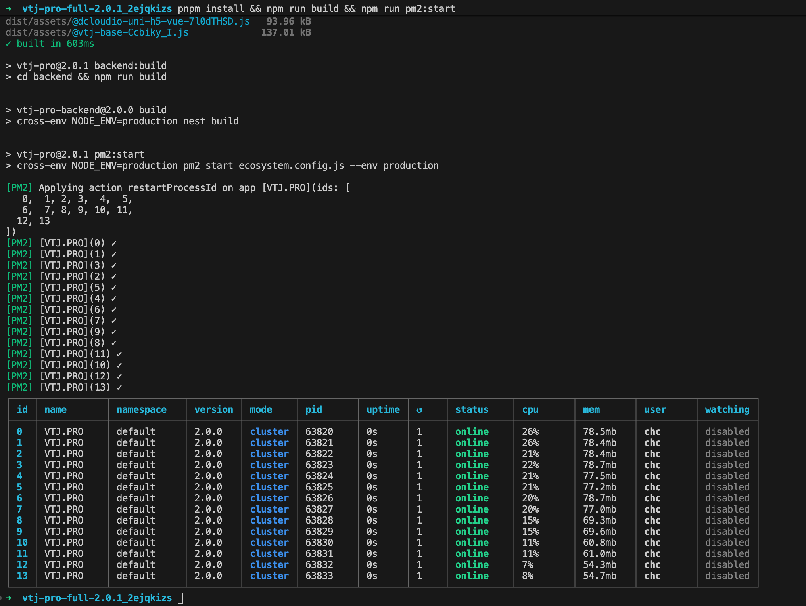

# 部署和运维

本文介绍如何在服务器上部署VTJ.PRO应用开发平台。

## 部署到服务器

项目完成初始化后，把项目工程全部文件上传到服务器，服务器需要安装 Nginx、 Node.js、pnpm。

可以在服务器从 git 仓库拉取项目的方式下载。

假定项目源码在服务器上的文件路径是：`/home/vtj-pro/`

### 后端服务

服务器需要预设安装 `Node.js` 和 `pnpm`

#### 安装 pm2 日志模块

首次部署，需运行以下命令完成pm2日志模块安装，只需运行一次。

```bash
npm run pm2:init
```

#### 编译项目并启动后端服务

完成后，依次执行以下命令：

```bash
pnpm install && npm run build && npm run pm2:start
```

显示以下界面，即表示后端服务已启动。



### 前端服务

前端服务用 `Nginx` 部署，前端的编译产物文件夹路径是：`/home/vtj-pro/frontend/dist/`。 完整 nginx.conf 配置参考：

```nginx
user www-data;
worker_processes auto;
pid /run/nginx.pid;
error_log /var/log/nginx/error.log;
include /etc/nginx/modules-enabled/*.conf;

events {
	worker_connections 1024;
	# multi_accept on;
}

http {
    log_format  main  '$remote_addr - $remote_user [$time_local] "$request" '
                      '$status $body_bytes_sent "$http_referer" '
                      '"$http_user_agent" "$http_x_forwarded_for"';

	##
	# Basic Settings
	##

    sendfile            on;
    tcp_nopush          on;
    tcp_nodelay         on;
    keepalive_timeout   65;
    types_hash_max_size 4096;
	# server_tokens off;

	# server_names_hash_bucket_size 64;
	# server_name_in_redirect off;

	include /etc/nginx/mime.types;
	default_type application/octet-stream;

	##
	# SSL Settings
	##

	ssl_protocols TLSv1 TLSv1.1 TLSv1.2 TLSv1.3; # Dropping SSLv3, ref: POODLE
	ssl_prefer_server_ciphers on;

	##
	# Logging Settings
	##

	access_log /var/log/nginx/access.log;

	##
	# Gzip Settings
	##

	gzip on;

	# gzip_vary on;
	# gzip_proxied any;
	# gzip_comp_level 6;
	# gzip_buffers 16 8k;
	# gzip_http_version 1.1;
	# gzip_types text/plain text/css application/json application/javascript text/xml application/xml application/xml+rss text/javascript;

	##
	# Virtual Host Configs
	##

	include /etc/nginx/conf.d/*.conf;
	include /etc/nginx/sites-enabled/*;

    server {
        listen       80;
        listen       [::]:80;
        server_name  app.vtj.pro;
        root         /home/vtj-pro/frontend/dist;
        client_max_body_size 10M;
        # Load configuration files for the default server block.
        include /etc/nginx/default.d/*.conf;

        error_page 404 /404.html;
        location = /404.html {
        }

        error_page 500 502 503 504 /50x.html;
        location = /50x.html {
        }

        location /api/ {
            proxy_pass http://127.0.0.1:3000;
            proxy_set_header Host $host;
            proxy_set_header X-Real-IP $remote_addr;
            proxy_set_header X-Forwarded-For $proxy_add_x_forwarded_for;
            proxy_set_header X-Forwarded-Proto $scheme;
			client_max_body_size 10M;
        }

        location /dev/ {
            try_files $uri $uri/ /dev/index.html;
        }

        location /web/ {
            try_files $uri $uri/ /web/index.html;
        }

        location /h5/ {
            try_files $uri $uri/ /h5/index.html;
        }

        location /uniapp/ {
            try_files $uri $uri/ /uniapp/index.html;
        }

        location /uploadfiles/ {
            alias /home/vtj-pro/backend/uploadfiles/;
            index index.html;
            try_files $uri $uri/ =404;
        }
    }

    # Settings for a TLS enabled server.

    server {
        listen       443 ssl http2;
        listen       [::]:443 ssl http2;
        server_name  app.vtj.pro;
        root         /home/vtj-pro/frontend/dist;
        client_max_body_size 10M;
        ssl_certificate "/home/app.vtj.pro_nginx/app.vtj.pro.pem";
        ssl_certificate_key "/home/app.vtj.pro_nginx/app.vtj.pro.key";
        ssl_session_cache shared:SSL:1m;
        ssl_session_timeout  10m;
        ssl_ciphers HIGH:!aNULL:!MD5;
        ssl_prefer_server_ciphers on;

        # Load configuration files for the default server block.
        include /etc/nginx/default.d/*.conf;

        error_page 404 /404.html;
        location = /40x.html {
        }

        error_page 500 502 503 504 /50x.html;
        location = /50x.html {
        }

        location /api/ {
            proxy_pass http://127.0.0.1:3000;
            proxy_set_header Host $host;
            proxy_set_header X-Real-IP $remote_addr;
            proxy_set_header X-Forwarded-For $proxy_add_x_forwarded_for;
            proxy_set_header X-Forwarded-Proto $scheme;
			client_max_body_size 10M;
        }

        location /dev/ {
            try_files $uri $uri/ /dev/index.html;
        }

        location /web/ {
            try_files $uri $uri/ /web/index.html;
        }

        location /h5/ {
            try_files $uri $uri/ /h5/index.html;
        }

        location /uniapp/ {
            try_files $uri $uri/ /uniapp/index.html;
        }

        location /uploadfiles/ {
            alias /home/vtj-pro/backend/uploadfiles/;
            index index.html;
            try_files $uri $uri/ =404;
        }
    }
}
```

### 重点关注配置项

- `location /api/`
- `location /dev/`
- `location /web/`
- `location /h5/`
- `location /uniapp/`
- `location /uploadfiles/`

### Nginx 配置文件说明

#### 1. 全局配置

- **用户和工作进程**：使用 `www-data` 用户运行，工作进程数自动调整
- **进程ID文件**：`/run/nginx.pid`
- **错误日志**：`/var/log/nginx/error.log`
- **模块配置**：包含 `/etc/nginx/modules-enabled/*.conf` 中的所有模块配置

#### 2. 事件模块配置

- **工作连接数**：每个工作进程最多处理 1024 个连接

#### 3. HTTP 配置块

- **日志格式**：定义了 `main` 日志格式，包含客户端IP、用户、时间、请求、状态码、响应大小等信息
- **基本设置**：
  - `sendfile on`：使用高效的文件传输方式
  - `tcp_nopush on`：优化TCP数据包发送
  - `keepalive_timeout 65`：保持连接超时时间为65秒
- **MIME类型**：包含 `/etc/nginx/mime.types` 文件中的MIME类型配置
- **SSL设置**：支持 TLSv1 到 TLSv1.3 协议，优先使用服务器端密码套件
- **访问日志**：`/var/log/nginx/access.log`
- **Gzip压缩**：启用Gzip压缩以减小传输文件大小

#### 4. HTTP 服务器配置（端口 80）

- **监听端口**：80（IPv4和IPv6）
- **服务器名称**：`app.vtj.pro`（需根据实际域名修改）
- **根目录**：`/home/vtj-pro/frontend/dist`（前端构建产物目录）
- **客户端请求体大小**：最大 10MB（适用于文件上传）

##### 路由配置说明：

- **`/api/`**：代理到后端服务（`http://127.0.0.1:3000`），用于处理API请求
- **`/dev/`**：开发环境前端路由，使用 `try_files` 实现前端路由
- **`/web/`**：Web端前端路由
- **`/h5/`**：H5移动端前端路由
- **`/uniapp/`**：UniApp前端路由
- **`/uploadfiles/`**：静态文件服务，映射到后端上传文件目录

#### 5. HTTPS 服务器配置（端口 443）

- **监听端口**：443（支持SSL和HTTP/2）
- **SSL证书**：
  - 证书文件：`/home/app.vtj.pro_nginx/app.vtj.pro.pem`
  - 私钥文件：`/home/app.vtj.pro_nginx/app.vtj.pro.key`
- **SSL会话缓存**：共享缓存，大小1MB，超时10分钟
- **密码套件**：使用高强度密码套件，禁用不安全的算法
- **其他配置**：与HTTP服务器相同的路由配置

#### 6. 关键配置项说明

- **`proxy_pass`**：将 `/api/` 请求代理到后端服务（端口3000）
- **`try_files`**：用于前端路由，当请求的文件不存在时返回对应的 `index.html`
- **`alias`**：将URL路径映射到文件系统目录（用于静态文件服务）
- **`client_max_body_size`**：限制客户端请求体大小，影响文件上传功能

#### 7. 部署注意事项

1. **域名配置**：将 `server_name` 修改为实际域名
2. **路径修改**：
   - 根目录路径：根据实际部署位置修改 `/home/vtj-pro/frontend/dist`
   - 上传文件目录：根据实际位置修改 `/home/vtj-pro/backend/uploadfiles/`
   - SSL证书路径：根据证书实际存放位置修改
3. **后端服务地址**：确保后端服务在 `127.0.0.1:3000` 运行
4. **文件权限**：确保Nginx进程有权限访问相关目录和文件
5. **SSL证书**：如需启用HTTPS，需要获取有效的SSL证书

#### 8. 配置文件使用步骤

1. 将本配置文件保存为 `/etc/nginx/nginx.conf` 或 `/etc/nginx/sites-available/vtj-pro`
2. 创建符号链接到 `/etc/nginx/sites-enabled/` 目录
3. 测试配置文件语法：`nginx -t`
4. 重新加载Nginx配置：`nginx -s reload` 或 `systemctl reload nginx`

## 运维相关命令

- 启动后端服务

  ```bash
  npm run pm2:start
  ```

- 停止后端服务

  ```bash
  npm run pm2:stop
  ```

- 重启后端服务

  ```bash
  npm run pm2:restart
  ```

- 查看后端日志

  ```bash
  npm run pm2:logs
  ```

- 后端服务监视器

  ```bash
  npm run pm2:monit
  ```
