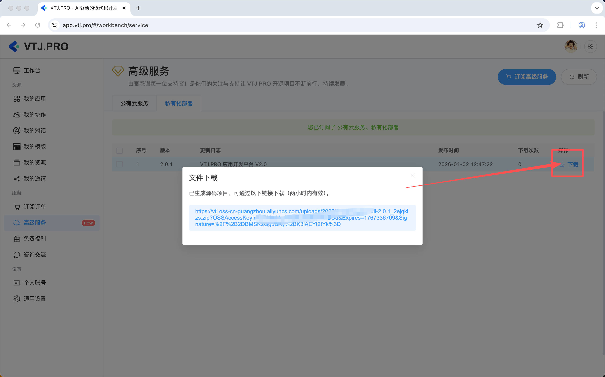
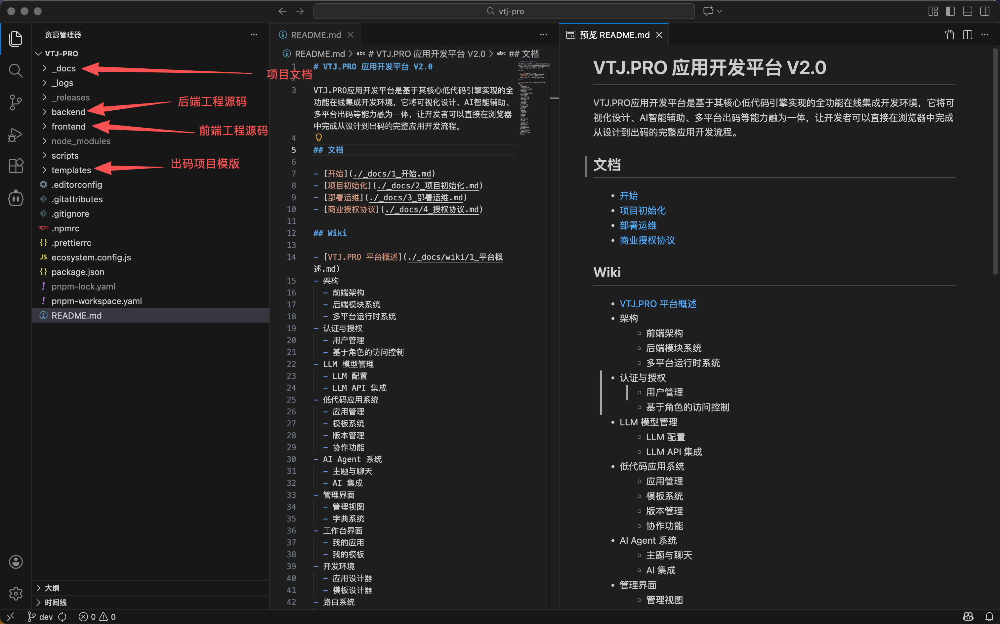

# VTJ.PRO 应用开发平台 V2.0

**VTJ.PRO**是一款 AI 驱动的 Vue3 低代码引擎，它通过独特的设计，让开发者既能享受可视化开发的快捷，又完全拥有对生成代码的自主控制权。其核心是为前端开发者提供"降本增效"的工具。

**VTJ.PRO应用开发平台**是基于其核心低代码引擎实现的全功能在线集成开发环境，它将可视化设计、AI智能辅助、多平台出码等能力融为一体，让开发者可以直接在浏览器中完成从设计到出码的完整应用开发流程。

## 源码获取方式

订阅高级服务，登录 [https://app.vtj.pro/#/workbench/service](https://app.vtj.pro/#/workbench/service) 下载。



## 项目工程

此项目工程采用 `pnpm` 搭建的 `Monorepo` 项目。 前端（frontend） 与 后端（backend） 分别是独立的子包项目。



### 开发环境要求

- node v20+
- pnpm v10+

### 前端技术栈

- Vite v6
- Vue v3
- TypeScript
- ElementPlus

### 后端技术栈

- NestJs v11
- MySQL 8.0
- pm2

### 推荐服务器配置

- **CPU & 内存：** 2 核（vCPU）4 GiB
- **操作系统：** Ubuntu 24.04 64位
- **安装程序：** Nginx、Node.js、MySQL
- **对象存储：** 阿里云OSS(可选)

### 项目目录结构

```
vtj-pro/                            # 项目根目录
├── .editorconfig                   # 编辑器配置
├── .gitattributes                  # Git属性配置
├── .gitignore                      # Git忽略文件
├── .npmrc                          # npm配置
├── .prettierrc                     # 代码格式化配置
├── ecosystem.config.js             # PM2配置文件
├── package.json                    # 根项目package.json
├── pnpm-workspace.yaml             # pnpm工作区配置
├── backend/                        # 后端NestJS项目
│   ├── .env                        # 环境变量
│   ├── .env.development            # 开发环境变量
│   ├── .env.production             # 生产环境变量
│   ├── .eslintrc.js                # ESLint配置
│   ├── nest-cli.json               # NestJS CLI配置
│   ├── package.json                # 后端依赖
│   ├── tsconfig.build.json         # TypeScript构建配置
│   ├── tsconfig.json               # TypeScript配置
│   ├── scripts/                    # 脚本目录
│   │   ├── migration-rollback.ts   # 数据库迁移回滚
│   │   ├── migration.ts            # 数据库迁移
│   │   ├── seed-clear.ts           # 种子数据清理
│   │   ├── seed.ts                 # 种子数据
│   │   └── zip.ts                  # 压缩脚本
│   ├── src/                        # 源代码目录
│   │   ├── app.module.ts           # 应用主模块
│   │   ├── env.d.ts                # 环境类型定义
│   │   ├── main.ts                 # 应用入口
│   │   ├── polyfill.ts             # 兼容性填充
│   │   ├── business/               # 业务模块
│   │   │   ├── index.ts
│   │   │   ├── agent/              # 代理模块
│   │   │   ├── apps/               # 应用模块
│   │   │   ├── daily/              # 日常模块
│   │   │   ├── dsl/                # DSL模块
│   │   │   ├── open/               # 开放平台模块
│   │   │   ├── orders/             # 订单模块
│   │   │   ├── products/           # 产品模块
│   │   │   ├── report/             # 报表模块
│   │   │   └── template/           # 模板模块
│   │   ├── core/                   # 核心模块
│   │   │   ├── index.ts
│   │   │   ├── cache/              # 缓存模块
│   │   │   ├── configuration/      # 配置模块
│   │   │   ├── crud/               # CRUD模块
│   │   │   ├── dictionary/         # 字典模块
│   │   │   ├── llm/                # 大语言模型模块
│   │   │   ├── oss/                # 对象存储模块
│   │   │   ├── permission/         # 权限模块
│   │   │   ├── role/               # 角色模块
│   │   │   ├── setting/            # 设置模块
│   │   │   ├── user/               # 用户模块
│   │   │   └── verification/       # 验证模块
│   │   ├── database/               # 数据库模块
│   │   │   ├── index.ts
│   │   │   ├── migration/          # 数据库迁移
│   │   │   └── seeding/            # 数据种子
│   │   └── shared/                 # 共享模块
│   │       ├── constants.ts        # 常量定义
│   │       ├── index.ts
│   │       ├── decorators/         # 装饰器
│   │       ├── enums/              # 枚举类型
│   │       ├── filters/            # 过滤器
│   │       ├── interceptors/       # 拦截器
│   │       ├── interfaces/         # 接口定义
│   │       ├── middlewares/        # 中间件
│   │       ├── pipes/              # 管道
│   │       └── utils/              # 工具函数
│   └── zip/                        # 模板压缩包
│       ├── h5/                     # H5模板
│       ├── uniapp/                 # 小程序模板
│       └── web/                    # Web模板
├── frontend/                       # 前端Vue3项目
│   ├── auth.html                   # 认证页面
│   ├── env.json                    # 环境配置
│   ├── index.html                  # 主页面
│   ├── package.json                # 前端依赖
│   ├── proxy.config.ts             # 代理配置
│   ├── tsconfig.json               # TypeScript配置
│   ├── tsconfig.node.json          # Node.js TypeScript配置
│   ├── vite.config.ts              # Vite配置
│   ├── dev/                        # 开发环境
│   │   └── index.html              # 开发环境入口
│   ├── h5/                         # H5平台
│   │   └── index.html              # H5入口
│   ├── public/                     # 静态资源
│   ├── src/                        # 源代码目录
│   │   ├── App.vue                 # 根组件
│   │   ├── auth.ts                 # 认证模块
│   │   ├── env.d.ts                # 环境类型定义
│   │   ├── main.ts                 # 应用入口
│   │   ├── apis/                   # API接口
│   │   │   ├── agent.ts            # AI助手API
│   │   │   ├── apps.ts             # 应用API
│   │   │   ├── caches.ts           # 缓存API
│   │   │   ├── daily.ts            # 日常API
│   │   │   ├── dictionaries.ts     # 字典API
│   │   │   ├── dsl.ts              # DSL API
│   │   │   ├── index.ts            # API索引
│   │   │   ├── llm.ts              # LLM API
│   │   │   ├── open.ts             # 开放平台API
│   │   │   ├── orders.ts           # 订单API
│   │   │   ├── oss.ts              # OSS API
│   │   │   ├── permissions.ts      # 权限API
│   │   │   ├── product.ts          # 产品API
│   │   │   ├── report.ts           # 报表API
│   │   │   ├── roles.ts            # 角色API
│   │   │   ├── settings.ts         # 设置API
│   │   │   ├── template.ts         # 模板API
│   │   │   ├── users.ts            # 用户API
│   │   │   └── verifications.ts    # 验证API
│   │   ├── assets/                 # 资源文件
│   │   ├── components/             # 组件目录
│   │   ├── extension/              # 扩展目录
│   │   ├── hooks/                  # 钩子函数
│   │   ├── platform/               # 平台相关
│   │   ├── router/                 # 路由配置
│   │   ├── shared/                 # 共享模块
│   │   ├── style/                  # 样式文件
│   │   ├── utils/                  # 工具函数
│   │   └── views/                  # 页面视图
│   ├── uniapp/                     # 小程序平台
│   │   └── index.html              # 小程序入口
│   └── web/                        # Web平台
│       └── index.html              # Web入口
├── scripts/                        # 项目脚本
│   ├── clean.mjs                   # 清理脚本
│   ├── publish.mjs                 # 发布脚本
│   └── template.mjs                # 模板脚本
├── templates/                      # 项目模板
│   ├── h5/                         # H5项目模板
│   ├── uniapp/                     # 小程序项目模板
│   └── web/                        # Web项目模板
└── _logs/                          # 日志目录
```

**说明：**

- 项目采用 `Monorepo` 结构，使用 `pnpm` 进行包管理
- `backend/` 目录包含完整的NestJS后端服务
- `frontend/` 目录包含Vue3前端应用，支持多平台（H5、小程序、Web）
- `templates/` 目录包含各平台的项目模板
- `scripts/` 目录包含项目构建和部署脚本
- `_docs/` 目录包含项目文档

## 项目脚本命令

以下是在项目根目录下可用的脚本命令，使用 `npm run <命令>` 或 `pnpm run <命令>` 执行：

### 开发命令

| 命令                   | 说明                                                |
| ---------------------- | --------------------------------------------------- |
| `npm run dev`          | 启动前端开发服务器（等同于 `npm run frontend:dev`） |
| `npm run server`       | 启动后端开发服务器（等同于 `npm run backend:dev`）  |
| `npm run frontend:dev` | 进入frontend目录并启动前端开发服务器                |
| `npm run backend:dev`  | 进入backend目录并启动后端开发服务器                 |
| `npm run web:dev`      | 启动Web模板项目开发服务器                           |
| `npm run h5:dev`       | 启动H5模板项目开发服务器                            |
| `npm run uniapp:dev`   | 启动小程序模板项目开发服务器                        |

### 构建命令

| 命令                       | 说明                                    |
| -------------------------- | --------------------------------------- |
| `npm run build:sit`        | 构建SIT环境（前端SIT构建 + 后端构建）   |
| `npm run build`            | 构建生产环境（前端生产构建 + 后端构建） |
| `npm run frontend:sit`     | 构建前端SIT环境                         |
| `npm run frontend:build`   | 构建前端生产环境                        |
| `npm run frontend:preview` | 预览前端构建结果                        |
| `npm run backend:build`    | 构建后端项目                            |
| `npm run web:build`        | 构建Web模板项目                         |
| `npm run h5:build`         | 构建H5模板项目                          |
| `npm run uniapp:build`     | 构建小程序模板项目                      |

### 部署与运维命令

| 命令                    | 说明                                         |
| ----------------------- | -------------------------------------------- |
| `npm run pm2:init`      | 初始化PM2（安装logrotate插件并设置日志大小） |
| `npm run pm2:start`     | 启动PM2服务（生产环境）                      |
| `npm run pm2:stop`      | 停止PM2服务                                  |
| `npm run pm2:logs`      | 查看PM2日志（最近50行）                      |
| `npm run pm2:monit`     | 打开PM2监控界面                              |
| `npm run pm2:delete`    | 删除所有PM2进程                              |
| `npm run pm2:save`      | 保存PM2配置                                  |
| `npm run pm2:restart`   | 重启PM2服务（停止 → 构建 → 启动）            |
| `npm run backend:start` | 启动后端生产服务（直接运行，不使用PM2）      |

### 数据库命令

| 命令                         | 说明                       |
| ---------------------------- | -------------------------- |
| `npm run seed`               | 运行种子数据（开发环境）   |
| `npm run seed:prod`          | 运行种子数据（生产环境）   |
| `npm run seed:clear`         | 清除种子数据（开发环境）   |
| `npm run migration`          | 运行数据库迁移（开发环境） |
| `npm run migration:prod`     | 运行数据库迁移（生产环境） |
| `npm run migration:rollback` | 回滚数据库迁移（开发环境） |

### 工具与维护命令

| 命令               | 说明                                              |
| ------------------ | ------------------------------------------------- |
| `npm run clean`    | 清理项目（调用scripts/clean.mjs）                 |
| `npm run outdate`  | 检查所有工作区中过时的依赖包                      |
| `npm run template` | 运行模板脚本（调用scripts/template.mjs）          |
| `npm run preview`  | 预览前端构建（等同于 `npm run frontend:preview`） |
| `npm run publish`  | 发布新版本（更新版本号并调用scripts/publish.mjs） |

### 常用工作流

1. **本地开发**：

   ```bash
   # 启动后端服务
   npm run server
   # 启动前端服务（新终端）
   npm run dev
   ```

2. **构建生产版本**：

   ```bash
   # 构建前后端
   npm run build
   # 启动生产服务
   npm run backend:start
   # 或使用PM2管理
   npm run pm2:start
   ```

3. **数据库迁移**：

   ```bash
   # 开发环境迁移
   npm run migration
   # 生产环境迁移
   npm run migration:prod
   # 如果需要回滚
   npm run migration:rollback
   ```

4. **模板项目开发**：

   ```bash
   # 开发Web模板
   npm run web:dev
   # 开发H5模板
   npm run h5:dev
   # 开发小程序模板
   npm run uniapp:dev
   ```
