# 项目初始化指南

本文档将引导您完成 VTJ.PRO 应用开发平台的首次初始化流程。请按照以下步骤顺序操作，确保系统正确配置并正常运行。

## 📋 初始化概览

| 步骤 | 任务                 | 预估时间 | 关键产出                       |
| ---- | -------------------- | -------- | ------------------------------ |
| 1    | 检查开发环境         | 2分钟    | 确认 Node.js 和 pnpm 版本      |
| 2    | 安装项目依赖         | 3-5分钟  | 安装所有必要的 npm 包          |
| 3    | 配置后端环境变量     | 5-10分钟 | 完整的 `.env` 配置文件         |
| 4    | 启动后端服务（首次） | 2-3分钟  | 创建数据库表结构               |
| 5    | 初始化种子数据       | 1-2分钟  | 基础数据（用户、角色、权限等） |
| 6    | 启动前后端服务       | 3-5分钟  | 运行完整的开发环境             |
| 7    | 平台功能配置         | 5-15分钟 | AI功能、邮箱服务等配置         |

## 步骤 0：检查开发环境

### 🎯 目的

确保您的开发环境满足项目运行的最低要求，避免因版本不兼容导致的问题。

### 📋 环境要求

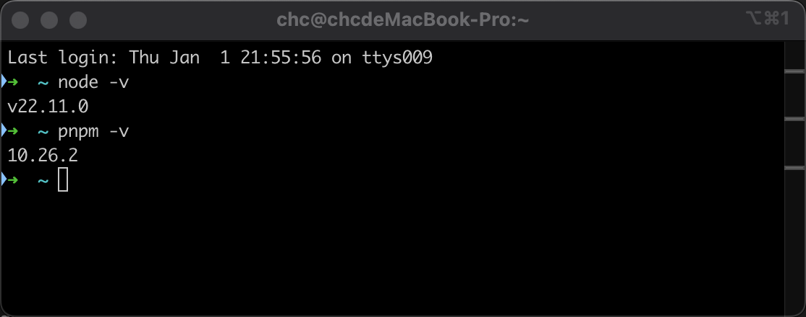

| 组件    | 最低版本 | 推荐版本  | 验证命令         |
| ------- | -------- | --------- | ---------------- |
| Node.js | v20.0.0  | v20.18.0+ | `node --version` |
| pnpm    | v10.0.0  | v10.4.0+  | `pnpm --version` |
| npm     | v10.0.0  | v10.8.0+  | `npm --version`  |

### ✅ 验证方法

```bash
# 检查 Node.js 版本
node --version

# 检查 pnpm 版本
pnpm --version

# 检查 npm 版本（可选）
npm --version
```

### ⚠️ 注意事项

- 如果使用 nvm 管理 Node.js 版本，请确保已切换到正确的版本
- 在 Windows 系统上，建议使用 Git Bash 或 WSL2 执行命令
- 如果遇到权限问题，请勿使用 `sudo`，而是通过 `pnpm setup` 正确配置

## 步骤 1：安装项目依赖

### 🎯 目的

安装项目运行所需的所有第三方依赖包，包括前端和后端模块。

### 📋 操作步骤

1. **打开终端**并导航到项目根目录
2. **执行安装命令**：
   ```bash
   pnpm install
   ```
   

### 🔍 预期输出

- 显示依赖解析过程
- 显示各工作区（frontend、backend）的安装进度
- 最终显示类似 `Done in 45.6s` 的成功消息

### ✅ 验证方法

```bash
# 检查依赖是否安装成功
pnpm list --depth=0

# 或检查特定包的版本
pnpm list vue
pnpm list @nestjs/core
```

### ⚠️ 注意事项

- 首次安装可能需要较长时间（取决于网络速度）
- 如果安装失败，请检查网络连接或尝试使用国内镜像源
- 确保磁盘空间充足（至少需要 500MB）

## 步骤 2：配置后端项目环境变量

### 🎯 目的

配置应用程序运行所需的环境变量，包括数据库连接、OSS存储、服务端口等关键设置。

### 📋 环境配置文件体系

VTJ.PRO 后端支持多环境配置，配置文件优先级如下：

1. **`.env.{NODE_ENV}.local`** - 本地环境覆盖（最高优先级）
2. **`.env.{NODE_ENV}`** - 特定环境配置
3. **`.env.local`** - 本地通用覆盖
4. **`.env`** - 默认/基础配置（最低优先级）

**环境变量 `NODE_ENV` 的取值**：

- `development` - 开发环境
- `production` - 生产环境
- 未设置时默认为 `development`

### 🗂️ 主要环境变量说明

| 变量名                  | 类别   | 必填 | 默认值        | 说明                                   |
| ----------------------- | ------ | ---- | ------------- | -------------------------------------- |
| **应用配置**            |        |      |               |                                        |
| `PORT`                  | 基础   | 否   | `3000`        | 应用服务监听端口                       |
| `NODE_ENV`              | 基础   | 否   | `development` | 运行环境：development/production       |
| **数据库配置**          |        |      |               |                                        |
| `DATABASE_HOST`         | 数据库 | 是   | -             | MySQL 主机地址                         |
| `DATABASE_PORT`         | 数据库 | 否   | `3306`        | MySQL 端口                             |
| `DATABASE_NAME`         | 数据库 | 是   | -             | 数据库名称                             |
| `DATABASE_USER`         | 数据库 | 是   | -             | 数据库用户名                           |
| `DATABASE_PASSWORD`     | 数据库 | 是   | -             | 数据库密码                             |
| **文件存储配置**        |        |      |               |                                        |
| `LOCAL_UPLOAD_BASE_DIR` | 存储   | 否   | `uploadfiles` | 本地文件上传目录（OSS未启用时生效）    |
| `OSS_ENABLED`           | OSS    | 否   | `false`       | 是否启用阿里云OSS                      |
| `OSS_ACCESS_KEY_ID`     | OSS    | 条件 | -             | OSS Access Key ID（OSS启用时必填）     |
| `OSS_ACCESS_KEY_SECRET` | OSS    | 条件 | -             | OSS Access Key Secret（OSS启用时必填） |
| `OSS_BUCKET`            | OSS    | 条件 | -             | OSS存储桶名称（OSS启用时必填）         |
| `OSS_REGION`            | OSS    | 条件 | -             | OSS区域，如 `oss-cn-guangzhou`         |
| `OSS_ENDPOINT`          | OSS    | 否   | -             | OSS端点，留空使用默认                  |
| `OSS_SECURE`            | OSS    | 否   | `true`        | 是否使用HTTPS                          |
| `OSS_TIMEOUT`           | OSS    | 否   | `6000`        | OSS请求超时时间（毫秒）                |
| `OSS_MAX_FILE_SIZE`     | OSS    | 否   | `10485760`    | 最大文件上传大小（字节，默认10MB）     |

### 📝 配置示例

#### 本地开发环境配置（.env）

```bash
# ============================================
# 应用基础配置
# ============================================
PORT=3000

# ============================================
# 数据库配置（MySQL）
# ============================================
DATABASE_HOST=127.0.0.1
DATABASE_PORT=3306
DATABASE_NAME=vtj_example
DATABASE_USER=root
DATABASE_PASSWORD=your_password_here
DATABASE_SYNC=false  # 生产环境必须为 false

# ============================================
# 文件存储配置
# ============================================
# 本地存储配置（当 OSS_ENABLED=false 时生效）
LOCAL_UPLOAD_BASE_DIR=uploadfiles

# 阿里云OSS配置（如需使用OSS存储，请设置为 true 并填写以下信息）
OSS_ENABLED=false
# OSS_ACCESS_KEY_ID=your_access_key_id
# OSS_ACCESS_KEY_SECRET=your_access_key_secret
# OSS_BUCKET=your_bucket_name
# OSS_REGION=oss-cn-guangzhou
# OSS_ENDPOINT=
# OSS_SECURE=true
# OSS_TIMEOUT=6000
# OSS_MAX_FILE_SIZE=10485760
```

#### 生产环境配置（.env.production）

```bash
# 生产环境配置示例
PORT=3000
NODE_ENV=production

# 生产数据库（使用云数据库）
DATABASE_HOST=rm-xxx.mysql.rds.aliyuncs.com
DATABASE_PORT=3306
DATABASE_NAME=vtj_example_prod
DATABASE_USER=prod_user
DATABASE_PASSWORD=strong_production_password
DATABASE_SYNC=false  # 生产环境必须为 false

# 启用OSS存储
OSS_ENABLED=true
OSS_ACCESS_KEY_ID=LTAI5t**********Ud
OSS_ACCESS_KEY_SECRET=5Hh4**********nEId
OSS_BUCKET=vtj-prod
OSS_REGION=oss-cn-guangzhou
OSS_SECURE=true
```

### 🛠️ 操作步骤

1. **进入后端目录**：

   ```bash
   cd backend
   ```

2. **创建环境配置文件**：

   ```bash
   # 复制示例文件（如果存在）
   cp .env.example .env 2>/dev/null || echo "创建新的 .env 文件"
   ```

3. **编辑配置文件**：

   ```bash
   # 使用您喜欢的编辑器
   vim .env
   # 或
   code .env
   ```

4. **根据实际情况修改配置值**，特别注意：
   - 数据库连接信息
   - OSS配置（如需要使用）
   - 端口号（避免冲突）

### 📊 数据库准备

**新建数据库**：
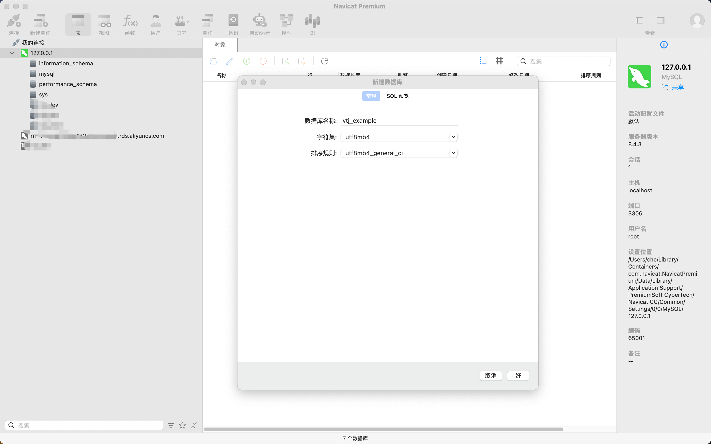

1. 登录 MySQL：

   ```bash
   mysql -u root -p
   ```

2. 创建数据库：

   ```sql
   CREATE DATABASE vtj_example CHARACTER SET utf8mb4 COLLATE utf8mb4_unicode_ci;
   ```

3. 验证数据库创建：
   ```sql
   SHOW DATABASES LIKE 'vtj_example';
   ```

**配置环境变量**：
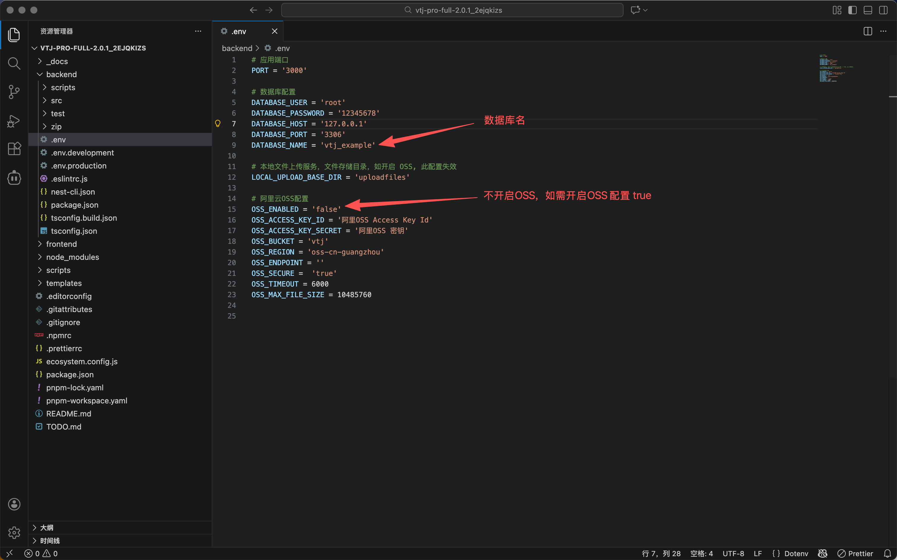

### ⚠️ 安全注意事项

1. **敏感信息保护**：
   - 切勿将包含真实密码、密钥的配置文件提交到版本控制系统
   - 将 `.env*` 文件添加到 `.gitignore`
   - 生产环境密钥应使用环境变量或密钥管理服务

2. **环境隔离**：
   - 开发、测试、生产环境应使用不同的数据库实例
   - 不同环境使用不同的OSS存储桶
   - 避免在开发环境使用生产数据

3. **配置验证**：
   ```bash
   # 检查环境变量是否加载成功
   cd backend && node -e "require('dotenv').config(); console.log('DB Host:', process.env.DATABASE_HOST)"
   ```

---

## 步骤 3：启动后端开发服务（首次）

### 🎯 目的

启动后端服务并自动创建数据库表结构，为系统运行准备基础数据存储。

### 📋 操作步骤

1. **确保在项目根目录中**：

   ```bash
   npm run server
   ```

### 🔍 预期输出

**服务启动成功**：
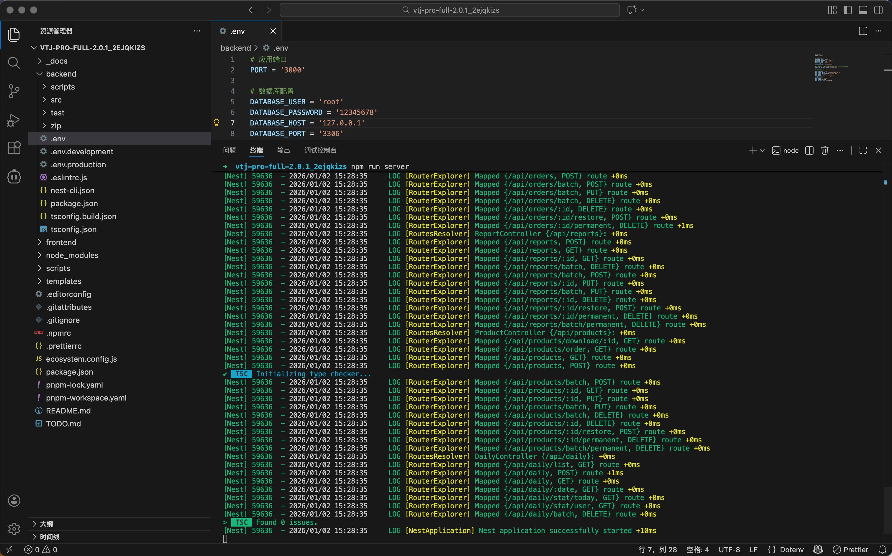

控制台应显示：

- NestJS 应用启动信息
- 数据库连接成功消息
- 服务监听端口（默认 3000）

**数据库表创建完成**：
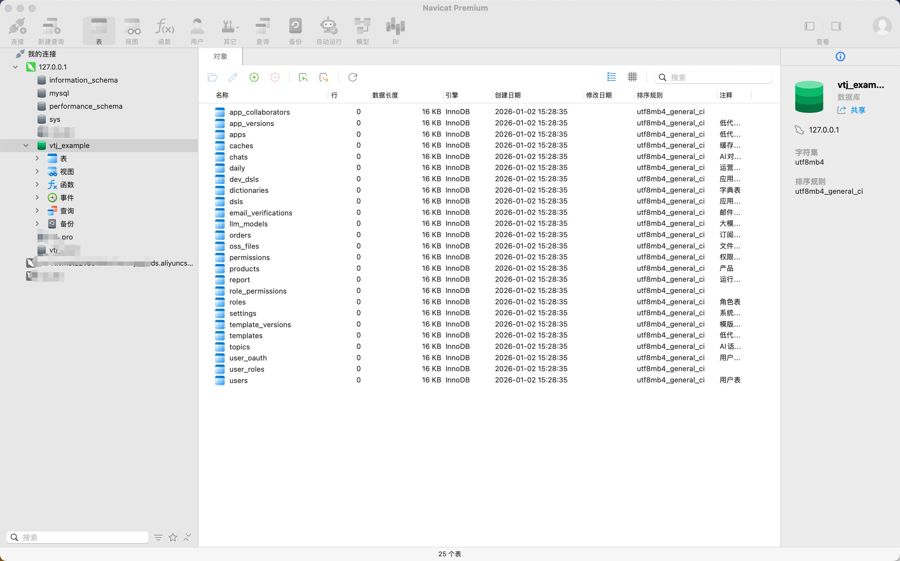

### ✅ 验证方法

1. **服务状态检查**：

   ```bash
   curl -I http://localhost:3000/api/docs
   ```

   应返回 `200 OK` 或类似成功响应。

2. **数据库表验证**：
   ```sql
   USE vtj_example;
   SHOW TABLES;
   ```
   应显示创建的所有表（约 20+ 个表）。

### ⚠️ 注意事项

- 首次启动会自动创建所有数据库表，请确保数据库用户有 CREATE TABLE 权限
- 如果表创建失败，请检查数据库连接配置和权限
- 服务启动后，**不要关闭终端**，保持服务运行或进行下一步操作

## 步骤 4：初始化种子数据

### 🎯 目的

向数据库插入系统运行所需的基础数据，包括：

- 默认管理员用户
- 系统角色和权限
- 基础配置项
- 示例数据（如需要）

### 📋 操作步骤

1. **确保后端服务已停止**（按 Ctrl+C 停止步骤3中的服务）
2. **执行种子数据初始化**：
   ```bash
   npm run seed
   ```
   或使用 pnpm：
   ```bash
   pnpm run seed
   ```

### 🔍 预期输出

**种子数据初始化完成**：
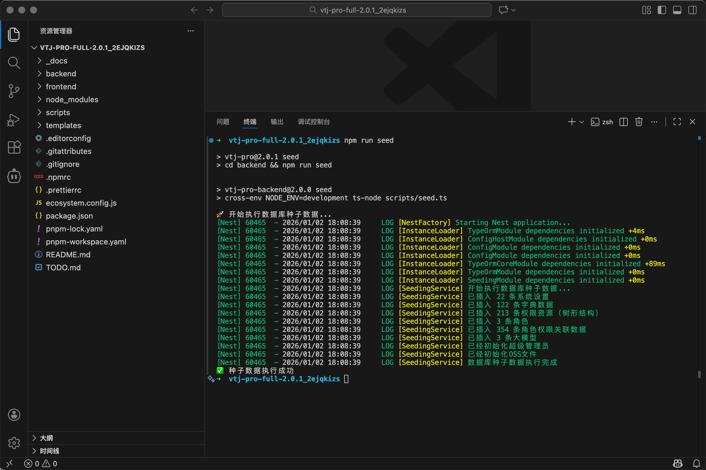

控制台应显示：

- 开始插入种子数据
- 各模块数据插入进度
- 最终完成消息

### 📝 种子数据详情

| 数据类型 | 数量 | 说明                           |
| -------- | ---- | ------------------------------ |
| 系统用户 | 1    | 超级管理员 (VtjAdmin)          |
| 系统角色 | 3+   | 超级管理员、管理员、普通用户等 |
| 权限项   | 50+  | 系统所有操作权限               |
| 系统设置 | 20+  | 平台基础配置项                 |
| 字典数据 | 10+  | 系统字典项                     |

### ⚠️ 注意事项

- 种子数据只应在首次初始化时运行
- 生产环境请使用 `npm run seed:prod` 命令
- 如需清除种子数据，可使用 `npm run seed:clear`（谨慎操作）

---

## 步骤 5：启动完整开发环境

### 🎯 目的

同时启动后端服务和前端开发服务器，进入完整的开发调试模式。

### 📋 操作步骤

#### 5.1 启动后端服务

```bash
# 在项目根目录中
npm run server
```

或新建终端窗口执行。

#### 5.2 启动前端开发服务

1. **新建终端窗口**（保持后端服务运行）
2. **导航到项目根目录**：
3. **启动前端开发服务器**：
   ```bash
   npm run dev
   ```

### 🔍 预期输出

**应用启动成功自动打开登录页面**：
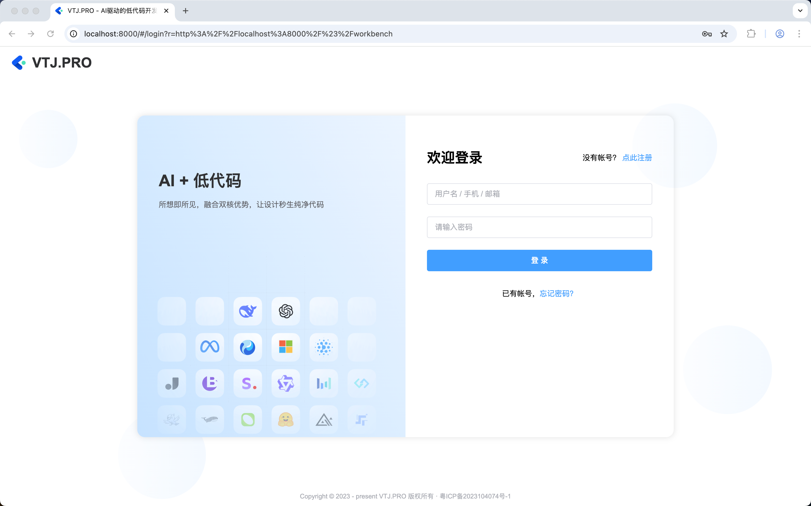

前端控制台应显示：

- Vite 开发服务器启动信息
- 编译进度和热重载状态
- 访问地址（通常是 `http://localhost:8000`）

浏览器自动打开登录页面。

### 🔑 首次登录

1. **使用默认管理员账号登录**：
   - **用户名**：`VtjAdmin`
   - **初始密码**：`Vtj@9527`

   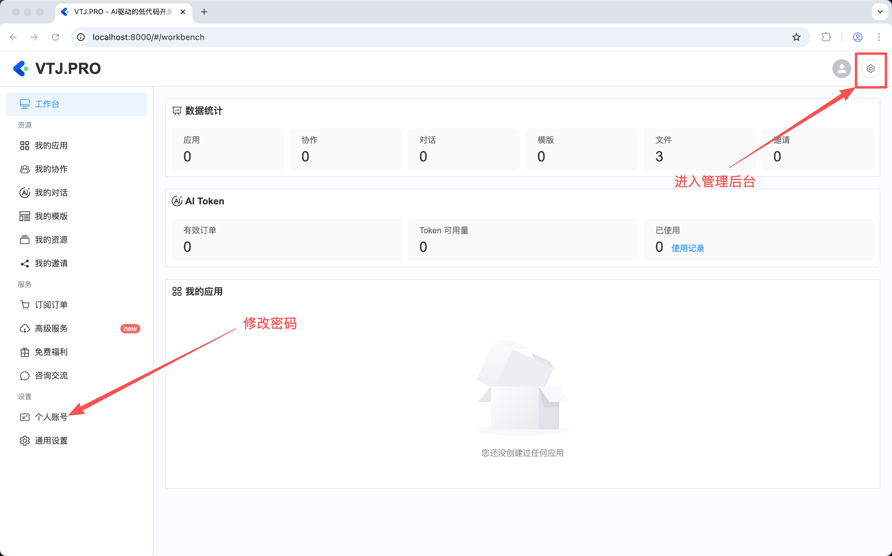

2. **登录后立即修改密码**：
   - 点击右上角用户头像 → "修改密码"
   - 设置强密码并妥善保管

### ✅ 验证方法

1. **后端服务验证**：

   ```bash
   curl http://localhost:3000/api/docs
   ```

   应返回API文档。

2. **前端服务验证**：
   - 访问 `http://localhost:8000`
   - 应显示登录页面
   - 控制台无错误信息

3. **API连通性验证**：
   - 登录后检查各功能模块是否正常加载
   - 验证菜单、权限等是否正常显示

### ⚠️ 注意事项

- 确保两个服务都在运行状态
- 前端默认端口为 8000，如果冲突会自动切换
- 修改密码后请妥善保管新密码
- 开发过程中保持服务运行以享受热重载功能

---

## 步骤 6：平台功能配置

### 🎯 目的

根据实际需求配置平台各项功能，特别是AI相关功能需要额外配置才能正常使用。

### 📋 配置项目

#### 6.1 系统运营模式设置

**位置**：系统设置 → 运营模式

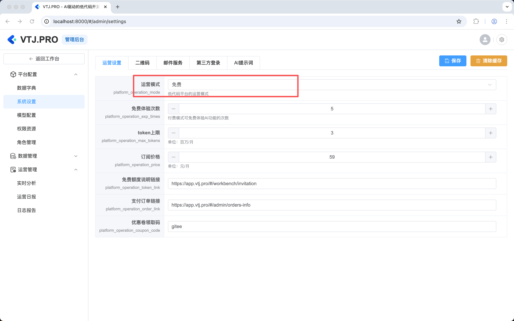

| 模式         | 说明                         | 适用场景           |
| ------------ | ---------------------------- | ------------------ |
| **免费模式** | 所有用户可自由使用AI功能     | 内部使用、演示环境 |
| **邀请模式** | 需管理员在后台为用户开通权限 | 小范围测试、内测   |
| **订阅模式** | 用户主动订阅并支付后使用     | 商业化运营         |

**推荐选择**：

- 内部开发测试：选择 **免费模式**
- 生产环境：根据业务需求选择 **邀请模式** 或 **订阅模式**

#### 6.2 邮箱服务配置

**位置**：系统设置 → 邮箱配置

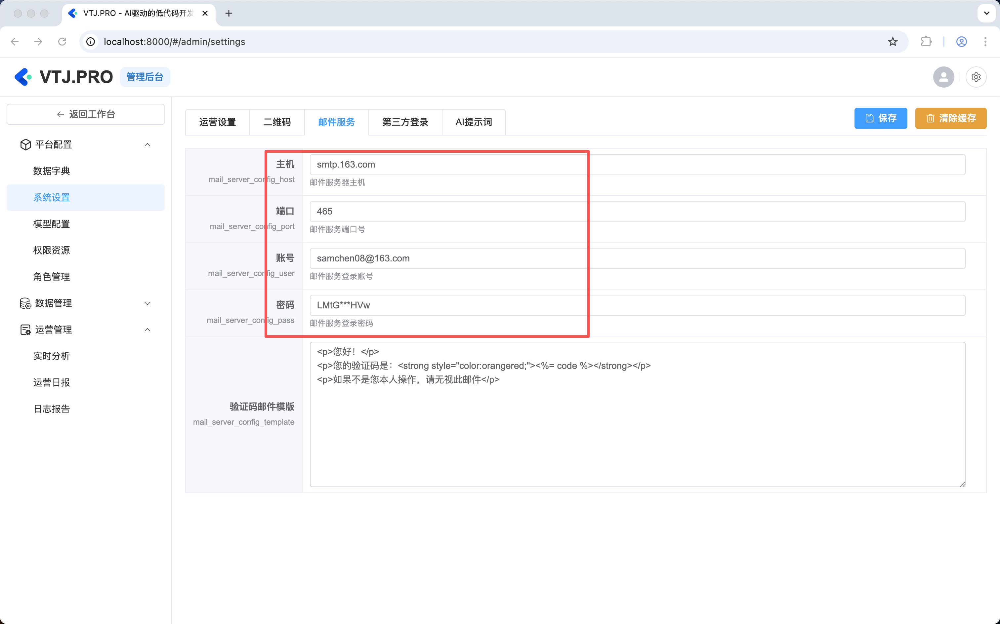

**必填配置项**：
| 配置项 | 说明 | 示例值 |
|--------|------|--------|
| 邮箱主机 | SMTP服务器地址 | `smtp.gmail.com` |
| 邮箱端口 | SMTP端口（SSL/TLS） | `465` 或 `587` |
| 邮箱账号 | 发件人邮箱地址 | `noreply@yourdomain.com` |
| 邮箱密码 | 邮箱密码或应用专用密码 | `your_email_password` |

**配置验证**：

1. 保存配置后，系统会自动测试邮箱连接
2. 可在"测试发送"功能中发送测试邮件验证配置
3. 确保防火墙未阻止SMTP端口

#### 6.3 大模型配置（AI功能核心）

**位置**：系统设置 → 大模型配置

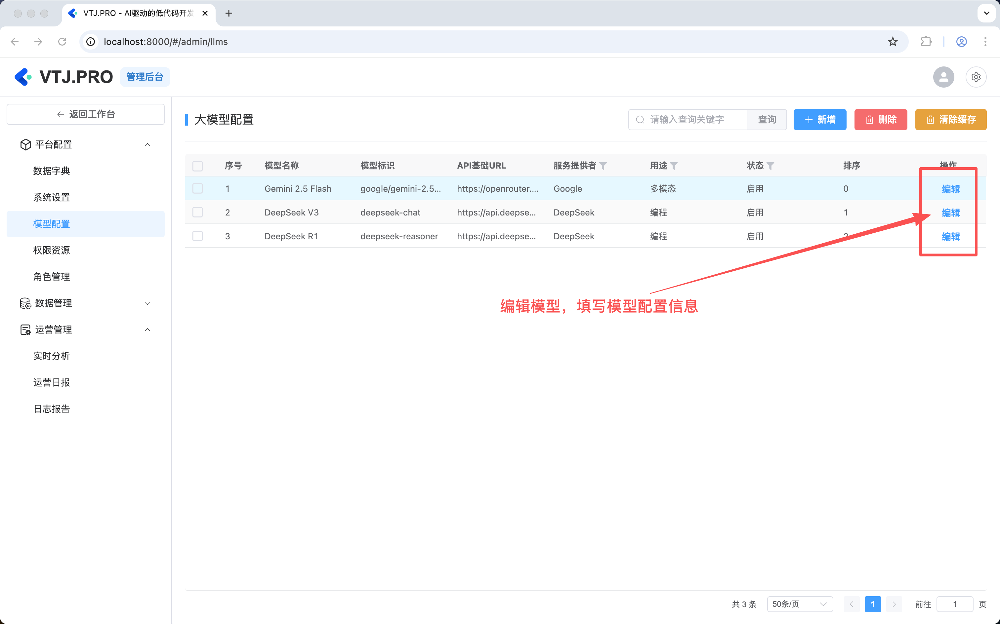

**核心要求**：

- AI助手需要 **至少配置两个类型** 的大模型：
  1. **多模态模型**：支持图像理解、文档分析等
  2. **编程模型**：支持代码生成、代码分析等

**配置步骤**：

1. 点击"新增模型"按钮
2. 填写模型配置信息：
   - 模型名称：自定义显示名称
   - 模型类型：选择"多模态"或"编程"
   - 供应商：选择模型提供商（OpenAI、DeepSeek、智谱AI等）
   - API密钥：对应供应商的API密钥
   - 基础URL：API端点地址
   - 模型标识：具体模型名称（如 `gpt-4o`、`deepseek-chat` 等）

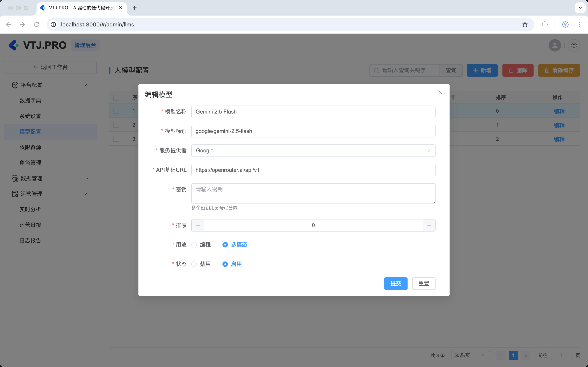

**配置验证**：

1. 保存配置后，系统会自动测试模型连接
2. 可在AI助手页面进行对话测试
3. 检查模型响应是否正常

#### 6.4 其他重要配置

**第三方登录**：

- Gitee：clientId、clientSecret

### ✅ 配置完成验证

完成所有配置后，请验证以下功能：

1. **AI功能测试**：
   - 在AI助手页面进行对话
   - 测试多模态功能（上传图片分析）
   - 测试编程功能（代码生成）

2. **邮箱功能测试**：
   - 用户注册接收验证邮件
   - 密码重置邮件发送
   - 系统通知邮件

3. **支付功能测试**（如配置）：
   - 创建测试订单
   - 完成支付流程
   - 验证订单状态更新

## 🚀 初始化完成检查清单

在完成所有初始化步骤后，请对照以下清单确认系统已完全就绪：

### ✅ 基础环境

- [ ] Node.js v20+ 已安装并验证
- [ ] pnpm v10+ 已安装并验证
- [ ] 项目依赖已成功安装
- [ ] 数据库已创建并配置

### ✅ 服务状态

- [ ] 后端服务正常启动（端口 3000）
- [ ] 前端开发服务器正常启动（端口 5173）
- [ ] 数据库连接正常
- [ ] API接口可正常访问

### ✅ 数据状态

- [ ] 数据库表结构已创建
- [ ] 种子数据已初始化
- [ ] 管理员账户可正常登录
- [ ] 系统角色和权限已配置

### ✅ 功能配置

- [ ] 运营模式已设置
- [ ] 邮箱服务已配置（如需要）
- [ ] 大模型已配置（至少多模态和编程各一个）
- [ ] 其他第三方服务已配置（如需要）

### ✅ 系统验证

- [ ] 管理员登录成功
- [ ] 各功能模块可正常访问
- [ ] AI助手功能可正常使用
- [ ] 文件上传功能正常

## 🔧 故障排除指南

### 常见问题及解决方案

#### 1. 依赖安装失败

**问题**：`pnpm install` 执行失败
**可能原因**：

- 网络连接问题
- 磁盘空间不足
- Node.js 版本不兼容
  **解决方案**：

```bash
# 清理缓存后重试
pnpm store prune
pnpm install --force

# 或使用国内镜像源
pnpm config set registry https://registry.npmmirror.com/
pnpm install
```

#### 2. 数据库连接失败

**问题**：后端启动时提示数据库连接错误
**可能原因**：

- 数据库服务未启动
- 连接信息配置错误
- 防火墙阻止连接
  **解决方案**：

1. 确认MySQL服务已启动：

   ```bash
   # Linux/Mac
   sudo systemctl status mysql

   # Windows
   services.msc  # 查看MySQL服务状态
   ```

2. 验证连接信息：
   ```bash
   mysql -h 127.0.0.1 -P 3306 -u root -p
   ```
3. 检查防火墙设置

#### 3. 端口冲突

**问题**：服务启动时提示端口已被占用
**解决方案**：

```bash
# 查找占用端口的进程
lsof -i :3000  # 后端端口
lsof -i :5173  # 前端端口

# 终止占用进程或修改配置
# 修改 backend/.env 中的 PORT
# 或修改前端 vite 配置
```

#### 4. 种子数据初始化失败

**问题**：`npm run seed` 执行失败
**可能原因**：

- 数据库表未创建
- 数据冲突
- 权限不足
  **解决方案**：

1. 确保已执行步骤3（创建数据库表）
2. 清理后重试：
   ```bash
   npm run seed:clear
   npm run seed
   ```
3. 检查数据库用户权限

#### 5. AI功能无法使用

**问题**：AI助手无响应或报错
**可能原因**：

- 大模型未配置
- API密钥错误
- 网络连接问题
  **解决方案**：

1. 确认已配置至少一个多模态和一个编程模型
2. 检查API密钥是否正确
3. 测试网络连接：
   ```bash
   curl https://api.openai.com/v1/models
   ```

#### 6. 前端页面空白或错误

**问题**：浏览器访问显示空白或错误
**可能原因**：

- 前端构建失败
- API代理配置错误
- 浏览器缓存
  **解决方案**：

1. 检查前端控制台错误信息
2. 验证代理配置：
   ```bash
   curl http://localhost:3000/api/docs
   ```
3. 清理浏览器缓存或使用无痕模式

### 获取帮助

如果以上解决方案无法解决问题，请：

1. **查看日志**：

   ```bash
   # 后端日志
   cd backend && npm run server  # 查看实时日志

   # 前端日志
   # 浏览器开发者工具 Console 面板
   ```

2. **检查文档**：
   - 参考 `_docs/1_开始.md` 了解项目结构
   - 参考 `_docs/3_部署运维.md` 了解部署配置

3. **寻求社区支持**：
   - GitHub Issues
   - 官方文档
   - 技术社区

---

## 📈 下一步建议

### 开发阶段

1. **熟悉平台功能**：
   - 探索AI助手各项功能
   - 测试可视化设计器
   - 了解多平台出码能力

2. **定制开发**：
   - 根据业务需求修改前端组件
   - 扩展后端API接口
   - 集成第三方服务

3. **测试验证**：
   - 进行功能测试
   - 性能测试
   - 安全测试

### 部署准备

1. **生产环境配置**：
   - 配置生产数据库
   - 设置OSS存储
   - 配置域名和SSL证书

2. **性能优化**：
   - 数据库索引优化
   - 前端资源压缩
   - CDN加速配置

3. **监控告警**：
   - 设置服务监控
   - 配置日志收集
   - 设置异常告警

### 运维管理

1. **定期维护**：
   - 数据库备份
   - 日志清理
   - 依赖更新

2. **安全加固**：
   - 定期更新依赖包
   - 配置防火墙规则
   - 实施访问控制

3. **用户管理**：
   - 用户权限管理
   - 操作日志审计
   - 数据统计分析

## 🎉 总结

恭喜！您已成功完成 VTJ.PRO 应用开发平台的初始化工作。系统现已具备以下能力：

### ✅ 核心功能就绪

- **开发环境**：完整的前后端开发环境
- **AI能力**：多模态和编程大模型支持
- **管理功能**：完整的用户、角色、权限管理
- **扩展能力**：可配置的第三方服务集成

### 🚀 开始使用

1. **立即体验**：访问 `http://localhost:8000` 开始使用平台
2. **探索功能**：试用AI助手、设计器、出码等功能
3. **开始开发**：基于现有功能进行二次开发

### 📚 学习资源

- **官方文档**：`_docs/` 目录下的详细文档
- **示例项目**：参考 templates/ 目录中的模板
- **社区支持**：加入开发者社区获取帮助

### 🔄 持续更新

VTJ.PRO 将持续更新和改进，建议：

- 定期拉取最新代码
- 关注版本更新日志
- 参与社区贡献

**祝您使用愉快！如有任何问题，请参考本文档或寻求社区支持。**
