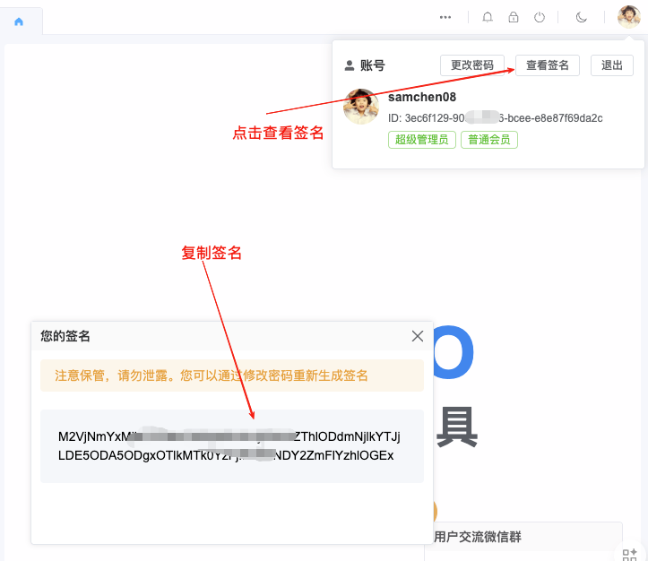
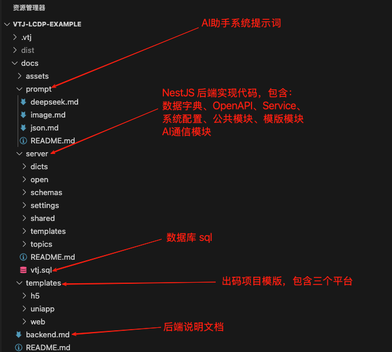
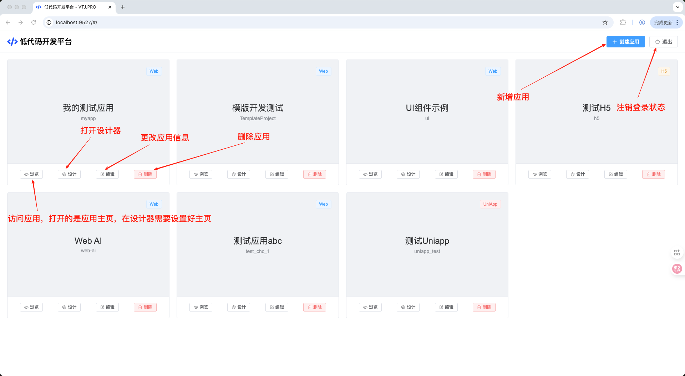
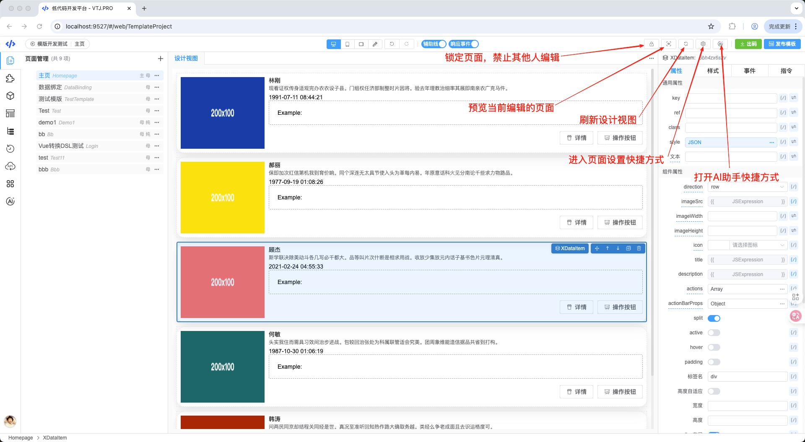

# 基于 VTJ.PRO 的在线「AI + 低代码」平台

这是一个基于 **VTJ.PRO** 低代码引擎实现的全功能在线开发平台项目，支持多平台应用开发。项目包含以下核心功能：

- 设计器与渲染器集成
- 自定义 `Service` 和 `OpenAPI` 实现
- 设计器个性化定制扩展
  项目功能完整度达到生产环境要求，支持定制、编译和部署。

## 准备工作

本项目是低代码平台前端工程，默认集成 **VTJ** 官方标准公有云服务接口。由于接口调用需要登录授权，如需静默自动授权，请获取账号授权签名。

### 获取授权签名

1. 访问 [https://lcdp.vtj.pro](https://lcdp.vtj.pro)
2. 登录后，点击右上角用户信息卡片中的"查看签名"按钮
3. 复制签名内容



### 配置环境变量

将获取的签名粘贴到项目根目录的 `env.json` 文件中：

```json
{
  "AUTH_CODE": "在此处粘贴您的账号签名",
  "REMOTE": "https://lcdp.vtj.pro"
}
```

完成以上配置后，您将获得一个功能完善、支持多平台（Web、H5、UniApp）的在线低代码开发环境。

## 项目脚本

| 命令              | 描述                                         |
| ----------------- | -------------------------------------------- |
| `npm run setup`   | 使用 `registry.npmmirror.com` 镜像源安装依赖 |
| `npm run dev`     | 启动开发服务器                               |
| `npm run sit`     | 测试环境构建                                 |
| `npm run build`   | 生产环境构建                                 |
| `npm run preview` | 预览构建产物                                 |
| `npm run clean`   | 清理项目工程                                 |

## 项目结构

本项目使用 `@vtj/cli` 搭建，基于 `Vite + Vue3 + TypeScript` 技术栈。采用多平台应用页面入口设计，实现环境隔离和优化打包体积。

`vite.config.ts` 中配置了多入口打包：

```typescript
const pages = {
  // 平台主应用：包含应用管理和设计器
  main: './index.html',

  // Web应用预览
  web: './web/index.html',

  // H5应用预览
  h5: './h5/index.html',

  // UniApp应用预览
  uniapp: './uniapp/index.html'
};
```

### 工程目录说明

项目结构与标准工程基本一致，以下是 VTJ 特有的重要目录说明：


## 最佳实践

### 设计器集成

设计器实现位于 `/src/views/designer.vue`，所有平台共用同一设计器，通过加载项目 DSL 的 `platform` 属性确定目标平台功能。

设计器路由格式：`/:platform/:id`

- **platform**: 平台标识（web、h5、uniapp）
- **id**: 应用标识（对应项目 DSL 的 `id` 字段）

### 渲染器集成

各平台渲染器实现文件：

- **Web**: `/src/platform/web/main.ts`
- **H5**: `/src/platform/h5/main.ts`
- **UniApp**: `/src/platform/uniapp/main.ts`

### 自定义 Service

低代码平台的项目、文件和历史记录通过 Service 进行存储管理。`/src/shared/service.ts` 实现了远程 Service，将数据保存至后端数据库。

### 自定义 OpenAPI

OpenAPI 提供低代码平台的远程服务能力，如页面模板和 AI 助手功能。`/src/extension/openapi.ts` 实现了自定义 OpenAPI，您可以根据需求调整 API 接口，只需确保函数签名符合类型要求。

### 设计器扩展

如需扩展设计器功能，可通过 `/src/extension/install.ts` 进行开发。可用平台 API 包括：

- `widgetManager`
- `depsManager`
- `setterManager`

### 后端实现

后端实现可自行设计，只需满足 Service 和 OpenAPI 的接口规范。具体实现细节请参考 `docs` 目录下的文档。



## 重要说明

- API方法统一在 `/src/apis` 目录下定义，函数都带有TS签名和注释， 可以按自己的需求更换对应接口。

- 代码中的Access是为了适配官方接口服务的权限控制，如果你改为自己实现的服务，可以不需要Access
- 请求工具使用了 `setGlobalRequest` 配置全局的`request`, 如果在设计器中的设计视图和预览也需要用相同的`request`, 可以通过参数传入到引擎和`createProvider`。

  ```ts
  // 传入引擎
  const engine = new Engine({
    //省略其他代码
    adapter: {
      request
    }
  });

  // 传入 createProvider
  const { provider, onReady } = createProvider({
    //省略其他代码
    adapter: {
      request
    }
  });
  ```

- 如果您不需要模版和AI功能，就不需要定义OpenAPI， 只需要把引擎的`remote`参数设置为`null`就可以关闭这两个功能。

### 设计器交互






## 在线体验

访问 Demo: [https://vtj.pro/demo/](https://vtj.pro/demo/)
