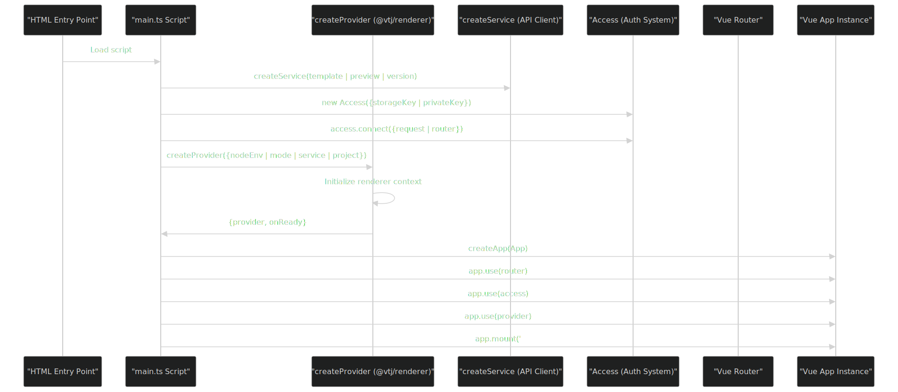

# VTJ.PRO 平台概述

### 目的与范围

本文档提供了VTJ.PRO平台的高级介绍，这是一个基于Vue3和TypeScript构建的AI驱动的低代码开发系统。它涵盖了整体系统架构、关键组件和平台能力。有关特定子系统的详细信息，请参考以下页面：

- 前端应用结构和路由：前端架构
- 后端模块组织和NestJS模式：后端模块系统
- 用户认证和权限系统：认证与授权
- AI模型配置和集成：LLM模型管理
- 低代码应用生命周期：低代码应用系统
- AI驱动的代码生成：AI代理系统

## 什么是VTJ.PRO

VTJ.PRO是一个AI驱动的低代码开发平台，使用户能够通过可视化设计工具和AI辅助创建、部署和管理跨多个平台（Web、H5、UniApp）的应用程序。系统包括：

- **管理界面：** 系统配置、用户管理、LLM模型设置和数据监控
- **工作台界面：** 用户工作空间，用于创建和管理个人应用程序和模板
- **开发环境：** 可视化设计器，用于构建具有实时预览的应用程序和模板
- **平台运行时：** 从DSL（领域特定语言）定义渲染应用程序的部署目标
- **AI代理系统：** 用于代码生成和开发辅助的对话式AI
- **后端服务：** 基于NestJS的API服务器，提供认证、数据持久化和业务逻辑

## 系统架构概述

该平台遵循前端应用和后端服务之间的清晰分离，具有多个服务于不同目的的部署上下文。

### 高级组件架构


## 前端入口点和上下文

前端架构被组织成五个不同的HTML入口点，每个入口点都有其自己的包和初始化逻辑，服务于特定目的。

### 入口点映射

| 入口点           | 用途                 | 主脚本                      | 路由上下文                                        |
| ---------------- | -------------------- | --------------------------- | ------------------------------------------------- |
| `index.html`     | 管理 + 工作台 + 认证 | `/src/main.ts`              | `/admin/*`, `/workbench/*`, `/login`, `/register` |
| `web/index.html` | Web平台运行时        | `/src/platform/web/main.ts` | `/#/page/:fileId` (动态)                          |
| `h5/index.html`  | H5平台运行时         | `/src/platform/h5/main.ts`  | `/#/page/:fileId` (动态)                          |
| `dev/index.html` | 开发环境             | `/src/platform/dev/main.ts` | `/#/app/:code`, `/#/template/:id`                 |
| `auth.html`      | 独立认证UI           | `/src/auth.ts`              | `/login`, `/register`, `/password`                |

### 前端初始化流程



## 后端模块架构

后端使用NestJS的模块系统，具有一个集中式的AppModule，协调所有核心和业务模块。全局认证通过注册为APP_GUARD的UsersGuard强制执行。

### 模块依赖图



### 数据库和ORM配置

后端使用TypeORM与MySQL，通过TypeOrmModule.forRootAsync()配置。autoLoadEntities: true设置自动发现并注册来自导入模块的所有实体。

```ts
// 来自 app.module.ts:39-50 的配置
TypeOrmModule.forRootAsync({
  imports: [ConfigModule],
  inject: [ConfigService],
  useFactory: async (configService: ConfigService) => {
    const database = configService.get<Database>('database');
    return {
      type: 'mysql',
      autoLoadEntities: true,
      charset: 'utf8mb4',
      ...database
    };
  }
});
```

## 核心渲染系统

该平台使用@vtj/renderer包作为其核心渲染引擎，它解释DSL定义以创建Vue应用程序。不同的上下文使用不同的模式和配置。

### 渲染器上下文模式

| 上下文       | 模式                  | NodeEnv   | 用途                         |
| ------------ | --------------------- | --------- | ---------------------------- |
| 主应用       | N/A                   | N/A       | 直接使用Vue Router，无渲染器 |
| Web运行时    | `ContextMode.Runtime` | 生产/开发 | 从DSL渲染已部署的应用        |
| H5运行时     | `ContextMode.Runtime` | 生产/开发 | 从DSL渲染移动应用            |
| UniApp运行时 | `ContextMode.Runtime` | 生产/开发 | 从DSL渲染UniApp应用          |
| 开发环境     | 设计器模式            | 开发      | 提供可视化编辑界面           |
| 项目模板     | `ContextMode.Raw`     | 生产/开发 | 具有嵌入式DSL的独立项目      |

### 提供者创建模式


## 多平台支持

VTJ.PRO支持三种平台类型，每种都有专用的运行时环境和项目模板。

### 平台类型枚举

AppPlatform枚举定义了支持的平台：

- **AppPlatform.Web** - 具有桌面优先UI的标准Web应用程序
- **AppPlatform.H5** - 具有触摸交互的移动优化H5应用程序
- **AppPlatform.UniApp** - 使用uni-app框架的跨平台应用程序

这些在创建提供者时用于指定特定平台的渲染行为：

```ts
// Web平台：frontend/src/platform/web/main.ts:36-39
project: {
  id: code,
  platform: AppPlatform.Web
}

// H5平台：frontend/src/platform/h5/main.ts:36-39
project: {
  id: code,
  platform: AppPlatform.H5
}

// UniApp平台：frontend/src/platform/uniapp/main.ts:85-88
project: {
  id: code,
  platform: AppPlatform.UniApp
}
```

### 平台特定项目模板

每个平台在templates/目录中都有相应的项目模板：

| 模板目录            | 入口点        | 平台   | 关键依赖                      |
| ------------------- | ------------- | ------ | ----------------------------- |
| `templates/web/`    | `src/main.ts` | Web    | `@vtj/web`, Vue Router, Pinia |
| `templates/h5/`     | `src/main.ts` | H5     | `@vtj/h5`, Vue Router, Pinia  |
| `templates/uniapp/` | `src/main.ts` | UniApp | `@vtj/uni-app`, uni-app框架   |

这些模板提供了可以独立导出和运行的独立项目结构，具有嵌入式DSL定义和VTJ渲染器。

## 认证和访问控制

系统实现了双层认证系统：通过`UsersGuard`的后端路由保护和通过`Access`类的前端访问控制。

### 认证架构



所有前端入口点都使用一致的配置初始化`Access`系统：

```ts
// 来自 frontend/src/main.ts:10-21 的模式
const access = new Access({
  alert,
  storageKey: STORAGE_KEY,
  privateKey: ACCESS_PRIVATE_KEY,
  whiteList: (to) =>
    ['/login', '/unauthorized', '/register', '/password'].includes(to.path)
});
access.connect({ request, router });
```

`UsersGuard`在`AppModule`中全局注册并保护所有后端路由：

```ts
// backend/src/app.module.ts:73-77
providers: [
  {
    provide: APP_GUARD,
    useClass: UsersGuard
  }
];
```

## 平台能力总结

该平台提供以下关键能力：

### 对于系统管理员

- 通过管理界面进行用户、角色和权限管理
- 用于AI功能的LLM模型配置（OpenAI、DeepSeek、Google、Anthropic等）
- 通过报告和日常统计进行系统监控
- 应用程序和模板审批工作流
- 用于系统范围下拉选项的字典管理

详见管理界面。

### 对于应用开发者

- 用于创建应用程序（`/#/app/:code`）和模板（`/#/template/:id`）的可视化设计器
- 具有平台特定预览的多平台支持（Web、H5、UniApp）
- 具有回滚能力的版本管理
- 团队开发的协作功能
- 通过代理主题的AI驱动代码生成

详见低代码应用系统和开发环境。

### 对于最终用户

- 通过平台运行时访问已部署的应用程序（`/web/:code`, `/h5/:code`）
- 用于管理拥有应用程序的个人工作空间
- 用于启动新项目的模板市场
- 用于开发问题和代码生成的AI助手

详见工作台界面。
