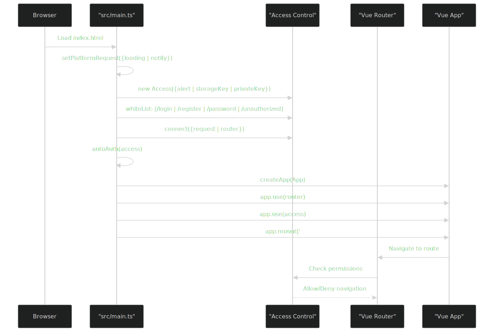
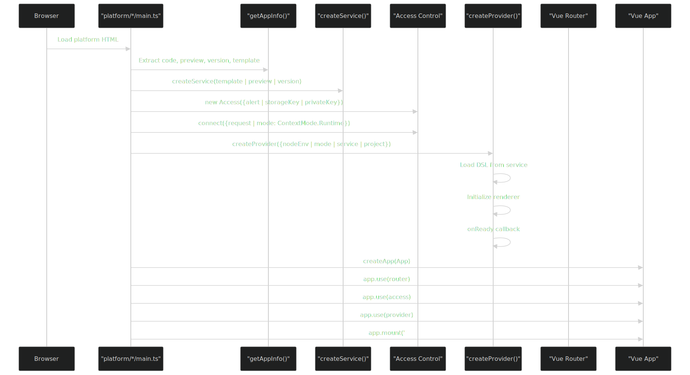
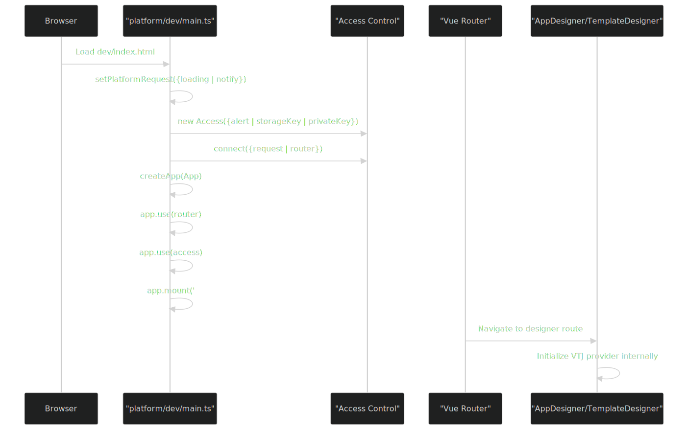

# 前端架构

### 目的与范围

本文档描述了 VTJ.PRO 平台的前端架构，涵盖五个不同的 HTML 入口点、它们的初始化流程以及如何与 `@vtj/renderer` 引擎集成。前端设计为一个多上下文系统，每个入口点服务于特定目的：主应用（管理后台和工作台）、平台运行时（Web、H5、UniApp）、开发环境和独立项目模板。

有关特定路由配置的信息，请参阅路由系统。有关 VTJ 渲染器页面渲染过程的详细信息，请参阅多平台运行时系统。有关后端模块架构的信息，请参阅后端模块系统。

### 架构概述

前端包含五个架构上下文，每个上下文都有自己的入口点和初始化逻辑：



## 入口点对比

每个入口点服务于不同的目的并具有不同的初始化要求：

| 入口点     | HTML 文件                 | 主脚本                     | 用途                       | 路由模式        | 访问控制         | VTJ 提供者         |
| ---------- | ------------------------- | -------------------------- | -------------------------- | --------------- | ---------------- | ------------------ |
| 主应用     | `frontend/index.html`     | `src/main.ts`              | 管理后台、工作台、认证页面 | Hash 或 History | 是（含白名单）   | 否                 |
| Web 运行时 | `frontend/web/index.html` | `src/platform/web/main.ts` | 部署 Web 应用程序          | Hash            | 是（运行时模式） | 是                 |
| H5 运行时  | `frontend/h5/index.html`  | `src/platform/h5/main.ts`  | 部署 H5 应用程序           | Hash            | 是（运行时模式） | 是                 |
| 开发环境   | `frontend/dev/index.html` | `src/platform/dev/main.ts` | 应用/模板设计器            | Hash            | 是               | 否（由设计器添加） |
| 认证流程   | `frontend/auth.html`      | `src/auth.ts`              | 独立认证流程               | Hash 或 History | 是               | 否                 |

## 主应用架构

主应用入口点服务于三个主要上下文：管理后台、工作台和认证页面。

### 初始化流程



### 路由结构

主应用定义了三个布局上下文及其相应的路由：



### 访问控制集成

主应用使用基于白名单的访问控制系统：

- whiteList 函数：对路径 `['/login', '/unauthorized', '/register', '/password']` 返回 `true`
- unauthorized 行为：设置为 `undefined`，允许自定义处理
- 存储键：来自共享配置的 `STORAGE_KEY`
- 私钥：用于令牌加密的 `ACCESS_PRIVATE_KEY`

## 平台运行时架构

Web、H5 和 UniApp 平台运行时共享通用的架构模式，但在平台特定实现上有所不同。

### 运行时初始化流程



### 提供者配置

createProvider() 函数使用平台特定配置调用：

Web 平台配置

```ts
createProvider({
  nodeEnv: preview ? NodeEnv.Development : NodeEnv.Production,
  mode: ContextMode.Runtime,
  service,
  project: {
    id: code,
    platform: AppPlatform.Web
  },
  materialPath: MATERIAL_PATH,
  dependencies: {
    Vue: () => import('vue'),
    VueRouter: () => import('vue-router'),
    Pinia: () => import('pinia')
  },
  router,
  enableStaticRoute: true,
  routeAppendTo: ROUTER_APPEND_TO,
  adapter: {
    notify,
    loading,
    alert,
    useTitle
  }
});
```

### H5 平台配置：

- 与 Web 几乎相同，平台参数为：`AppPlatform.H5`
- 使用移动端优化的适配器函数

### UniApp 平台配置：

- 不包含 router 或 routeAppendTo（路由由 UniApp 框架处理）
- 使用 `@vtj/uni` 处理平台特定组件
- 需要通过 `setupUniApp()` 进行特殊初始化

### 平台路由

平台运行时使用最小化路由，因为页面由 VTJ 渲染器动态创建：

**Web/H5 路由器：**

```ts
createRouter({
  history: createWebHashHistory(),
  routes: [
    {
      path: '/',
      component: Page,
      name: ROUTER_APPEND_TO // 渲染器将路由追加到这里
    },
    {
      path: '/:pathMatch(.*)*',
      name: 'NotFound',
      component: NotFound
    }
  ]
});
```

**支持的 URL 模式：**

- 生产环境：`/web/:code/#/page/:fileId`
- 预览环境：`/web/:code/preview/#/page/:fileId`
- 版本环境：`/web/:code/version/:versionId/#/page/:fileId`

### 上下文模式

平台运行时使用不同的上下文模式：

| 模式     | 值                    | 使用场景                  | 描述                     |
| -------- | --------------------- | ------------------------- | ------------------------ |
| 运行时   | `ContextMode.Runtime` | Web/H5/UniApp 平台        | 部署应用程序的生产运行时 |
| 开发环境 | `NodeEnv.Development` | 预览模式 (`preview=true`) | 启用开发功能             |
| 生产环境 | `NodeEnv.Production`  | 生产部署                  | 优化的运行时             |

## 开发环境架构

开发环境提供用于创建和编辑应用程序和模板的设计器界面。

### 设计器路由



### 设计器初始化



### 设计器 URL 模式

设计器支持平台特定的 URL：

- Web 应用开发：`/dev/web/#/app/:code?id=xxx`
- H5 应用开发：`/dev/h5/#/app/:code?id=xxx`
- UniApp 应用开发：`/dev/uniapp/#/app/:code?id=xxx`
- Web 模板开发：`/dev/web/#/template/:id`
- H5 模板开发：`/dev/h5/#/template/:id`
- UniApp 模板开发：`/dev/uniapp/#/template/:id`

## 项目模板架构

`templates/` 目录包含可以独立生成和使用的独立项目模板。

### 模板类型

系统提供三种模板类型：



### 模板初始化模式

所有模板都遵循使用 LocalService 的类似初始化模式：

**Web 模板**：

```ts
const app = createApp(App);
const adapter = createAdapter({ loading, notify, Startup, useTitle });
const service = new LocalService(createServiceRequest(notify));
const { provider, onReady } = createProvider({
  nodeEnv: process.env.NODE_ENV as NodeEnv,
  mode: ContextMode.Raw,
  modules: createModules(),
  adapter,
  service,
  router,
  dependencies: {
    Vue: () => import('vue'),
    VueRouter: () => import('vue-router'),
    Pinia: () => import('pinia'),
    VueI18n: () => import('vue-i18n')
  },
  project: {
    id: vtj?.id || name
  },
  enableStaticRoute: true
});
```

**与平台运行时的关键区别：**

- 使用 `LocalService` 而不是远程服务
- 模式为 `ContextMode.Raw`（非 `ContextMode.Runtime`）
- 包含模块：`createModules()` 用于本地模块定义
- 项目 ID 来自 `package.json`（`vtj.id` 或 `name`）
- 在生产环境中启用自动更新

### 模板路由配置

模板使用最小化路由，因为 VTJ 提供者管理页面路由：

**Web/H5 模板路由器：**

```ts
createRouter({
  history: createWebHashHistory(),
  routes: [
    {
      path: '/unauthorized',
      name: 'Unauthorized',
      component: () => import('@/views/unauthorized.vue')
    },
    {
      path: '/:pathMatch(.*)*',
      name: 'NotFound',
      component: () => import('@/views/not-found.vue')
    }
  ]
});
```

## 共享基础设施

前端在所有入口点使用共享的基础设施组件。

### 服务层


### 访问控制系统

来自 @vtj/renderer 的访问控制系统在所有入口点进行配置：

**配置参数：**

- `alert`：用于显示消息的警告函数
- `storageKey`：localStorage 令牌存储的键（`STORAGE_KEY`）
- `privateKey`：令牌加密的密钥（`ACCESS_PRIVATE_KEY`）
- `whiteList`：确定公共路由的函数（仅主应用）
- `unauthorized`：自定义重定向行为

**连接方法：**

- `connect({ request, router, mode })`：将访问控制连接到路由器和请求处理器
- 模式选项：`ContextMode.Runtime`（平台运行时）或 undefined（主应用）

### TypeScript 配置

所有前端上下文共享类似的 TypeScript 声明：

**Vue 组件类型增强：**

```ts
declare module 'vue' {
  interface ComponentCustomProperties {
    $uploader: any;
    $reqeust: any;
    $apis: any;
    $libs: any;
  }
}
```

这些全局属性由 VTJ 渲染器注入，在所有 Vue 组件中可用。

## 依赖管理

前端使用动态导入核心依赖以实现代码分割：

### 提供者依赖

平台运行时和模板为 VTJ 提供者配置依赖：

**Web/H5 平台依赖：**

```ts
dependencies: {
  Vue: () => import('vue'),
  VueRouter: () => import('vue-router'),
  Pinia: () => import('pinia')
}
```

**模板依赖：**

```ts
dependencies: {
  Vue: () => import('vue'),
  VueRouter: () => import('vue-router'),
  Pinia: () => import('pinia'),
  VueI18n: () => import('vue-i18n')
}
```

**UniApp 依赖：**

```ts
dependencies: {
  VueI18n: async () => VueI18n;
}
```

目的：这些懒加载的依赖允许 VTJ 渲染器使用与宿主应用程序相同的版本，防止版本冲突。

## 平台特定适配器

每个平台提供用于平台特定 UI 操作的适配器函数：

### 适配器接口


## 总结

VTJ.PRO 前端架构设计为一个多上下文系统，具有五个不同的入口点：

- 主应用：具有全面路由和访问控制的管理后台和工作台
- Web/H5 平台：使用 `@vtj/renderer` 部署应用程序的运行时环境
- UniApp 平台：具有特殊初始化的跨平台移动运行时
- 开发环境：用于构建应用程序和模板的设计器界面
- 项目模板：使用 `LocalService` 的独立启动项目

所有上下文共享通用基础设施（服务层、访问控制、TypeScript 配置），同时保持平台特定的实现。VTJ 渲染器（`@vtj/renderer`）作为核心渲染引擎，在所有平台上将 DSL 定义转换为功能性的 Vue 应用程序。
