# 后端模块系统

### 目的与范围

本文档描述了基于NestJS的VTJ.PRO后端模块架构。它涵盖了模块组织结构、依赖注入模式、TypeORM集成以及业务逻辑在核心模块和业务模块中的组织方式。本文档侧重于后端的结构组织；具体业务功能请参见低代码应用系统、LLM管理系统和用户管理与安全。

## NestJS模块架构概述

后端使用NestJS作为应用框架，将代码组织成封装相关功能的模块。每个模块都是一个用`@Module()`装饰器装饰的类，包含以下元数据：

- imports: 该模块依赖的其他模块
- controllers: HTTP请求处理器
- providers: 服务、仓库和其他可注入类
- exports: 提供给其他模块使用的服务/提供者
- 根模块`AppModule`位于`backend/src/app.module.ts`

协调所有功能模块并配置全局基础设施，如数据库连接、调度和守卫。

## 模块组织结构

后端组织为两个主要类别：

### 核心模块

位于`backend/src/core/`，提供基础平台服务：

| 模块                      | 目的           | 导出                                 |
| ------------------------- | -------------- | ------------------------------------ |
| `UserModule`              | 用户管理和认证 | `UserService`, `OAuthService`        |
| `RoleModule`              | 角色管理       | `RoleService`                        |
| `PermissionModule`        | 权限定义和检查 | `PermissionService`, `TypeOrmModule` |
| `CacheModule`             | Redis/内存缓存 | `CacheService`                       |
| `DictionaryModule`        | 配置数据管理   | `DictionaryService`                  |
| `SettingModule`           | 系统设置       | `SettingService`                     |
| `LLMModelModule`          | LLM提供者配置  | `LLMModelService`                    |
| `OssModule`               | 对象存储集成   | `OssFactoryService`                  |
| `EmailVerificationModule` | 邮箱验证流程   | `EmailVerificationService`           |

### 业务模块

位于`backend/src/business/`，实现特定领域功能：

| 模块               | 目的       | 导出              |
| ------------------ | ---------- | ----------------- |
| `LowcodeAppModule` | 应用管理   | `AppService`      |
| `TemplateModule`   | 模板管理   | `TemplateService` |
| `DSLModule`        | DSL配置    | `DSLService`      |
| `OrderModule`      | 订单交易   | `OrderService`    |
| `ProductModule`    | 产品目录   | `ProductService`  |
| `ReportModule`     | 分析报告   | `ReportService`   |
| `DailyModule`      | 运营报告   | `DailyService`    |
| `AgentModule`      | AI代理服务 | `AgentService`    |
| `OpenModule`       | 公共API    | -                 |

## 根模块配置



位于`backend/src/app.module.ts`的AppModule配置：

- ConfigModule: 从`.env`文件加载环境变量，具有层次结构（`.env.local` → `.env.${NODE_ENV}` → `.env`）
- TypeOrmModule: 使用`ConfigService`异步配置MySQL连接，启用`autoLoadEntities`和`utf8mb4`字符集
- ScheduleModule: 启用cron作业调度
- 全局守卫: 注册`UsersGuard`以在所有路由上强制执行授权

## 标准模块结构模式

每个功能模块遵循一致的结构，包含四个主要组件：

### 模块结构图



### 示例：产品模块

`ProductModule`展示了此模式：

```ts
@Module({
  imports: [TypeOrmModule.forFeature([Product]), OrderModule],
  providers: [ProductService],
  controllers: [ProductController],
  exports: [ProductService]
})
export class ProductModule {}
```

**组件：**

- 实体: `Product` - TypeORM实体定义数据库模式
- 服务: `ProductService` - 业务逻辑和仓库操作
- 控制器: `ProductController` - REST API端点
- DTOs: 用于验证的数据传输对象（在`product.dto.ts`中）
- 模块: `ProductModule` - 封装并导出功能

模块的桶式导出重新导出所有公共接口。

## TypeORM集成模式

所有需要数据库访问的模块都使用`TypeOrmModule.forFeature()`模式：


### 示例：订单模块

`OrderModule`展示了TypeORM集成：

- 导入`TypeOrmModule.forFeature([OrderEntity])`以注册实体
- 将`Repository<OrderEntity>`注入到`OrderService`
- 同时导入`UserModule`用于跨模块依赖

### 示例：包含多个实体的应用模块

`LowcodeAppModule`展示了一个管理多个相关实体的模块：

```ts
@Module({
  imports: [
    TypeOrmModule.forFeature([AppEntity, AppVersionEntity]),
    DSLModule
  ],
  controllers: [AppController],
  providers: [AppService],
  exports: [AppService]
})
```

这注册了`AppEntity`和`AppVersionEntity`，允许`AppService`为两个实体注入仓库。

## 模块依赖模式

### 直接模块依赖

模块通过imports数组声明依赖：



### 跨模块服务注入

当一个模块导出一个服务时，其他模块可以注入它：

| 导出模块           | 导出的服务          | 消费模块                          |
| ------------------ | ------------------- | --------------------------------- |
| `UserModule`       | `UserService`       | `OrderModule`, `RoleModule`       |
| `RoleModule`       | `RoleService`       | `UserModule`, `PermissionModule`  |
| `PermissionModule` | `PermissionService` | `RoleModule`                      |
| `DSLModule`        | `DSLService`        | `LowcodeAppModule`, `DailyModule` |
| `TemplateModule`   | `TemplateService`   | `DailyModule`                     |
| `ReportModule`     | `ReportService`     | `DailyModule`                     |

### 循环依赖解决

当两个模块需要彼此的服务时，NestJS提供`forwardRef()`：


来自`backend/src/core/user/user.module.ts`的示例：

```ts
imports: [
  TypeOrmModule.forFeature([UserEntity, UserOAuthEntity]),
  SettingModule,
  forwardRef(() => RoleModule), // 循环依赖解决
  EmailVerificationModule
];
```

来自`backend/src/core/role/role.module.ts`：

```ts
imports: [
  TypeOrmModule.forFeature([RoleEntity, PermissionEntity]),
  forwardRef(() => PermissionModule) // 循环依赖解决
];
```

## 全局模块

`@Global()`装饰器使模块的导出在整个应用程序中可用，无需显式导入：

### UserModule作为全局模块

```ts
@Global()
@Module({
  imports: [
    TypeOrmModule.forFeature([UserEntity, UserOAuthEntity]),
    SettingModule,
    forwardRef(() => RoleModule),
    EmailVerificationModule
  ],
  controllers: [UserController, OAuthController],
  providers: [UserService, OAuthService, OAuthConfigService, SettingService],
  exports: [UserService, OAuthService]
})
export class UserModule {}
```

`UserModule`被标记为`@Global()`，使`UserService`和`OAuthService`对所有模块可用，无需导入`UserModule`。

理由：用户认证在整个应用程序中都需要（守卫、装饰器、业务逻辑），因此将其设为全局可减少样板导入。

## 复杂模块依赖

### Daily模块：聚合模式

`DailyModule`展示了一个复杂的聚合模式，导入多个业务模块：



导入显示跨领域依赖：

- `AgentModule`用于AI驱动的报告生成
- `ReportModule`用于分析数据
- `TemplateModule`和`DSLModule`用于低代码结构
- `LowcodeAppModule`用于应用管理
- `OssFactoryService`（来自全局上下文）用于文件存储

## 模块桶式导出

每个模块目录包含一个index.ts桶式文件，重新导出公共接口：

### 示例：应用模块桶式导出

```ts
export * from './app.entity';
export * from './app-version.entity';
export * from './app.dto';
export * from './app.service';
export * from './app.controller';
export * from './app.module';
```

此模式允许消费者从模块目录导入：

```ts
import { AppEntity, AppService, AppModule } from './business/apps';
```

而不是单个文件路径：

```ts
import { AppEntity } from './business/apps/app.entity';
import { AppService } from './business/apps/app.service';
import { AppModule } from './business/apps/app.module';
```

## 模块依赖图


此图显示模块之间的主要依赖关系。注意：

- `UserModule`是全局的，因此未显示所有消费者的依赖
- 循环依赖通过`forwardRef()`解决
- `DailyModule`具有最多的依赖，聚合跨领域的数据
- 基础设施模块（Config、TypeORM、Cache）被许多模块使用但未显式导入（由根配置提供）

## 总结

VTJ.PRO后端遵循NestJS最佳实践，具有：

1. 清晰分离：核心基础设施模块与业务领域模块
2. 一致结构：实体 → 服务 → 控制器 → 模块模式
3. TypeORM集成：用于实体注册的`forFeature()`模式
4. 依赖注入：通过构造函数注入服务，通过`@InjectRepository()`注入仓库
5. 循环依赖：在需要时通过`forwardRef()`解决
6. 全局模块：UserModule标记为`@Global()`以实现全局访问
7. 桶式导出：`index.ts`文件简化导入
8. 聚合模式：高级模块（如DailyModule）组合多个领域服务

这种架构实现了可维护性、可测试性以及平台广泛功能集的清晰关注点分离。
