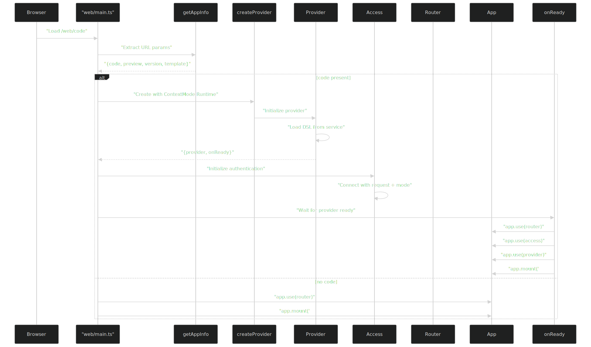

# 多平台运行时系统

### 目的与范围

本文档解释了VTJ.PRO如何使单一DSL定义能够部署到三个不同的平台：Web、H5（移动端网页）和UniApp（跨平台原生应用）。多平台运行时系统基于`@vtj/renderer`包构建，该包提供了核心的`Provider`抽象和渲染引擎。每个平台都有自己的初始化逻辑和入口点，但共享相同的DSL源和渲染核心。

有关整体架构以及此系统如何融入更广泛系统的信息，请参阅架构文档。有关应用程序和模板管理的详细信息，请参阅低代码应用系统。

## 系统架构概述

多平台运行时系统由三层组成：

- 平台入口点 - 位于`frontend/src/platform/{web,h5,uniapp}/main.ts`的平台特定初始化
- 渲染器核心 - 共享的`@vtj/renderer`包，包含`createProvider`和Provider类
- 模板项目 - 位于`templates/{web,h5,uniapp}/`的独立模板项目

运行时架构图



## 上下文模式与Node环境

运行时系统在两种不同的上下文模式和两种Node环境中运行，这决定了应用程序如何初始化和执行。

### 上下文模式

| 模式                  | 值          | 目的          | 服务类型          | 使用场景                |
| --------------------- | ----------- | ------------- | ----------------- | ----------------------- |
| `ContextMode.Runtime` | `'runtime'` | 生产/预览部署 | `createService()` | Web/H5/UniApp运行时平台 |
| `ContextMode.Raw`     | `'raw'`     | 本地开发模式  | `LocalService`    | 模板项目、离线开发      |

### Node环境

| 环境                  | 值              | 预览标志            | 行为                   |
| --------------------- | --------------- | ------------------- | ---------------------- |
| `NodeEnv.Development` | `'development'` | `preview === true`  | 启用热重载、调试模式   |
| `NodeEnv.Production`  | `'production'`  | `preview === false` | 优化打包、启用自动更新 |

**上下文模式选择逻辑**



## Web平台实现

Web平台是主要的部署目标，使用标准的Vue Router和HTML5历史模式。

### 初始化流程

**Web平台入口点图**



### createProvider配置

Web平台使用以下关键参数配置`createProvider`：

```ts
createProvider({
  nodeEnv: preview ? NodeEnv.Development : NodeEnv.Production,
  mode: ContextMode.Runtime,
  service: createService(template, preview, version),
  project: {
    id: code,
    platform: AppPlatform.Web
  },
  materialPath: MATERIAL_PATH,
  dependencies: {
    Vue: () => import('vue'),
    VueRouter: () => import('vue-router'),
    Pinia: () => import('pinia')
  },
  router,
  enableStaticRoute: true,
  routeAppendTo: ROUTER_APPEND_TO,
  adapter: {
    notify,
    loading,
    alert,
    useTitle
  }
});
```

**关键配置选项：**

- `service`: 通过`createService(template, preview, version)`创建，从后端获取DSL
- `project.id`: 来自URL的应用程序代码（例如`/web/myapp`）
- `project.platform`: 设置为AppPlatform.Web以进行平台特定渲染
- `dependencies`: Vue生态系统的动态导入（Vue、VueRouter、Pinia）
- `router`: 现有的Vue Router实例，动态路由将附加到其中
- `enableStaticRoute`: 允许混合静态和动态路由
- `routeAppendTo`: 指定DSL生成路由的父路由
- `adapter`: 平台特定的notify、loading、alert、useTitle实现

## H5平台实现

H5平台针对移动端网页进行了优化，具有触摸设备的视口配置和移动端特定的样式。

### H5与Web的差异

| 方面     | Web                                 | H5                                                                     |
| -------- | ----------------------------------- | ---------------------------------------------------------------------- |
| 视口     | 标准桌面                            | 移动端，使用`maximum-scale=1.0, minimum-scale=1.0, viewport-fit=cover` |
| 平台ID   | `AppPlatform.Web`                   | `AppPlatform.H5`                                                       |
| 样式     | 桌面优化                            | 触摸优化，更大的点击目标                                               |
| 入口HTML | `frontend/web/index.html`           | `frontend/h5/index.html`                                               |
| 主脚本   | `frontend/src/platform/web/main.ts` | `frontend/src/platform/h5/main.ts`                                     |

### 初始化逻辑

H5初始化与Web几乎相同，仅平台标识符不同：

```ts
project: {
  id: code,
  platform: AppPlatform.H5  // 与Web的唯一区别
}
```

Web和H5使用相同的：

- `createProvider`配置结构
- `Access`认证系统
- `createService`用于获取DSL
- 带有`enableStaticRoute`的Vue Router
- 适配器函数（notify、loading、alert、useTitle）

## UniApp平台实现

UniApp与Web/H5有显著不同，因为它使用UniApp的组件系统和基于页面的路由生成原生类应用。

### UniApp特定架构

**UniApp初始化流程**


### 与Web/H5的关键差异

1. 无Router参数

UniApp不向`createProvider`传递`router`参数：

```ts
createProvider({
  nodeEnv: preview ? NodeEnv.Development : NodeEnv.Production,
  mode: ContextMode.Runtime,
  service,
  project: {
    id: code,
    platform: AppPlatform.UniApp
  }
  // 无router参数
  // 无enableStaticRoute
  // 无routeAppendTo
});
```

2. 自定义App组件创建

UniApp需要使用`createUniAppComponent`创建自定义App组件：

```ts
const App = createUniAppComponent(project.uniConfig || {}, (script) =>
  parseFunction(script, window, false, true)
);
```

此函数：

- 接收项目的`uniConfig`（包含`pagesJson`、`manifestJson`、`css`）
- 使用`parseFunction`在沙盒化的window上下文中执行自定义脚本
- 返回一个作为UniApp根组件的Vue组件

3. 基于页面的路由

UniApp使用基于页面的路由，而不是Vue Router，通过`createUniRoutes`：

```ts
const routes = await createUniRoutes(provider, true, basePath);
```

这基于以下内容生成路由：

- DSL定义的页面
- `pagesJson`配置
- 所有页面的基础路径（默认为`/pages`）

4. UniApp设置函数

UniApp需要`setupUniApp`来初始化UniApp生态系统：

```ts
const app = setupUniApp({
  Vue,
  App,
  UniH5,
  routes,
  css,
  pagesJson,
  manifestJson
});
```

此函数：

- 将Vue与UniApp的H5运行时（`UniH5`）集成
- 应用来自`uniConfig.css`的全局CSS
- 根据`pagesJson`配置页面
- 根据`manifestJson`设置应用清单

5. Body挂载

UniApp直接挂载到`document.body`而不是`#app`：

```ts
app.mount(document.body);
```

### 回退处理

当未提供应用程序代码或路由为空时，UniApp显示`NotFound.vue`组件：

```ts
if (routes.length === 0) {
  routes.push({
    id: 'NotFound',
    path: '/',
    component: NotFound as any
  });
}
```

## 模板项目

模板项目是独立的启动项目，开发人员可以用于本地开发，无需完整的VTJ.PRO平台后端。

### 模板与运行时平台对比

| 方面       | 运行时平台                                  | 模板项目                                     |
| ---------- | ------------------------------------------- | -------------------------------------------- |
| 位置       | `frontend/src/platform/{web,h5,uniapp}/`    | `templates/{web,h5,uniapp}/`                 |
| 上下文模式 | `ContextMode.Runtime`                       | `ContextMode.Raw`                            |
| 服务       | `createService(template, preview, version)` | `LocalService(createServiceRequest(notify))` |
| DSL源      | 从后端API获取                               | 嵌入在项目中或本地文件                       |
| 项目ID     | 来自URL的应用代码                           | 来自`package.json`（`vtj.id`或`name`）       |
| 依赖项     | 运行时导入                                  | 在项目中打包                                 |
| 自动更新   | 在生产环境中启用                            | 在生产环境中启用                             |

### Web模板初始化

**Web模板配置**

```ts
const service = new LocalService(createServiceRequest(notify));
const { provider, onReady } = createProvider({
  nodeEnv: process.env.NODE_ENV as NodeEnv,
  mode: ContextMode.Raw,
  modules: createModules(),
  adapter: createAdapter({ loading, notify, Startup, useTitle }),
  service,
  router,
  dependencies: {
    Vue: () => import('vue'),
    VueRouter: () => import('vue-router'),
    Pinia: () => import('pinia'),
    VueI18n: () => import('vue-i18n')
  },
  project: {
    id: vtj?.id || name // 来自package.json
  },
  enableStaticRoute: true
});
```

**关键模板特性：**

- `modules`: `createModules()`为本地开发提供预配置的模块
- `LocalService`: 从本地源而不是API加载DSL
- `createServiceRequest`: 创建带有notify回调的请求处理器
- `VueI18n`: 包含国际化支持
- `IconsPlugin`: UI组件的图标系统插件
- `autoUpdate()`: 仅在生产环境中检查更新的功能

### H5模板初始化

H5模板遵循与Web模板相同的模式，但有以下调整：

- 使用`@vtj/h5`包而不是`@vtj/web`
- 无`IconsPlugin`（移动端不需要）
- 适配器中无`useTitle`（移动端不更改文档标题）
- 与H5运行时平台相同的视口配置

### UniApp模板初始化

UniApp模板由于SSR（服务器端渲染）架构而使用完全不同的结构：

```ts
export function createApp() {
  const app = createSSRApp(App);
  onReady(() => {
    app.use(provider);
  });

  return {
    app
  };
}
```

**UniApp模板差异：**

- 使用`createSSRApp`而不是`createApp`以支持SSR
- 导出`createApp`函数而不是立即挂载
- 无router参数（使用pages.json）
- 无Access认证
- 仅`VueI18n`依赖项（无router或Pinia）

## 服务层架构

服务层负责获取DSL定义并将其提供给渲染器。

### 服务类型

**服务层对比**


### createService函数

`createService`函数在运行时平台中用于从后端获取DSL：

```ts
const service = createService(template, preview, version);
```

**参数：**

- `template`: 布尔值，指示是否加载模板（true）或应用（false）
- `preview`: 布尔值，指示预览模式与生产模式
- `version`: 可选版本标识符，用于特定版本加载

**行为：**

- 根据参数构建API端点：`/api/apps/{code}`或`/api/templates/{id}`
- 附加预览和版本的查询参数
- 返回Provider用于获取DSL的服务对象
- 自动包含来自Access系统的认证头

### LocalService类

LocalService类在模板项目中用于本地开发：

```ts
const service = new LocalService(createServiceRequest(notify));
```

**特性：**

- 从本地项目文件或嵌入式定义加载DSL
- 不需要后端API连接
- 使用`createServiceRequest`创建带有notify回调的请求处理器
- 适用于离线开发和测试

## 访问控制集成

Access类为运行时平台提供认证和授权。

### Access初始化

**Access配置模式**

```ts
const access = new Access({
  alert,
  storageKey: STORAGE_KEY,
  privateKey: ACCESS_PRIVATE_KEY
});

access.connect({ request, mode: ContextMode.Runtime });
```

### Access参数

| 参数           | 类型   | 目的                                 |
| -------------- | ------ | ------------------------------------ |
| `alert`        | 函数   | 向用户显示错误消息                   |
| `storageKey`   | 字符串 | 用于存储加密登录数据的localStorage键 |
| `privateKey`   | 字符串 | 用于保护存储凭据的加密密钥           |
| `whiteList`    | 函数   | 可选函数，用于确定路由是否需要认证   |
| `unauthorized` | 字符串 | 未授权访问的可选重定向路径           |

### Access连接

connect方法初始化访问控制：

- `request`: 由`setPlatformRequest`创建的请求处理器
- `mode`: ContextMode（Runtime或Raw）
- `router`: 可选的Vue Router用于导航守卫

### 认证流程


### 平台特定的Access使用

**运行时平台（Web、H5、UniApp）：**

```ts
app.use(access); // 作为Vue插件安装
```

**开发平台：**

```ts
access.connect({ request, router }); // 不需要mode参数
```

**模板项目：**

- 不使用Access类
- 如果需要，认证由外部处理
- 适用于面向公众的应用

## 适配器系统

适配器提供常见UI操作的平台特定实现。

### 适配器接口

```ts
adapter: {
  notify: Function,
  loading: Function,
  alert: Function,
  useTitle?: Function  // 仅Web/H5平台
}
```

### 适配器函数

| 函数       | 目的                | 参数                        | 返回            |
| ---------- | ------------------- | --------------------------- | --------------- |
| `notify`   | 显示Toast通知       | `(message, type, duration)` | `void`          |
| `loading`  | 显示/隐藏加载旋转器 | `(show: boolean)`           | `void`          |
| `alert`    | 显示警告对话框      | `(message, type)`           | `Promise<void>` |
| `useTitle` | 更新文档标题        | `(title: string)`           | `void`          |

### 平台特定适配器

**Web平台：**

- 使用`@vueuse/core`的`useTitle`
- 支持完整的桌面UI模式
- 可以显示带有操作的丰富通知

**H5平台：**

- 移动端优化的Toast样式
- 触摸友好的警告对话框
- 与Web相同的适配器接口

**UniApp平台：**

- 使用UniApp的原生UI组件
- `notify`映射到`uni.showToast`
- `loading`映射到`uni.showLoading`/`uni.hideLoading`
- `alert`映射到`uni.showModal`
- 无`useTitle`（在原生上下文中不适用）

### 适配器创建

**运行时平台：**

```ts
import { notify, loading, alert, useTitle } from './adapter';

adapter: {
  (notify, loading, alert, useTitle);
}
```

**模板项目：**

```ts
import { createAdapter } from '@vtj/web';
const adapter = createAdapter({ loading, notify, Startup, useTitle });
```

## 依赖管理

渲染器动态导入Vue生态系统依赖项，以避免初始包过大。

### 依赖配置

**运行时平台（Web、H5）：**

```ts
dependencies: {
  Vue: () => import('vue'),
  VueRouter: () => import('vue-router'),
  Pinia: () => import('pinia')
}
```

**模板项目（Web、H5）：**

```ts
dependencies: {
  Vue: () => import('vue'),
  VueRouter: () => import('vue-router'),
  Pinia: () => import('pinia'),
  VueI18n: () => import('vue-i18n')
}
```

**UniApp运行时：**

无依赖配置（UniApp提供自己的生态系统）

**UniApp模板：**

```ts
dependencies: {
  VueI18n: async () => VueI18n; // 直接导入
}
```

### 依赖加载

渲染器在需要时异步加载依赖项：

- 初始加载：仅加载Vue核心
- 需要路由时：当DSL定义路由时动态导入VueRouter
- 状态管理：当DSL使用存储时加载Pinia
- 国际化：当DSL使用翻译时加载VueI18n

此策略减少了初始包大小并提高了加载性能。

## 部署上下文

运行时系统支持三种部署上下文，由URL结构决定。

### URL模式

| 上下文   | Web URL 模式              | H5 URL 模式              | UniApp URL 模式              |
| -------- | ------------------------- | ------------------------ | ---------------------------- |
| 生产环境 | `/web/{code} `            | `/h5/{code} `            | `/uniapp/{code}`             |
| 预览环境 | `/web/{code}/preview`     | `/h5/{code}/preview`     | `/uniapp/{code}/preview`     |
| 版本环境 | `/web/{code}/version/{v}` | `/h5/{code}/version/{v}` | `/uniapp/{code}/version/{v}` |

### 上下文提取

`getAppInfo()` 函数从URL中提取上下文：

```ts
const { code, preview, version, template } = getAppInfo();
```

**返回值：**

- `code`: 应用程序代码标识符（来自URL段）
- `preview`: 布尔值，指示预览模式（如果URL中包含`/preview`则为true）
- `version`: 版本标识符（来自URL中的`/version/{v}`）
- `template`: 布尔值，指示模板模式（如果URL中包含`/template/`则为true）

### 上下文特定行为

**生产环境上下文：**

- `NodeEnv.Production`
- 优化打包
- 启用缓存
- 自动更新检查
- 加载生产环境DSL版本

**预览环境上下文：**

- `NodeEnv.Development`
- 启用热重载
- 加载最新草稿DSL
- 调试模式激活
- 无缓存

**版本环境上下文：**

- `NodeEnv.Production`
- 加载特定DSL版本
- 历史版本查看
- 只读（不可编辑）
- 支持版本比较

## 路由集成

Web和H5平台与Vue Router集成，以支持静态和动态路由。

### 路由配置

```ts
{
  router,
  enableStaticRoute: true,
  routeAppendTo: ROUTER_APPEND_TO
}
```

**参数：**

- `router`: 现有的Vue Router实例
- `enableStaticRoute`: 允许混合平台路由和DSL路由
- `routeAppendTo`: DSL路由附加到的父路由名称

### 路由结构

**静态路由（平台定义）：**

```txt
/web/{code}.          → 应用容器
/web/{code}/preview.  → 预览模式
/h5/{code}            → 应用容器
/h5/{code}/preview    → 预览模式
```

**动态路由（DSL定义）：**

```txt
/web/{code}/#/page/{id} → DSL页面路由
/web/{code}/#/...       → 自定义DSL路由
```

### 路由附加

渲染器将DSL生成的路由作为平台路由的子路由附加：



**哈希模式 vs 历史模式：**

- 运行时平台：在应用路由中使用哈希模式（`/#/page/1`）
- 模板项目：使用历史模式以获得干净的URL

## HTML入口点

每个平台都有一个HTML入口点，用于加载适当的主脚本。

### 入口点对比

| 平台       | HTML 路径                     | 脚本路径                    | 视口   |
| ---------- | ----------------------------- | --------------------------- | ------ |
| 主应用     | `frontend/index.html `        | `/src/main.ts`              | 桌面   |
| Web运行时  | `frontend/web/index.html`     | `/src/platform/web/main.ts` | 桌面   |
| H5运行时   | `frontend/h5/index.html`      | `/src/platform/h5/main.ts`  | 移动端 |
| 开发环境   | `frontend/dev/index.html`     | `/src/platform/dev/main.ts` | 响应式 |
| Web模板    | `templates/web/index.html`    | `/src/main.ts`              | 桌面   |
| H5模板     | `templates/h5/index.html`     | `/src/main.ts`              | 移动端 |
| UniApp模板 | `templates/uniapp/index.html` | `/src/main.ts`              | 动态   |

### 移动端视口配置

H5平台使用以下视口配置以获得最佳移动端体验：

```html
<meta
  name="viewport"
  content="width=device-width, initial-scale=1.0, maximum-scale=1.0, minimum-scale=1.0, viewport-fit=cover" />
```

**关键设置：**

- `width=device-width`: 匹配设备屏幕宽度
- `initial-scale=1.0`: 无初始缩放
- `maximum-scale=1.0`: 防止缩放（以获得类似应用的体验）
- `minimum-scale=1.0`: 防止缩小
- `viewport-fit=cover`: 处理刘海屏和安全区域

### UniApp动态视口

UniApp使用JavaScript检测安全区域支持：

```js
var coverSupport =
  'CSS' in window &&
  typeof CSS.supports === 'function' &&
  (CSS.supports('top: env(a)') || CSS.supports('top: constant(a)'));

document.write(
  '<meta name="viewport" content="width=device-width, user-scalable=no, initial-scale=1.0, maximum-scale=1.0, minimum-scale=1.0' +
    (coverSupport ? ', viewport-fit=cover' : '') +
    '" />'
);
```

这确保仅在设备支持时才添加`viewport-fit=cover`。

## 总结

多平台运行时系统使VTJ.PRO能够通过以下方式从单一DSL源部署应用到Web、H5和UniApp：

1. 统一核心：`@vtj/renderer`包，包含`createProvider`和`Provider`类
2. 平台抽象：适配器和依赖项隔离平台特定代码
3. 上下文模式：用于部署的运行时模式，用于本地开发的原始模式
4. 服务层：从后端或本地源动态加载DSL
5. 访问控制：为安全运行时环境集成的认证
6. 路由集成：平台路由和DSL路由的无缝混合
7. 模板项目：用于离线开发的独立项目
8. 每个平台都维护自己的入口点和初始化逻辑，同时共享核心渲染引擎，确保在所有部署目标上行为一致。
