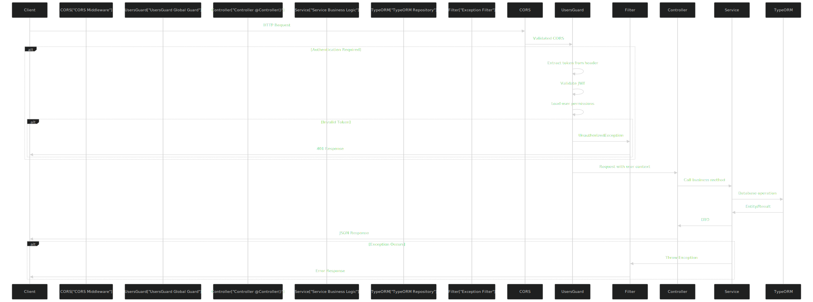

# 架构

### 目的与范围

本文档描述了 VTJ.PRO 平台的整体架构，包括前后端分层、多平台运行时系统和核心设计模式。它涵盖了高层结构和模块组织，但不详细说明各个子系统。

- 关于前端特定架构（包括入口点和路由），请参阅前端架构。
- 关于后端模块组织和依赖注入模式，请参阅后端模块系统。
- 关于平台运行时实现细节，请参阅多平台运行时系统。

## 系统分层

VTJ.PRO 平台遵循三层架构，具有独立的前端应用程序、后端服务和数据持久层。

### 分层架构图



## 前端入口点

前端在架构上分为五个独立的 HTML 入口点，每个入口点单独编译并服务于不同的目的。每个入口点使用特定于平台的配置初始化自己的 Vue 应用程序。

### 入口点初始化流程



### 入口点特性

| 入口点              | 目的              | 路由系统                | VTJ 提供者              | 访问控制       |
| ------------------- | ----------------- | ----------------------- | ----------------------- | -------------- |
| `index.html`        | 管理后台 + 工作台 | Vue Router (客户端路由) | 否                      | 是，使用白名单 |
| `web/index.html`    | Web 平台运行时    | 静态 + 动态路由         | 是，ContextMode.Runtime | 是，运行时模式 |
| `h5/index.html`     | H5 平台运行时     | 静态 + 动态路由         | 是，ContextMode.Runtime | 是，运行时模式 |
| `uniapp/index.html` | UniApp 平台运行时 | UniApp 路由             | 是，AppPlatform.UniApp  | 是，运行时模式 |
| `dev/index.html`    | 设计器环境        | Vue Router (设计器)     | 否                      | 是，设计器模式 |

## 后端模块组织

后端使用 NestJS 的模块系统和依赖注入。位于 `backend/src/app.module.ts` 的 AppModule 作为根模块，导入所有核心和业务模块，并注册全局 UsersGuard。

### 后端模块依赖图



### 模块导入模式

后端遵循一致的模块定义模式：

- 实体注册：每个模块使用 TypeOrmModule.forFeature([Entity]) 注册实体
- 服务导出：模块通过 exports 数组导出其服务，以支持跨模块依赖
- 控制器注册：控制器在 controllers 数组中注册
- 依赖注入：服务在 providers 数组中列出

来自 `backend/src/business/apps/app.module.ts` 的 `LowcodeAppModule` 示例：

```ts
@Module({
  imports: [TypeOrmModule.forFeature([AppEntity, AppVersionEntity]), DSLModule],
  controllers: [AppController],
  providers: [AppService],
  ex
```

来自 `backend/src/business/orders/order.module.ts` 的 `OrderModule` 示例：

```ts
@Module({
  imports: [TypeOrmModule.forFeature([OrderEntity]), UserModule],
  providers: [OrderService],
  controllers: [OrderController],
  exports: [OrderService]
})
```

## 请求处理流程

请求在到达控制器之前会经过多层中间件、守卫、拦截器和过滤器。

### 请求处理管道



### 全局守卫注册

`UsersGuard` 在 `backend/src/app.module.ts` 中全局注册：

```ts
providers: [
  {
    provide: APP_GUARD,
    useClass: UsersGuard
  }
];
```

这确保所有路由默认受到保护，异常情况通过元数据装饰器处理。

## VTJ 渲染器集成

平台运行时能力的核心是 @vtj/renderer 包，它从 DSL（领域特定语言）配置创建 Vue 应用程序。此模式在所有平台运行时中使用。

### VTJ 提供者创建模式



### 平台特定实现

Web 平台位于 `frontend/src/platform/web/main.ts`

```ts
const { provider, onReady } = createProvider({
  nodeEnv: preview ? NodeEnv.Development : NodeEnv.Production,
  mode: ContextMode.Runtime,
  service,
  project: {
    id: code,
    platform: AppPlatform.Web
  },
  materialPath: MATERIAL_PATH,
  dependencies: {
    Vue: () => import('vue'),
    VueRouter: () => import('vue-router'),
    Pinia: () => import('pinia')
  },
  router,
  enableStaticRoute: true,
  routeAppendTo: ROUTER_APPEND_TO,
  adapter: { notify, loading, alert, useTitle }
});
```

H5 平台位于 `frontend/src/platform/h5/main.ts`

使用相同的配置，但 AppPlatform 为 H5。

UniApp 平台位于 `frontend/src/platform/uniapp/main.ts`

```ts
const { provider, onReady } = createProvider({
  nodeEnv: preview ? NodeEnv.Development : NodeEnv.Production,
  mode: ContextMode.Runtime,
  materialPath: MATERIAL_PATH,
  service,
  project: {
    id: code,
    platform: AppPlatform.UniApp
  },
  adapter: { notify, loading, alert }
});
```

## 模板项目架构

平台为 Web、H5 和 UniApp 生成独立的项目模板。这些模板使用不同的初始化模式，专注于使用 `LocalService` 进行本地开发。

模板初始化模式



### 与平台运行时的关键区别

| 对比项   | 平台运行时                                  | 模板项目                    |
| -------- | ------------------------------------------- | --------------------------- |
| 服务     | `createService(template, preview, version)` | `new LocalService(request)` |
| 模式     | `ContextMode.Runtime`                       | `ContextMode.Raw`           |
| 项目 ID  | 来自 URL 的应用代码                         | `vtj.id` 或包名             |
| 依赖     | 动态导入                                    | 动态导入                    |
| 自动更新 | 不适用                                      | 生产环境中的 `autoUpdate()` |
| 图标     | 不包含                                      | `IconsPlugin` (仅 Web)      |

## 共享基础设施

前端和后端都维护共享的实用工具和组件，以确保跨模块的一致性。

### 前端共享结构

前端共享目录位于 `frontend/src/extension/index.ts` 和 `backend/src/shared/index.ts`，导出通用功能：

**前端共享导出：**

- `install` - 插件安装助手
- `openApi` - API 客户端配置

**后端共享导出：**

- `constants` - 应用程序常量
- `decorators` - 用于元数据的自定义装饰器
- `filters` - 异常过滤器
- `interfaces` - 共享 TypeScript 接口
- `interceptors` - 请求/响应拦截器
- `middlewares` - Express 中间件
- `pipes` - 验证和转换管道
- `utils` - 实用函数
- `enums` - 枚举类型

## 数据库初始化策略

平台使用双轨方法进行数据库管理：种子用于初始数据填充，迁移用于模式演进。

### 数据库初始化组件



### 种子导出位于 `backend/src/database/seeding/seeds/index.ts`

```ts
export * from './dictionary';
export * from './setting';
export * from './role';
export * from './llm';
export * from './permission';
export * from './oss';
```

### 迁移导出位于 `backend/src/database/migration/migrations/index.ts`

```ts
export * from './user.task';
export * from './oss.task';
export * from './apps.task';
export * from './dsl.task';
export * from './template.task';
export * from './order.task';
export * from './topic.task';
export * from './chat.task';
export * from './report.task';
export * from './daily.task';
```

## 关键架构模式

### 1. 模块封装

每个业务领域都封装在一个自包含的 NestJS 模块中，具有自己的实体、服务、控制器和 DTO。模块通过 exports 暴露服务，并显式导入依赖项。

### 2. 依赖注入

平台使用 NestJS 内置的 DI 容器。服务通过构造函数参数注入，模块在其 imports 数组中声明依赖项。

### 3. 全局守卫

UsersGuard 使用 APP_GUARD 令牌在 `backend/src/app.module.ts` 中全局注册，确保所有路由都需要身份验证，除非明确豁免。

### 4. 自动实体加载

TypeORM 的 autoLoadEntities: true 在 `backend/src/app.module.ts` 中自动发现并注册来自导入模块的所有实体，消除了手动实体注册。

### 5. 多入口前端

前端使用多个单独编译的 HTML 入口点，允许为不同上下文（管理、运行时、设计器）使用不同的包，而无需代码重叠。

### 6. VTJ 提供者模式

所有平台运行时都使用来自 `@vtj/renderer` 的 createProvider 函数，该函数返回一个提供者插件和一个 onReady 回调。提供者管理 DSL 加载、页面创建和生命周期。

### 7. 访问控制集成

来自 @vtj/renderer 的 Access 类作为 Vue 插件集成，为整个应用程序提供 access.can() 进行权限检查。它通过请求对象连接到后端，并在身份验证期间加载权限。
