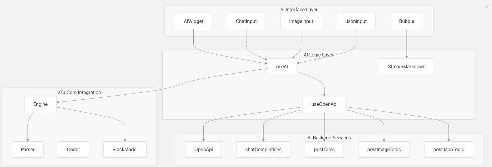
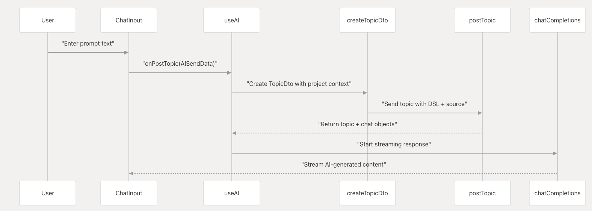
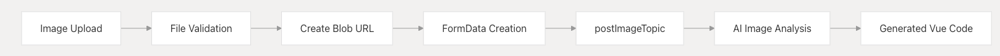
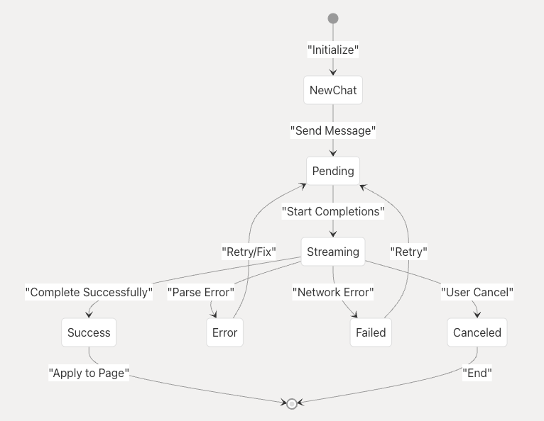
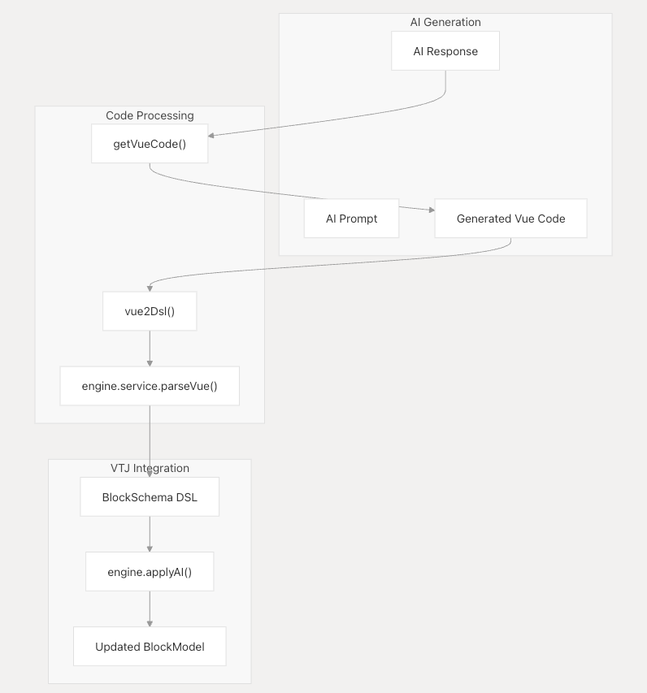
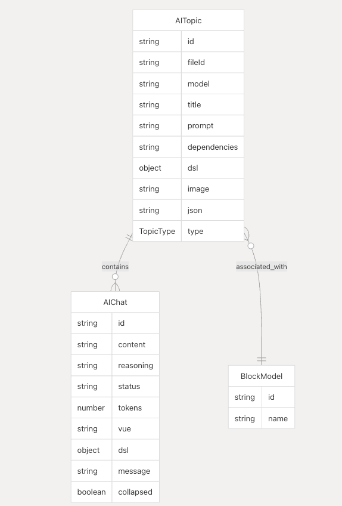

# AI 集成架构

本文档详细介绍了 VTJ（Visual Template JavaScript）平台中 AI 驱动的代码生成与设计辅助功能。AI 子系统与 VTJ 核心引擎深度集成，支持通过自然语言提示、图像上传和结构化元数据文件生成 Vue 单文件组件（SFC）和完整页面。

## 文档概述

VTJ 的 AI 集成旨在提升前端开发效率，将自然语言描述、设计稿或结构化数据快速转换为可运行的 Vue 代码。系统采用模块化设计，确保生成的代码符合项目规范且易于维护。

### 相关文档

- **核心架构文档**：了解 VTJ 底层处理机制和引擎设计
- **设计器与渲染器文档**：查看可视化设计实现细节
- **API 参考文档**：获取完整的接口定义和使用示例

## AI 系统架构

VTJ 的 AI 集成采用分层架构设计，各层协同工作实现从用户输入到可执行 Vue 代码的完整转换流程。这种设计确保了系统的可扩展性、可维护性和高性能。



### 架构层次详解

**AI 集成架构包含以下四个核心层次：**

1. **接口层（Interface Layer）**
   - **职责**：收集并标准化用户输入，包括文本、图像和 JSON 数据
   - **关键组件**：`ChatInput`、`ImageInput`、`JsonInput` 组件
   - **输入验证**：对上传文件进行格式、大小和安全性检查
   - **数据预处理**：将原始输入转换为 AI 模型可处理的标准化格式

2. **逻辑控制层（Logic Control Layer）**
   - **职责**：管理应用状态、协调 API 通信、处理异常情况
   - **状态管理**：基于状态机的对话流程控制（INITIAL → STREAMING → COMPLETED/ERROR）
   - **API 网关**：统一管理与外部 AI 服务的通信，支持负载均衡和故障转移
   - **错误处理**：捕获并处理网络异常、API 限流、认证失败等场景

3. **AI 处理层（AI Processing Layer）**
   - **职责**：执行自然语言理解、计算机视觉分析和代码生成
   - **模型集成**：支持多种 AI 模型（如 GPT、Claude、本地模型等）
   - **上下文管理**：维护对话历史、项目配置和用户偏好
   - **代码生成**：基于上下文生成符合 Vue 3 和 TypeScript 最佳实践的代码

4. **引擎集成层（Engine Integration Layer）**
   - **职责**：将 AI 生成的代码无缝集成到 VTJ 核心引擎
   - **代码转换**：将 Vue SFC 转换为 VTJ DSL 中间表示
   - **变更应用**：通过增量更新机制将生成代码应用到当前项目
   - **渲染同步**：确保 UI 实时反映代码变更，提供即时反馈

### 数据流与通信机制

各层之间通过明确定义的接口进行通信，采用事件驱动架构确保松耦合：

- **向上通信**：使用回调函数和 Promise 处理异步操作
- **向下通信**：通过方法调用传递处理结果
- **横向通信**：基于事件总线实现组件间通信

## AI 输入处理机制

VTJ 支持三种输入模式，每种模式针对不同的开发场景和用户需求。系统根据输入类型自动选择最合适的处理管线，确保生成代码的质量和准确性。

### 输入模式对比

| 输入类型     | 前端组件   | 支持格式          | 最大文件大小 | 典型应用场景              | 处理延迟    |
| ------------ | ---------- | ----------------- | ------------ | ------------------------- | ----------- |
| 自然语言文本 | ChatInput  | 纯文本            | 无限制       | 功能需求描述、代码优化    | 低 (1-3秒)  |
| 设计图像     | ImageInput | .png, .jpg, .jpeg | 10MB         | 界面原型、设计稿转代码    | 中 (3-10秒) |
| 结构化元数据 | JsonInput  | .json             | 5MB          | Figma/Sketch 设计文件导出 | 低 (1-5秒)  |

**选择建议：**

- **快速原型**：使用自然语言文本描述需求
- **设计稿实现**：上传设计图像获取精确布局
- **设计系统集成**：使用结构化 JSON 保持设计一致性

### 文本输入处理流程

文本输入通过 `AISendData` 接口处理自然语言提示，将用户需求转换为高质量的 Vue 代码。处理流程如下：



#### 详细处理步骤

**1. 上下文提取**

```typescript
// 上下文提取示例
interface ProjectContext {
  currentDSL: DSLDefinition; // 当前 DSL 定义
  vueComponents: VueComponent[]; // 现有 Vue 组件
  styleConfig: StyleConfig; // 样式配置
  dependencies: string[]; // 项目依赖
  userPreferences: UserPrefs; // 用户偏好设置
}

function extractContext(blockId: string): ProjectContext {
  // 从引擎中提取当前块的相关上下文
  return {
    currentDSL: engine.getCurrentDSL(blockId),
    vueComponents: engine.getComponentsInScope(blockId),
    styleConfig: styleSystem.getConfig(),
    dependencies: packageManager.getDependencies(),
    userPreferences: userConfig.getPreferences()
  };
}
```

**2. 提示词构建**

- **系统提示**：定义 AI 角色和任务目标
- **用户提示**：包含用户原始输入和提取的上下文
- **格式约束**：指定输出格式（Vue 3 + TypeScript + Composition API）
- **质量要求**：强调代码可读性、性能和可维护性

**3. AI 代码生成**

- **模型调用**：通过配置的 AI 服务生成代码
- **温度控制**：平衡创造性和确定性（默认 temperature=0.7）
- **最大长度**：限制生成内容长度，避免过长响应
- **重试机制**：网络失败时自动重试（最多3次）

**4. 代码验证与解析**

```typescript
// 代码验证逻辑
function validateGeneratedCode(vueCode: string): ValidationResult {
  const result: ValidationResult = {
    isValid: false,
    errors: [],
    warnings: [],
    parsedAST: null
  };

  try {
    // 语法检查
    const ast = parseVueSFC(vueCode);

    // 组件命名规范检查
    if (!isPascalCase(ast.componentName)) {
      result.warnings.push('组件名称建议使用 PascalCase 格式');
    }

    // 样式作用域检查
    if (ast.styles.some((style) => !style.scoped)) {
      result.warnings.push('建议为组件样式添加 scoped 属性');
    }

    // 依赖检查
    const missingDeps = checkDependencies(ast.imports);
    if (missingDeps.length > 0) {
      result.errors.push(`缺少依赖: ${missingDeps.join(', ')}`);
    }

    result.isValid = result.errors.length === 0;
    result.parsedAST = ast;
  } catch (error) {
    result.errors.push(`语法解析错误: ${error.message}`);
  }

  return result;
}
```

#### 性能优化

- **上下文缓存**：频繁访问的上下文数据缓存 5 分钟
- **提示词模板**：预编译提示词模板，减少运行时开销
- **流式响应**：支持边生成边返回，提升用户体验
- **并发控制**：限制同时处理的请求数量，避免资源耗尽

### 图像输入处理流程

图像处理管线将视觉设计转换为语义化的 Vue 组件：



**转换流程：**

1. 图像预处理（尺寸归一化、特征增强）
2. 基于 CV 模型识别 UI 元素和布局结构
3. 生成组件层次结构和样式定义
4. 输出符合 VTJ DSL 规范的中间表示

## AI 聊天系统与实时流处理

AI 聊天系统通过状态机管理对话交互，支持实时响应流：



**状态机关键状态：**

- `INITIAL`: 等待用户输入
- `STREAMING`: 处理 AI 流式响应
- `COMPLETED`: 生成最终代码结果
- `ERROR`: 处理异常情况

### 实时流式响应实现

使用 Server-Sent Events (SSE) 实现低延迟响应传输：

```ts
// 聊天补全核心逻辑
const chatCompletions = async (
  topicId: string,
  chatId: string,
  callback?: (data: any, done?: boolean) => void,
  error?: (err: any, cancel?: boolean) => void
) => {
  const controller = new AbortController();

  try {
    // 建立 SSE 连接
    const response = await fetch(API_ENDPOINT, {
      method: 'POST',
      signal: controller.signal,
      headers: { 'Content-Type': 'application/json' },
      body: JSON.stringify({ topicId, chatId })
    });

    // 处理流式数据块
    const reader = response.body.getReader();
    const decoder = new TextDecoder();
    let buffer = '';

    while (true) {
      const { value, done } = await reader.read();
      if (done) break;

      buffer += decoder.decode(value, { stream: true });
      const lines = buffer.split('\n');

      for (const line of lines) {
        if (line.startsWith('data:')) {
          const data = JSON.parse(line.substring(5));
          callback(data, false);
        }
      }
    }

    callback(null, true); // 流处理完成
  } catch (err) {
    error(err, true); // 错误处理
  }
};
```

## 代码生成与 DSL 集成

AI 系统通过双向转换管道与 VTJ 核心引擎集成：



**集成工作流：**

1. 从 AI 响应中提取 Vue SFC 代码
2. 将 Vue 代码转换为 DSL 中间表示
3. 应用变更到当前块模型
4. 通过渲染引擎更新 UI

### 代码转换关键函数

| 函数       | 功能描述                  | 输入         | 输出             |
| ---------- | ------------------------- | ------------ | ---------------- |
| getVueCode | 从 Markdown 提取 Vue 代码 | AI 响应文本  | Vue SFC 代码     |
| vue2Dsl    | Vue SFC 转 DSL 表示       | Vue SFC 代码 | 块架构定义       |
| applyAI    | 应用变更到引擎            | 块架构定义   | 更新后的 UI 状态 |

转换过程包含严格验证：

1. 组件命名符合 PascalCase 规范
2. 属性类型与值匹配验证
3. 样式作用域隔离检查
4. 依赖项完整性校验

## 主题管理与对话上下文

AI 系统通过主题机制管理对话上下文：



**数据模型关系：**

- 每个 `BlockModel` 关联多个 `Topic`
- 每个 `Topic` 包含多个 `Chat` 对话
- 每个 `Chat` 包含多条 `Message` 记录

### 主题生命周期管理

1. **主题创建**  
   通过 `onPostTopic` 创建新主题，关联项目上下文
2. **对话管理**  
   `onPostChat` 向主题添加消息，维护完整对话历史
3. **上下文加载**  
   根据 BlockModel 状态动态加载关联主题
4. **资源清理**  
   `onRemoveTopic` 级联删除主题及关联对话

## 用户体验增强功能

### 自动应用机制

启用后，系统自动应用验证通过的生成代码：

```ts
// 自动应用逻辑
function handleAutoApply(generatedCode) {
  if (config.autoApplyEnabled) {
    const dsl = vue2Dsl(generatedCode);
    if (validateDSL(dsl)) {
      engine.applyDSL(dsl);
    }
  }
}
```

### 交互式代码审查

提供多维度代码审查界面：

- **源码编辑器**：支持直接修改生成的 Vue 代码
- **DSL 预览面板**：实时显示转换后的 DSL 结构
- **版本比对**：对比不同生成版本的代码差异
- **手动应用控制**：选择性应用审查后的代码

### 错误恢复机制

全面错误处理框架：

| 错误类型     | 处理机制              | 恢复策略                   |
| ------------ | --------------------- | -------------------------- |
| 语法解析错误 | vue2Dsl 异常捕获      | 高亮错误位置，提供修复建议 |
| 网络通信异常 | 请求超时/中断处理     | 自动重试机制（最多3次）    |
| 验证错误     | DSL 模式校验          | 过滤无效节点，保留有效部分 |
| 用户取消操作 | onCancelChat 事件处理 | 清理中间状态，释放资源     |

错误处理系统提供上下文感知的恢复建议，支持用户迭代优化 AI 生成的代码。

## 配置与最佳实践

### AI 服务配置

VTJ 支持多种 AI 服务提供商，您可以根据需求进行配置：

```typescript
// AI 配置示例 (config/ai.config.ts)
export const aiConfig = {
  // OpenAI 配置
  openai: {
    apiKey: process.env.OPENAI_API_KEY,
    model: 'gpt-4-turbo-preview',
    temperature: 0.7,
    maxTokens: 4000,
    timeout: 30000 // 30秒超时
  },

  // 本地模型配置
  local: {
    endpoint: 'http://localhost:11434/api/generate',
    model: 'codellama:13b',
    temperature: 0.5,
    contextWindow: 4096
  },

  // 图像识别配置
  vision: {
    provider: 'google-vision',
    apiKey: process.env.GOOGLE_VISION_API_KEY,
    features: ['TEXT_DETECTION', 'LABEL_DETECTION', 'OBJECT_LOCALIZATION']
  },

  // 通用设置
  general: {
    autoApply: true, // 自动应用验证通过的代码
    enableStreaming: true, // 启用流式响应
    maxRetries: 3, // 最大重试次数
    cacheDuration: 300000 // 缓存持续时间 (5分钟)
  }
};
```

### 性能优化建议

1. **上下文管理**
   - 定期清理过期的对话历史
   - 使用增量更新减少上下文大小
   - 启用上下文压缩（移除重复信息）

2. **提示词工程**
   - 为常见任务创建模板提示词
   - 使用少样本学习（few-shot learning）提供示例
   - 明确指定输出格式和约束条件

3. **错误处理策略**
   - 实现指数退避重试机制
   - 设置合理的超时时间
   - 提供用户友好的错误信息

### 安全注意事项

1. **API 密钥管理**
   - 使用环境变量存储敏感信息
   - 定期轮换 API 密钥
   - 实施访问控制和速率限制

2. **输入验证**
   - 验证上传文件的类型和大小
   - 扫描恶意内容
   - 实施内容过滤策略

3. **输出审查**
   - 检查生成代码的安全性
   - 验证第三方依赖的安全性
   - 实施代码沙箱执行环境

### 监控与日志

建议启用以下监控指标：

- **成功率**：AI 请求成功比例
- **响应时间**：从输入到代码生成的平均时间
- **代码质量**：生成代码的验证通过率
- **用户满意度**：用户对生成代码的反馈评分

```typescript
// 监控指标收集示例
interface AIMetrics {
  requestId: string;
  inputType: 'text' | 'image' | 'json';
  processingTime: number;
  success: boolean;
  errorCode?: string;
  validationResult: ValidationResult;
  userFeedback?: number; // 1-5 评分
}
```

## 总结

VTJ 的 AI 集成架构提供了一个强大而灵活的平台，将自然语言、设计图像和结构化数据转换为高质量的 Vue 代码。通过分层架构设计、实时流处理、严格的代码验证和全面的错误处理，系统确保了生成代码的可靠性、安全性和性能。

### 核心优势

1. **多模态输入**：支持文本、图像和 JSON 多种输入方式
2. **实时交互**：基于 SSE 的流式响应提供即时反馈
3. **高质量输出**：严格的验证机制确保代码符合项目规范
4. **可扩展架构**：模块化设计支持多种 AI 模型和服务提供商
5. **开发者友好**：提供交互式审查、自动应用等增强功能

### 未来发展方向

1. **多模型支持**：集成更多开源和专有 AI 模型
2. **代码优化**：自动优化生成代码的性能和可访问性
3. **团队协作**：支持多人协作和代码评审工作流
4. **自定义训练**：允许用户基于项目代码训练专属模型

通过持续优化和改进，VTJ 的 AI 集成将继续提升前端开发效率，帮助开发者更快地将创意转化为可运行的代码。
