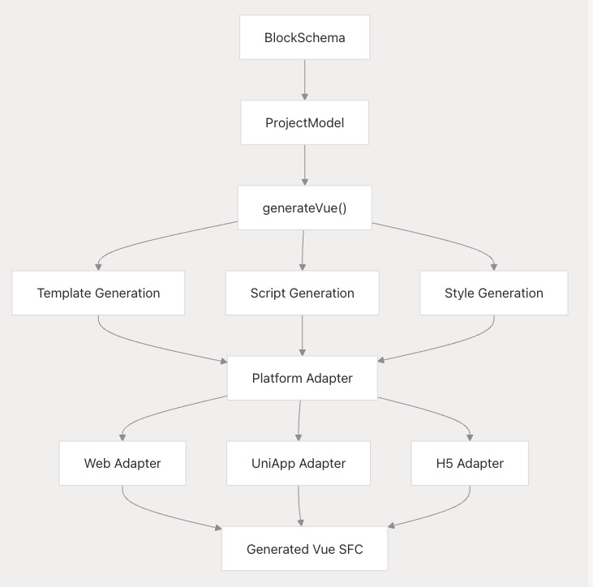
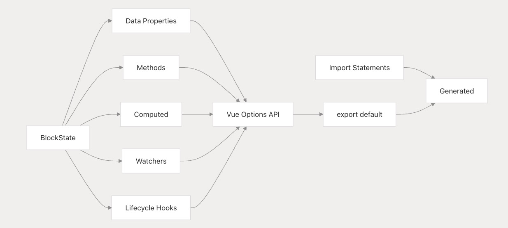

# 代码生成和解析管道

本文档涵盖了 VTJ 在 Vue 单文件组件 （SFC） 和平台内部领域特定语言 （DSL） 之间的双向转换系统。该系统通过 `@vtj/parser` 和 `@vtj/coder` 包实现基于代码的开发和可视化低代码设计之间的无缝集成。

有关编排这些管道的整体引擎架构的信息，请参阅**引擎、提供程序和服务层** 。有关这些管道所作的数据模型的详细信息，请参阅**项目模型和块模型**。

## 架构概述

代码生成和解析管道构成了 VTJ 的 AI 增强开发工作流程的支柱，支持人类可读的 Vue 代码和机器可处理的 DSL 表示之间的转换。

## 解析管道：Vue SFC 到 DSL

解析管道通过多阶段过程将 Vue 单文件组件转换为 VTJ 的内部 DSL 表示。

### 解析器入口点

主解析函数 parseVue 编排整个转换过程：

`ParseVueOptions` 接口定义了所需的输入，包括目标项目上下文、块标识符和源代码。

### 模板解析

模板解析使用 Vue 的编译器基础设施将 Vue 模板语法转换为 `NodeSchema` 结构：

关键处理函数处理不同的模板节点类型，包括元素、文本节点、条件语句 （v-if）、循环 （v-for） 和插槽。

### 脚本解析

脚本解析提取 Vue 组件逻辑并将其转换为 BlockState 表示：

脚本解析器处理 Vue 的 Options API 语法，提取组件属性、方法、计算属性、侦听器和生命周期钩子。

## 代码生成管道：DSL 到 Vue SFC

代码生成管道将 VTJ 的内部 DSL 转换回针对不同目标平台的可部署的 Vue 单文件组件。

### 生成过程

平台适配器可确保生成的代码针对特定部署目标进行优化，从而处理组件库、API 和平台特定功能中的差异。

### 模板代码生成

模板生成将 `NodeSchema` 结构转换回 Vue 模板语法：

| 节点类型        | 生成的输出              | 特殊处理               |
| --------------- | ----------------------- | ---------------------- |
| ElementNode     | tag 元素                | 标记名称格式、属性绑定 |
| TextNode        | 文本内容                | 表达式插值             |
| ConditionalNode | v-if、v-else-if、v-else | 分支逻辑               |
| LoopNode        | v-for 指令              | 迭代语法               |
| SlotNode        | slot 元素               | 命名插槽、插槽 props   |

生成器处理特定于平台的标记名称，并确保正确转义动态内容。

### 脚本代码生成

脚本生成从 `BlockState` 表示中重建 Vue 组件逻辑：

脚本生成器可确保正确的 TypeScript 类型并自动处理依赖项导入。

## 关键组件和数据结构

### 解析器组件

| 元件          | 目的         | 主要功能                     |
| ------------- | ------------ | ---------------------------- |
| parseVue      | 主解析入口点 | 编排 SFC → DSL 转换          |
| parseTemplate | 模板处理     | 将 Vue 模板转换为 NodeSchema |
| parseScripts  | 脚本分析     | 将组件逻辑提取到 BlockState  |
| parseStyle    | 样式处理     | 将 CSS 转换为 CSSRule        |
| htmlToNodes   | HTML 解析    | 直接 HTML → NodeSchema 转换  |

### 编码器组件

代码生成系统使用特定于平台的适配器来确保生成的代码在不同的部署目标中正常工作：

### 数据结构转换

管道执行几个关键数据转换：

| 源格式      | 目标格式     | 转型                      |
| ----------- | ------------ | ------------------------- |
| 模板视图    | NodeSchema[] | AST 解析 + 属性提取       |
| Script 视图 | BlockState   | Babel AST 分析 + 逻辑提取 |
| Vue 样式    | CSSRules     | CSS 解析 + 范围           |
| BlockSchema | SFC 视图     | DSL → 代码生成            |

每个转换都会保留语义含义，同时适应目标表示的约束。

## 平台支持和扩展

### 多平台代码生成

系统支持生成平台优化代码：

- **Web 平台** ：带有 Element Plus/Ant Design Vue 的标准 Vue 3 组件
- **UniApp Platform**：移动端 / 小程序的跨平台组件
- **H5 平台** ：使用 Vant UI 的移动优化 Web 组件

平台适配器处理以下方面的差异：

- 组件库 API
- 事件处理机制
- 样式方法
- 构建工具配置

### HTML 导入支持

系统可以通过 htmlToNodes 将原始 HTML 内容直接导入到可视化设计器中：

这样就可以导入现有的 HTML 布局，并在可视化设计器中将它们转换为可编辑的组件。

:::info 提示
内容由AI翻译，可能会出现错漏或过时信息，请查阅原文：https://deepwiki.com/ChenXiaohui99/vtj/2.3-code-generation-and-parsing-pipeline
:::
