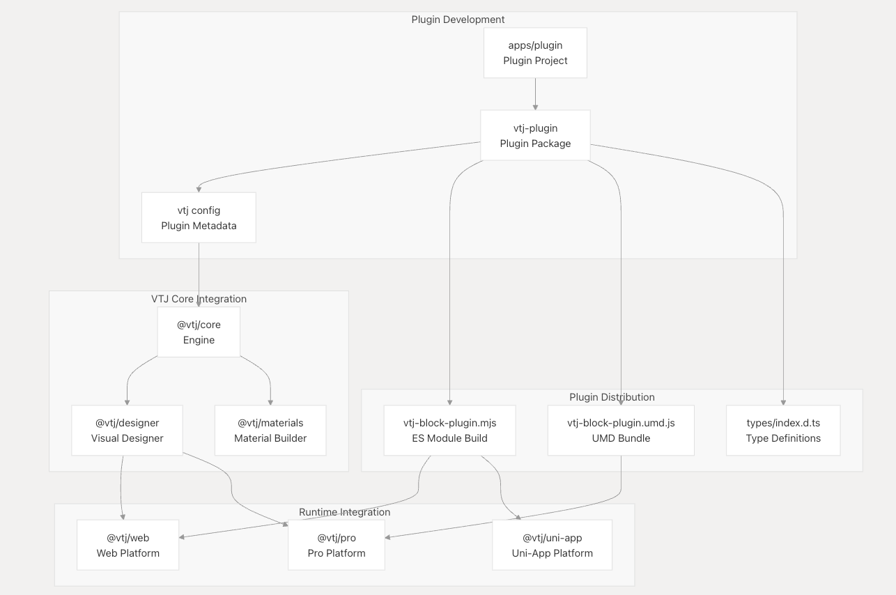
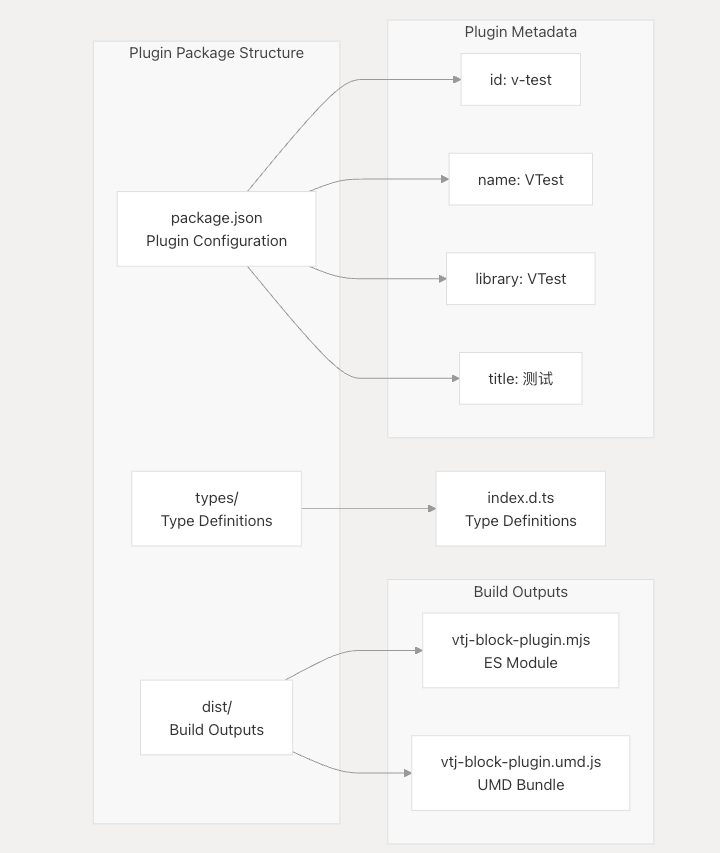
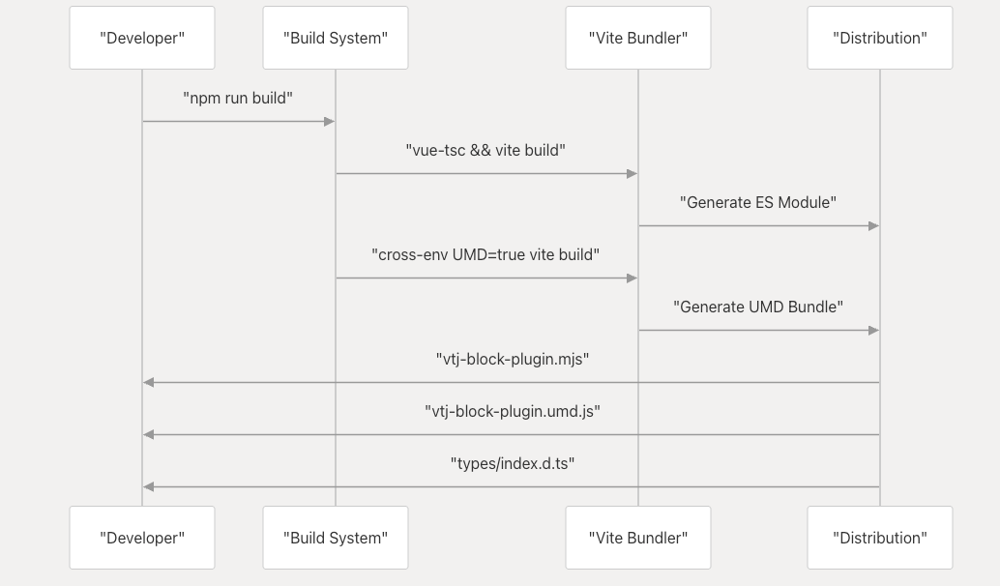
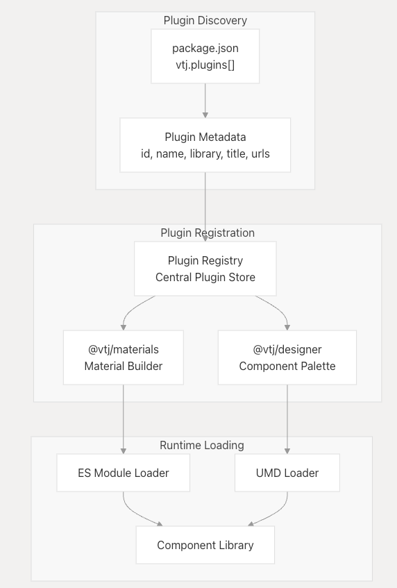
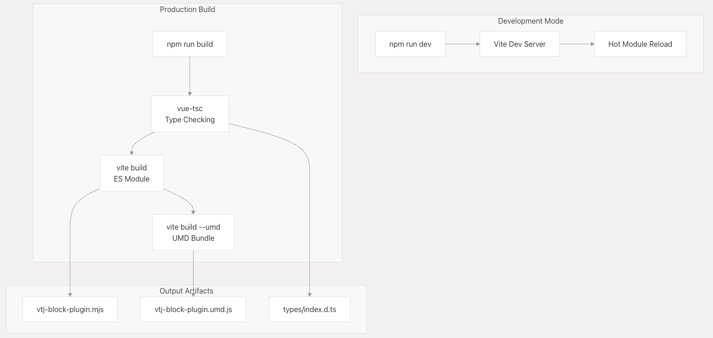

# 插件系统

VTJ 插件系统提供了一个可扩展性框架，允许开发人员为 VTJ 低代码平台创建和分发自定义组件、功能和集成。该系统使第三方开发人员能够扩展核心平台功能，同时保持不同 VTJ 平台实施之间的兼容性。

有关用于创建和构建插件的 CLI 工具的信息，请参阅 **CLI 和 Build System**。有关将插件与特定平台集成的详细信息，请参阅**平台实现** 。

## 插件架构概述

VTJ 插件系统遵循模块化架构，其中插件作为独立软件包开发，可与核心 VTJ 生态系统无缝集成。每个插件都是一个独立的 Vue.js 组件库，可以动态加载到 VTJ 应用程序中。

**插件架构组件**

## 插件包结构

VTJ 插件遵循标准化的软件包结构，以确保与平台的构建和运行时系统兼容。插件包包括配置元数据、构建输出和类型定义。

### 插件配置架构

插件配置在 package.json 文件中的 vtj 键下定义：

| 字段    | 类型   | 描述                      |
| ------- | ------ | ------------------------- | ---------------- |
| id      | string | 唯一插件标识符            |
| name    | string | 内部插件名称              |
| library | string | UMD                       | 构建的全局库名称 |
| title   | string | 显示插件的标题            |
| urls    | string | 资源 URL（CSS、JS、JSON） |

**插件包结构和配置**

## 插件开发工作流程

插件开发过程与 VTJ monorepo 结构集成，并利用平台的构建工具和开发依赖项。

### 开发依赖项

VTJ 插件在开发过程中可以访问完整的 VTJ 生态系统：

| 包            | 目的               |
| ------------- | ------------------ |
| @vtj/core     | 核心引擎和数据模型 |
| @vtj/designer | 可视化设计器集成   |
| @vtj/pro      | 专业的平台功能     |
| @vtj/web      | Web 平台实用程序   |
| @vtj/ui       | 组件库             |
| @vtj/icons    | 图标系统           |
| @vtj/utils    | 效用函数           |

### 构建过程

插件构建系统支持多种输出格式，以保证不同部署场景的兼容性：

**插件构建工作流程**

## 插件注册和发现

VTJ 平台根据 `package.json` 文件中的配置元数据自动发现和注册插件。这将启用插件功能的动态加载和集成。

### 插件发现机制

插件系统使用 package.json 中的 vtj.plugins 数组来注册插件元数据：

**插件发现和注册流程**

## 构建系统集成

插件构建系统利用 Vite 和 VTJ CLI 为不同的部署场景创建优化的捆绑包。构建过程支持开发和生产工作流程。

### 构建脚本和配置

| 脚本      | 命令                                       | 目的           |
| --------- | ------------------------------------------ | -------------- |
| dev       | cross-env DEV=true vite                    | 开发服务器     |
| build     | vue-tsc && vite build && npm run build:umd | 完整的构建过程 |
| build:umd | cross-env UMD=true vite build              | UMD 捆绑包生成 |

## 插件打包和分发

VTJ 插件打包为标准 npm 包，具有支持 ES 模块和 CommonJS 环境的特定导出配置。软件包配置可确保与各种捆绑程序和部署目标兼容。

### 包导出配置

插件包使用条件导出为不同的模块系统提供适当的构建：

| 导出路径 | 模块类型                | 文件                           |
| -------- | ----------------------- | ------------------------------ |
| types    | TypeScript （类型脚本） | ./types/index.d.ts             |
| import   | ES 模块                 | ./dist/vtj-block-plugin.mjs    |
| main     | UMD/CommonJS            | ./dist/vtj-block-plugin.umd.js |

### 版本管理

插件系统遵循 VTJ monorepo 版本控制策略，在所有软件包之间保持同步版本，以确保兼容性和一致的版本
