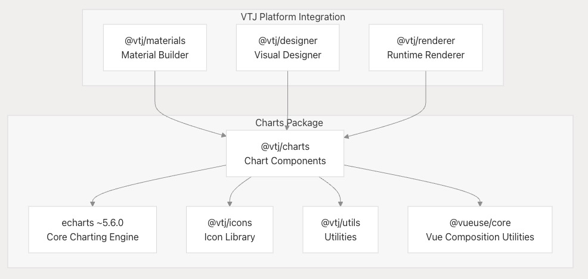
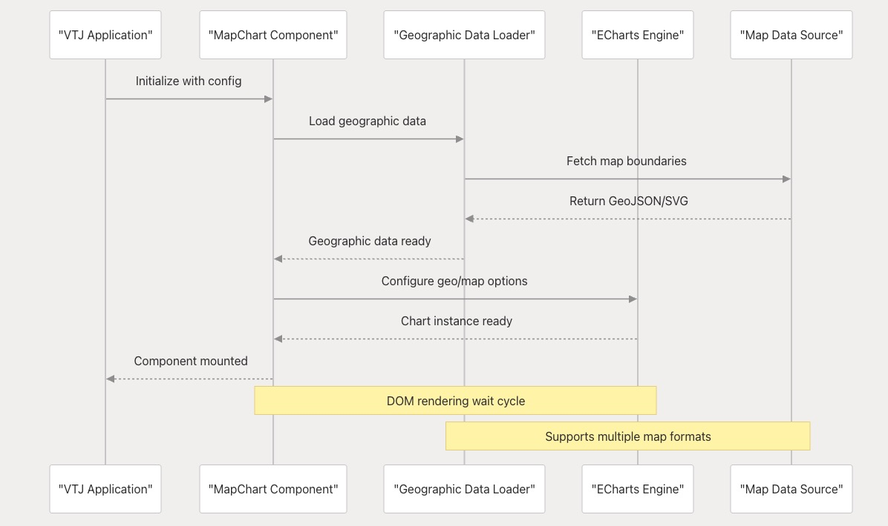
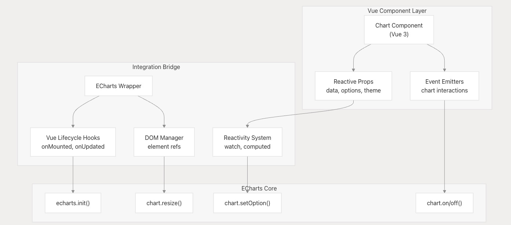
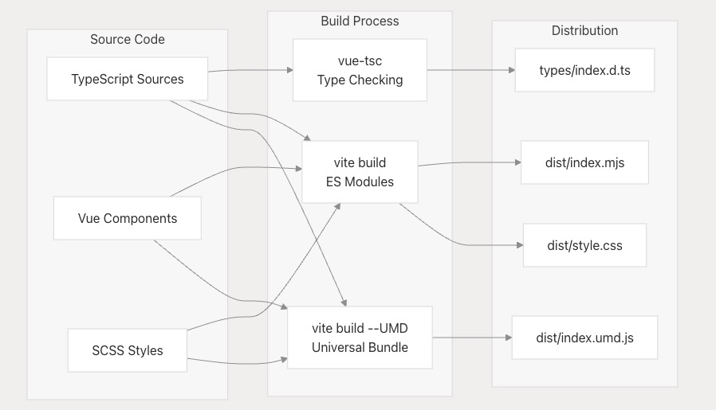

# 图表和可视化

本文档涵盖了 `@vtj/charts` 包，该包通过 ECharts 集成为 VTJ 低代码平台提供了全面的数据可视化能力。该软件包提供图表组件、地理映射和可视化工具，这些工具可与 VTJ 的设计时和运行时环境无缝集成。

有关更广泛的 UI 组件生态系统的信息，请参阅 **UI 组件库 **。有关特定于平台的实施，请参阅**平台实施** 。

## 软件包概述

`@vtj/charts` 包是 VTJ 组件生态中的主要可视化层，基于 ECharts 5.6.0 构建，作为其核心图表引擎。该包提供了 Vue 3 组件，这些组件封装了 ECharts 功能，同时保持了与 VTJ 低代码设计模式的兼容性。

**Chart 包依赖项和集成**

## 图表组件系统

charts 包提供了一种基于组件的架构，将 ECharts 功能封装到可重用的 Vue 组件中。这些组件旨在在 VTJ 的低代码环境中工作，同时提供对 ECharts 可视化能力的完全访问权限。

| 组件类别   | 功能性                       | ECharts 集成          |
| ---------- | ---------------------------- | --------------------- |
| 基本图表   | 折线图、条形图、饼图、散点图 | 直接 ECharts 选项绑定 |
| 地理图表   | 地图、地理可视化             | ECharts geo/map 组件  |
| 复杂图表   | 多轴，组合                   | ECharts 高级配置      |
| 交互式图表 | 画笔、DataZoom、图例         | ECharts 交互 API      |

**Chart 组件架构和 ECharts 集成**

## 地理可视化支持

图表包的一个重要功能是其地理可视化功能，包括对地理地图和地理数据显示的支持。添加此功能是为了在 VTJ 应用程序中支持基于位置的数据可视化。

**地理图表初始化和数据加载流程**

地理可视化系统解决了 DOM 就绪和异步数据加载的常见问题，与地图就绪状态和 DOM 渲染计时相关的错误修复证明了这一点。

## ECharts 集成架构

该包为 ECharts 提供了一个复杂的包装器，在保持 Vue 3 响应性的同时，保留了对完整 ECharts API 的访问。此集成处理图表生命周期、数据绑定和事件管理。

**ECharts Vue 3 集成架构**

集成层处理几个关键方面：

- **DOM 就绪性**：确保 ECharts 初始化发生在 DOM 元素可用之后
- **反应式更新** ：当数据或配置 props 发生变化时自动更新图表
- **事件桥接** ：将 ECharts 事件转换为 Vue 组件事件
- **资源管理** ：在组件卸载期间正确处理 Chart 实例

## 构建和分发系统

charts 包使用双重构建系统，该系统可同时生成 ES 模块和 UMD 捆绑包，从而确保 VTJ 生态系统内不同部署场景之间的兼容性。

| 构建目标        | 输出格式          | 用例                     |
| --------------- | ----------------- | ------------------------ |
| ES 模块         | dist/index.mjs    | 现代捆绑器，tree-shaking |
| UMD 捆绑包      | dist/index.umd.js | 浏览器全局变量、遗留系统 |
| TypeScript 定义 | types/index.d.ts  | 类型安全和 IDE 支持      |
| CSS 捆绑包      | dist/style.css    | 组件样式                 |

**图表包构建和分发管道**

构建系统确保 charts 包可以在 VTJ 的多平台部署目标中使用，同时通过 tree-shaking 支持保持最佳捆绑包大小。
