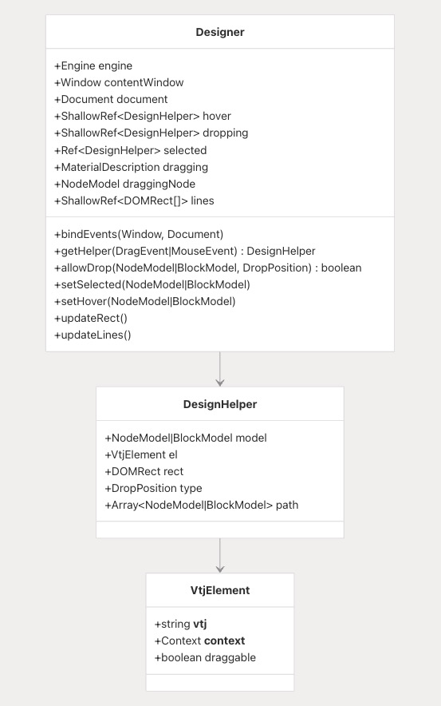
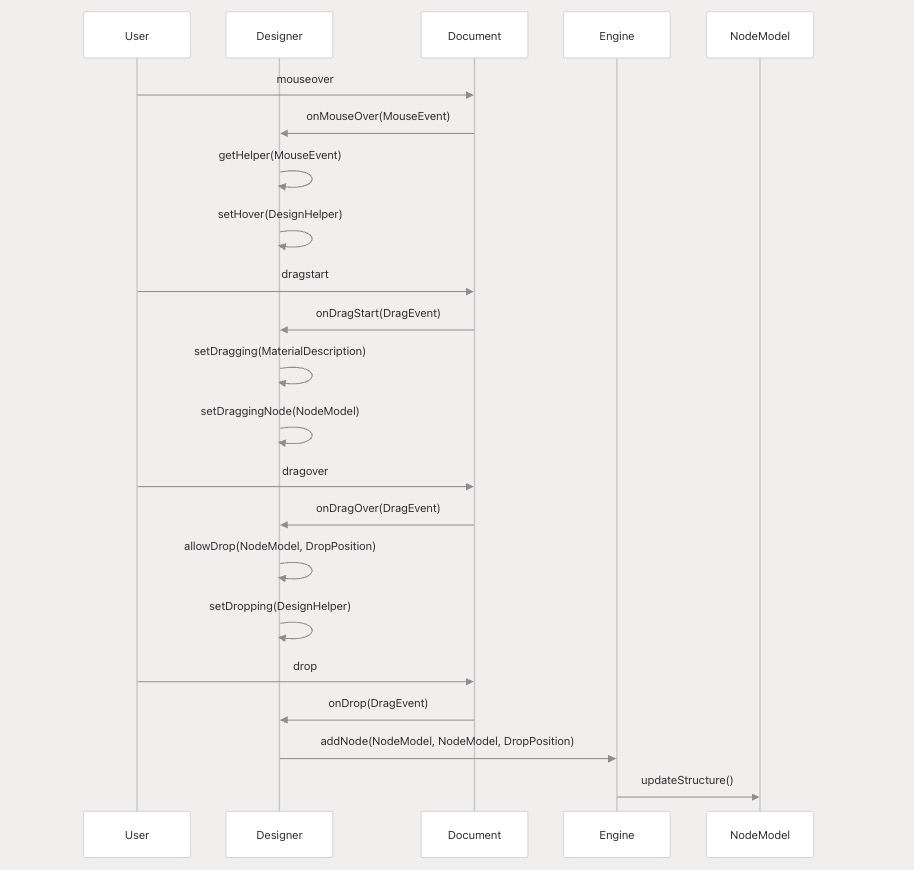
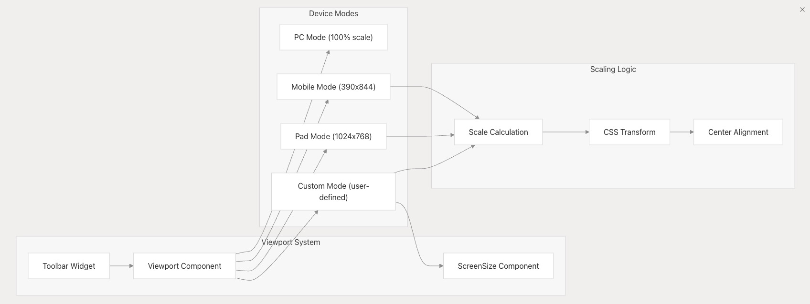

# 设计器和渲染器

本文档介绍了支持 VTJ 低代码体验的可视化设计环境 （`@vtj/designer`） 和运行时渲染系统 （`@vtj/renderer`）。Designer 提供了交互式可视化编辑环境，用户可以在其中拖放和配置组件，而 Renderer 在设计时预览和运行时环境中执行生成的 DSL 架构。

有关这些系统运行的核心引擎和数据模型的信息，请参阅**引擎、提供程序和服务层** 。有关提供实际小组件的 UI 组件库的详细信息，请参阅 **UI 组件库** 。

## Designer 架构

Designer 系统通过以 `Designer` 类及其与仿真环境的集成为中心的复杂事件驱动架构提供交互式可视化编辑功能。

### Core Designer 类

`Designer` 类充当所有设计时交互的中心编排器，管理鼠标事件、拖放作、元素选择和视觉反馈系统。

Designer 通过对具有特殊属性 （`__vtj__`、`__context__`） 的 DOM 元素进行检测来运行，这些属性使其能够在可视元素及其相应的数据模型之间进行映射。

### 事件处理系统

Designer 实现了一个全面的事件处理系统，该系统可以捕获用户交互并将其转换为设计作：

### 视觉反馈组件

Designer 系统通过突出显示交互式元素的叠加组件提供实时视觉反馈：

## 渲染器架构

Renderer 系统为 VTJ DSL 模式提供运行时执行环境，支持多种执行模式和上下文。

### 上下文系统

`Context` 类充当运行时执行环境，为组件实例提供对状态、props、生命周期方法和实用程序函数的访问：

Context 系统支持三种不同的执行模式：

- **设计模式** ：用于设计时交互的 Instruments 元素
- **运行模式** ：提供生产执行环境
- **VNode 模式** ：支持无 refs 的虚拟节点渲染

### 多模式渲染

Renderer 支持通过 Context 系统在设计时和运行时模式之间无缝切换：

## 设计时集成

Designer 和 Renderer 系统通过基于 iframe 的共享模拟环境进行集成，该环境支持实时预览和交互。

### 模拟器架构

### 元件检测

在设计模式下，Renderer 使用特殊属性检测 DOM 元素，使 Designer 能够跟踪和作它们：

## 视口和响应式设计

Designer 提供了一个复杂的视口系统，该系统支持多种设备模式和自定义大小调整，以便进行响应式设计测试。

### 视口模式

## 运行时性能优化

Renderer 系统包括针对运行时性能的多项优化，用于区分设计时插桩和生产执行。

Context 系统会自动管理 Vue 实例生命周期、引用跟踪和清理，以确保在不同执行模式下的最佳性能，同时保持设计时插桩所需的灵活性。
